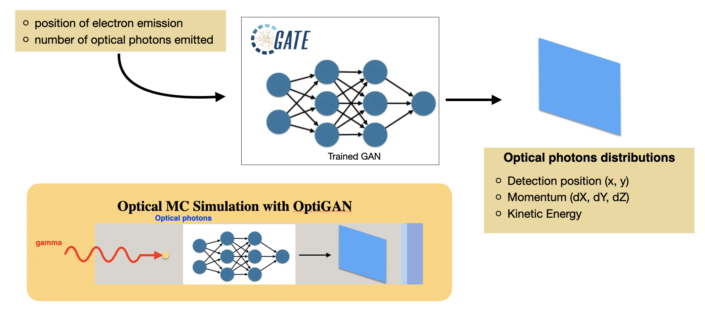
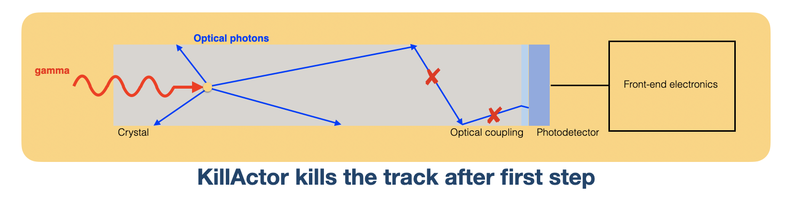

Advanced physics
================

OptiGAN
~~~~~~~

Refer to this `testcase <https://github.com/OpenGATE/opengate/blob/6cd98d3f7d76144889b1615e28a00873ebc28f81/opengate/tests/src/test081_simulation_optigan_with_random_seed.py>`_ for a simulation example.

In the default optical simulations of Gate v10, each optical photon generated is treated as a separate track, which can be quite resource-intensive. For instance, approximately one second is required to simulate the spatial distribution of optical photons detected from a single 511 keV gamma ray interaction in a 20 mm thick layer of bismuth germanate (BGO), which has a light yield of about 8500 photons per MeV. Recent advancements in Monte Carlo simulations using deep learning, particularly with Generative Adversarial Networks (GANs), have shown significant potential in reducing simulation times. We have adopted a specific type of GAN known as Wasserstein GAN to enhance the efficiency of generating optical photons in scintillation crystals, which we have named OptiGAN. For more detailed information, you can refer to this `research paper <https://iopscience.iop.org/article/10.1088/2632-2153/acc782>`_.

The OptiGAN model trained with 3 x 3 x 3 mm\ :sup:`3` BGO crystal is already included with Gate 10. More models will be added in the future.

Users can utilize OptiGAN in two ways: they can integrate it into the simulation file, or they can use it after running the simulation.

Method 1 - Running OptiGAN with Simulation
------------------------------------------

.. code-block:: python

    optigan = OptiGAN(input_phsp_actor=phsp_actor)

Method 2 - Running OptiGAN After Simulation
-------------------------------------------

.. code-block:: python

    optigan = OptiGAN(root_file_path=hc.get_output_path())

Method 1 can be used when a user wants to run OptiGAN within the same simulation file. The ``input_phsp_actor`` parameter must be set to the phase space actor attached to the crystal in the simulation. The output will then be saved in the folder specified by ``sim.output_dir``.

Method 2 can be used when a user wants to use OptiGAN in a file outside their main simulation file. In this case, the ``root_file_path`` must be set to the path of the root file obtained from the simulation.

Workflow of OptiGAN Module in Gate 10
-------------------------------------

OptiGAN requires two pieces of input information: the position of gamma interaction in the crystal and the number of optical photons emitted. This information is automatically parsed from the root files when users utilize OptiGAN.

- **Position of gamma interaction:** This refers to the coordinate information of gamma interaction with the scintillation crystal.

- **Number of optical photons emitted:** This indicates the total number of optical photons emitted per gamma event.

Obtaining the number of optical photons emitted without modifying Geant4 is challenging. As a workaround for now, we ask users to use a kill actor and add a filter in the test case to eliminate optical photons.

.. code-block:: python

    # filter : remove opticalphoton
    fe = sim.add_filter("ParticleFilter", "fe")
    fe.particle = "opticalphoton"
    fe.policy = "reject"

    # add a kill actor to the crystal
    ka = sim.add_actor("KillActor", "kill_actor2")
    ka.attached_to = crystal
    ka.filters.append(fe)

NOTE: Using a kill actor still creates optical photons, but it terminates the track after the first step. This approach provides us with the required information (number of optical photons emitted) as an input for OptiGAN, while also saving tracking time by terminating the photons early.

NOTE: The analysis of computation time gained by using OptiGAN in Gate 10 is still in works by the team at UC Davis.
