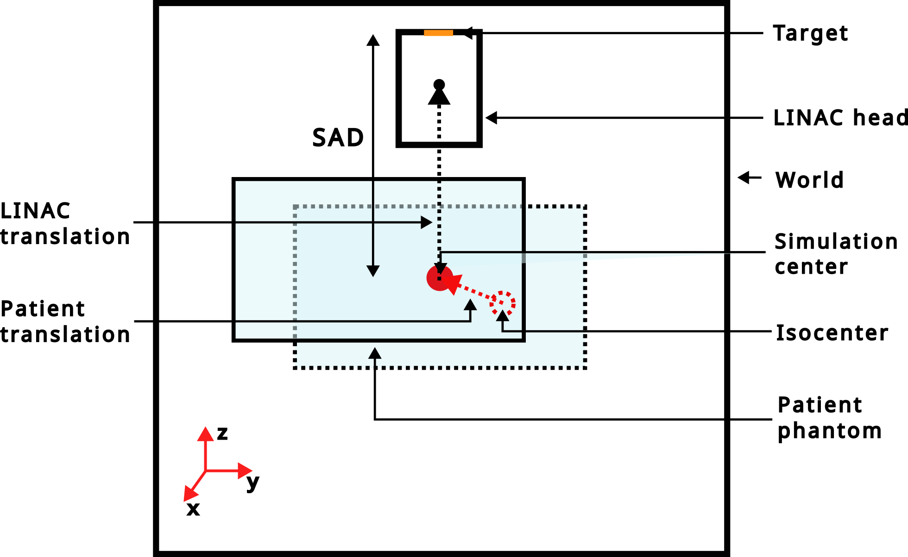

Contributions
=============

The "contribution folder" contains additional useful functions that do not belong to the core of gate.

Dose rate computation
---------------------

(documentation TODO), test035

Phantoms
--------

### Phantom: IEC 6 spheres NEMA phantom

An analytical model of the 6 spheres IEC NEMA phantom is provided. It can be used as follows:

.. code-block:: python

    import opengate as gate
    import opengate.contrib.phantoms.nemaiec as gate_iec

    sim = gate.Simulation()
    iec_phantom = gate_iec.add_iec_phantom(sim, 'iec_phantom')
    activities = [3 * BqmL, 4 * BqmL, 5 * BqmL, 6 * BqmL, 9 * BqmL, 12 * BqmL]
    iec_source = gate_iec.add_spheres_sources(sim, 'iec_phantom', 'iec_source', 'all', activities)
    iec_bg_source = gate_iec.add_background_source(sim, 'iec_phantom', 'iec_bg_source', 0.1 * BqmL)

The rotation should be adapted according to your need. The order of the 6 spheres can be changed with the parameter `sphere_starting_angle` of the `add_iec_phantom` command.

.. image:: ../figures/iec_6spheres.png

Examples can be found in `test015 <https://github.com/OpenGATE/opengate/blob/master/opengate/tests/src/test015_iec_phantom_1.py>`_ (and others).

### Phantom: cylinder phantom for PET NECR

An analytical model of the simple NECR phantom (cylinder and linear source) is provided. It can be used as follows:

.. code-block:: python

    import opengate as gate
    import opengate.contrib.phantoms.necr as gate_necr

    sim = gate.Simulation()
    necr_phantom = gate_necr.add_necr_phantom(sim, 'necr_phantom')
    necr_source = gate_necr.add_necr_source(sim, 'necr_phantom')
    necr_source.activity = 1000 * Bq

Example can be found in `test049 <https://github.com/OpenGATE/opengate/blob/master/opengate/tests/src/test049_pet_digit_blurring_v1.py>`_ (and others).

Radiation therapy linac
-----------------------

**Important Notice**: Please be aware that the models provided within the OpenGate toolkit are based on approximate simulations. Users are strongly encouraged to independently verify these models against empirical data to ensure their applicability and accuracy for specific use cases.

The following models are available:

- Elekta Synergy, without patient-specific collimation systems
- Elekta Versa HD, with Agility multileaf collimator (160 leaves) and back-up jaws.

.. code-block:: python

    import opengate as gate
    import opengate.contrib.linacs.elektasynergy as synergy
    import opengate.contrib.linacs.elektaversa as versa

    sim = gate.Simulation()
    linac1 = synergy.add_linac(sim)
    linac2 = versa.add_linac(sim)

### LINACs reference systems

Each LINAC head is simulated with a z-axis translation relative to the world center. This translation aligns the machine's isocenter with the world center, with a user-defined Source-Axis Distance (SAD). The "translation_from_sad" function (example in `test019_linac_elekta_versa.py <https://github.com/OpenGATE/opengate/blob/master/opengate/tests/src/test019_linac_elekta_versa.py>`_) can be used to move the LINAC head with a translation relative to the SAD.

The "rotation_around_user_point" function enables LINAC head rotation around either the world center (i.e., the isocenter) or a user-defined point. Axis and angle lists for each axis must be defined in a way consistent with `Rotation.from_euler <https://docs.scipy.org/doc/scipy/reference/generated/scipy.spatial.transform.Rotation.from_euler.html>`_. An example illustrating how to use this function is available in `test019_elekta_versa.py <https://github.com/OpenGATE/opengate/blob/master/opengate/tests/src/test019_linac_elekta_versa.py>`_.

...

(Full details of LINACs sources, fields, collimators, and more continue here in a similar structured format, depending on the sections and sub-sections required.)

...

SPECT imaging systems
---------------------

**Important Notice**: Please be aware that the models provided within the OpenGate toolkit are based on approximate simulations. Users are strongly encouraged to independently verify these models against empirical data to ensure their applicability and accuracy for specific use cases.

The following models are available:

- GE Discovery 670 SPECT
- Siemens Symbia Intevo Bold SPECT

.. code-block:: python

    import opengate as gate
    import opengate.contrib.spect.ge_discovery_nm670 as discovery
    import opengate.contrib.spect.siemens_intevo as intevo

    sim = gate.Simulation()

    spect = discovery.add_spect_head(sim, "discovery1", collimator_type="melp")
    crystal = sim.volume_manager.get_volume(f"{spect.name}_crystal")
    discovery.add_digitizer_tc99m(sim, crystal.name, "digit_tc99m")

    spect = discovery.add_spect_head(sim, "discovery12", collimator_type="lehr")
    crystal = sim.volume_manager.get_volume(f"{spect.name}_crystal")
    discovery.add_digitizer_lu177(sim, crystal.name, "digit_lu177")

    spect = intevo.add_spect_head(sim, "intevo1", collimator_type="melp")
    crystal = sim.volume_manager.get_volume(f"{spect.name}_crystal")
    intevo.add_digitizer_tc99m(sim, crystal.name, "digit_tc99m")

    spect = discovery.add_spect_head(sim, "intevo2", collimator_type="lehr")
    crystal = sim.volume_manager.get_volume(f"{spect.name}_crystal")
    intevo.add_digitizer_lu177(sim, crystal.name, "digit_lu177")

test028

PET imaging systems
-------------------

**Important Notice**: Please be aware that the models provided within the OpenGate toolkit are based on approximate simulations. Users are strongly encouraged to independently verify these models against empirical data to ensure their applicability and accuracy for specific use cases.

The following models are available:

- Philips Vereos Digital PET
- Siemens Biograph Vision PET

test037
