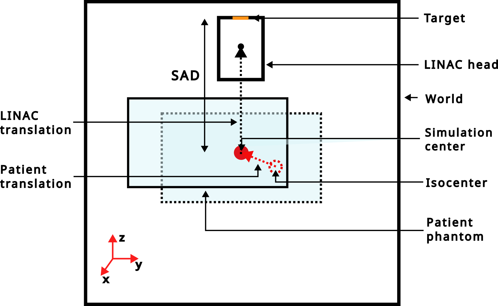

Radiation therapy linac
=======================

**Important Notice**: Please be aware that the models provided within the OpenGate toolkit are based on approximate simulations. Users are strongly encouraged to independently verify these models against empirical data to ensure their applicability and accuracy for specific use cases.

Elekta Synergy (no collimator)
------------------------------

This example comes without a patient-specific collimation system.

.. code-block:: python

    import opengate as gate
    import opengate.contrib.linacs.elektasynergy as synergy

    sim = gate.Simulation()
    linac = synergy.add_linac(sim)

Elekta Versa HD
---------------

This linac is with the Agility multileaf collimator (160 leaves) and back-up jaws.

.. code-block:: python

    import opengate as gate
    import opengate.contrib.linacs.elektaversa as versa

    sim = gate.Simulation()
    linac = versa.add_linac(sim)

Each LINAC head is simulated with a z-axis translation relative to the world center. This translation aligns the machine's isocenter with the world center, with a user-defined Source-Axis Distance (SAD). The "translation_from_sad" function (example in `test019_linac_elekta_versa.py <https://github.com/OpenGATE/opengate/blob/master/opengate/tests/src/geometry/test019_linac_elekta_versa.py>`_) can be used to move the LINAC head with a translation relative to the SAD.

The "rotation_around_user_point" function enables LINAC head rotation around either the world center (i.e., the isocenter) or a user-defined point. Axis and angle lists for each axis must be defined in a way consistent with `Rotation.from_euler <https://docs.scipy.org/doc/scipy/reference/generated/scipy.spatial.transform.Rotation.from_euler.html>`_. An example illustrating how to use this function is available in `test019_elekta_versa.py <https://github.com/OpenGATE/opengate/blob/master/opengate/tests/src/geometry/test019_linac_elekta_versa.py>`_.

