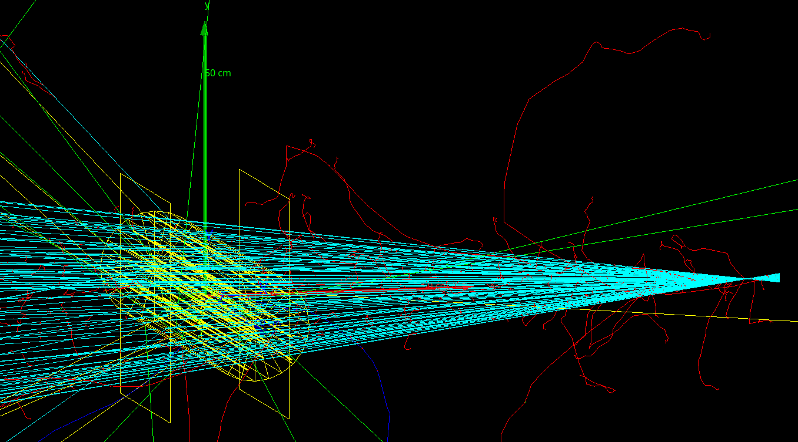

From GATE 9 to 10 - Example Proton CT
*************************************

This is an example of a proton beam with a spiral phantom placed in between two proton detectors. The spiral phantom was used in the article `Filtered backprojection proton CT reconstruction along most likely paths by Rit et al <https://doi.org/10.1118/1.4789589>`_. The data generated by this simulation can be processed by the `PCT software <https://github.com/SimonRit/PCT>`_.

Initialization
==============

GATE 9
------

.. code-block::

      /gate/run/initialize

      /gate/random/setEngineName MersenneTwister
      /gate/random/setEngineSeed auto

      /gate/application/setTimeSlice              1 s
      /gate/application/setTimeStart              0 s
      /gate/application/setTimeStop               360 s

      /gate/application/setTotalNumberOfPrimaries 720000

GATE 10
-------

.. code-block:: python

    n = 360

    # Units
    nm = gate.g4_units.nm
    mm = gate.g4_units.mm
    cm = gate.g4_units.cm
    m = gate.g4_units.m
    sec = gate.g4_units.second
    MeV = gate.g4_units.MeV
    Bq = gate.g4_units.Bq

    # Simulation
    sim = gate.Simulation()

    sim.random_engine = "MersenneTwister"
    sim.random_seed = "auto"
    sim.run_timing_intervals = [[i * sec, (i + 1) * sec] for i in range(n)]
    sim.check_volumes_overlap = False
    sim.visu = True
    sim.visu_type = "qt"
    sim.g4_verbose = False
    sim.progress_bar = True
    sim.number_of_threads = 1
    sim.output_dir = "output"

    # Misc
    yellow = [1, 1, 0, 1]

Geometry
========

GATE 9
------

.. code-block::

    /gate/geometry/setMaterialDatabase  data/GateMaterials.db
    /gate/world/setMaterial             Air
    /gate/world/geometry/setXLength     4 m
    /gate/world/geometry/setYLength     4 m
    /gate/world/geometry/setZLength     4 m

GATE 10
-------

.. code-block:: python

    sim.volume_manager.add_material_database(path_to_gate_materials)
    sim.world.material = "Air"
    sim.world.size = [4 * m, 4 * m, 4 * m]

Phantom
=======

GATE 9
------

.. code-block::

    /gate/world/daughters/name              Spiral
    /gate/world/daughters/insert            cylinder
    /gate/Spiral/geometry/setRmin           0 cm
    /gate/Spiral/geometry/setRmax           10 cm
    /gate/Spiral/geometry/setHeight         40 cm
    /gate/Spiral/setMaterial                Water
    /gate/Spiral/vis/setColor               yellow
    /gate/Spiral/vis/setVisible             1

    # Insert at radius 0.00 mm and angle 0.00 degree
    /gate/Spiral/daughters/name             SpiralInsert01
    /gate/Spiral/daughters/insert           cylinder
    /gate/SpiralInsert01/geometry/setRmin         0 mm
    /gate/SpiralInsert01/geometry/setRmax         1 mm
    /gate/SpiralInsert01/geometry/setHeight       40 cm
    /gate/SpiralInsert01/setMaterial              Aluminium
    /gate/SpiralInsert01/placement/setTranslation 0.0000 0.0000 0 mm
    /gate/SpiralInsert01/vis/setColor             yellow
    /gate/SpiralInsert01/vis/setVisible           1

    # ...
    # 24 additional inserts, omitted for brevity
    # ...

    /gate/Spiral/moves/insert       rotation
    /gate/Spiral/rotation/setSpeed  1 deg/s
    /gate/Spiral/rotation/setAxis   0 0 0

GATE 10
-------

.. code-block:: python

    def add_spiral_insert(sim, mother, name, rmin=0 * mm, rmax=1 * mm, dz=20 * cm, material="Aluminium", translation=[0 * mm, 0 * mm, 0 * mm], color=yellow):
      spiral_insert = sim.add_volume("Tubs", name=name)
      spiral_insert.mother = mother.name
      spiral_insert.rmin = rmin
      spiral_insert.rmax = rmax
      spiral_insert.dz = dz
      spiral_insert.material = material
      spiral_insert.translation = translation
      spiral_insert.color = color

    def add_spiral(sim):
      # Mother of all
      spiral = sim.add_volume("Tubs", name="Spiral")
      spiral.rmin = 0 * cm
      spiral.rmax = 10 * cm
      spiral.dz = 20 * cm
      spiral.material = "Water"
      spiral.color = yellow

      # Spiral inserts
      sradius = 4
      radius = list(range(0, 100 - sradius // 2, sradius))
      sangle = 139
      angles = [math.radians(a) for a in range(0, sangle * len(radius), sangle)]
      posx = [radius[i] * math.cos(angles[i]) for i in range(len(radius))]
      posy = [radius[i] * math.sin(angles[i]) for i in range(len(radius))]

      for i in range(len(radius)):
           add_spiral_insert(sim, spiral, f"SpiralInsert{i:02d}", translation=[posx[i] * mm, posy[i] * mm, 0])

      # Spiral rotation
      tr, rot = gate.geometry.utility.volume_orbiting_transform("z", 0, 360, n, spiral.translation, spiral.rotation)
      spiral.add_dynamic_parametrisation(translation=tr, rotation=rot)

    add_spiral(sim)

Beam
====

GATE 9
------

.. code-block::

      /gate/source/addSource mybeam gps
      /gate/source/mybeam/gps/particle       proton
      /gate/source/mybeam/gps/ene/mono       200 MeV
      /gate/source/mybeam/gps/ene/type       Mono
      /gate/source/mybeam/gps/pos/halfx      8 mm
      /gate/source/mybeam/gps/pos/halfy      1 mm
      /gate/source/mybeam/gps/pos/centre     1060 0 0 mm
      /gate/source/mybeam/gps/pos/rot1       0 1 0
      /gate/source/mybeam/gps/pos/rot2       0 0 1
      /gate/source/mybeam/gps/pos/type       Plane
      /gate/source/mybeam/gps/pos/shape      Rectangle
      /gate/source/mybeam/gps/direction      -1 0 0
      /gate/source/mybeam/gps/ang/type       focused
      /gate/source/mybeam/gps/ang/rot1       0 1 0
      /gate/source/mybeam/gps/ang/rot2       0 0 1
      /gate/source/mybeam/gps/ang/focuspoint 1000 0 0 mm

GATE 10
-------

.. code-block:: python

    source = sim.add_source("GenericSource", "mybeam")
    source.particle = "proton"
    source.energy.mono = 200 * MeV
    source.energy.type = "mono"
    source.position.type = "box"
    source.position.size = [1 * nm, 16 * mm, 1 * nm]
    source.position.translation = [1060 * mm, 0 * mm, 0 * mm]
    source.direction.type = "focused"
    source.direction.focus_point = [1000 * mm, 0 * mm, 0 * mm]
    source.n = 720000 / sim.number_of_threads

Physics list
============

GATE 9
------

.. code-block::

      /control/execute mac/physicslist_EM_std.mac
      /control/execute mac/physicslist_HAD_std.mac

GATE 10
-------

.. code-block:: python

    sim.physics_manager.physics_list_name = "QGSP_BIC_EMZ"

Phase spaces
============

GATE 9
------

.. code-block::

      /gate/world/daughters/name                          PlanePhaseSpaceIn
      /gate/world/daughters/insert                        box
      /gate/PlanePhaseSpaceIn/geometry/setXLength         1 nm
      /gate/PlanePhaseSpaceIn/geometry/setYLength         400 mm
      /gate/PlanePhaseSpaceIn/geometry/setZLength         400 mm
      /gate/PlanePhaseSpaceIn/setMaterial                 Air
      /gate/PlanePhaseSpaceIn/vis/setVisible              1
      /gate/PlanePhaseSpaceIn/vis/setColor                yellow

      /gate/actor/addActor PhaseSpaceActor                PhaseSpaceIn
      /gate/actor/PhaseSpaceIn/save                       output/PhaseSpaceIn.root
      /gate/actor/PhaseSpaceIn/attachTo                   PlanePhaseSpaceIn
      /gate/actor/PhaseSpaceIn/enableEkine                true
      /gate/actor/PhaseSpaceIn/enableXPosition            false
      /gate/actor/PhaseSpaceIn/enableYPosition            true
      /gate/actor/PhaseSpaceIn/enableZPosition            true
      /gate/actor/PhaseSpaceIn/enableXDirection           true
      /gate/actor/PhaseSpaceIn/enableYDirection           true
      /gate/actor/PhaseSpaceIn/enableZDirection           true
      /gate/actor/PhaseSpaceIn/enableProductionVolume     false
      /gate/actor/PhaseSpaceIn/enableProductionProcess    false
      /gate/actor/PhaseSpaceIn/enableParticleName         false
      /gate/actor/PhaseSpaceIn/enableWeight               false
      /gate/actor/PhaseSpaceIn/enableTime                 true
      /gate/actor/PhaseSpaceIn/storeSecondaries           true
      /gate/actor/PhaseSpaceIn/useVolumeFrame             false
      /gate/actor/PhaseSpaceIn/storeOutgoingParticles     false               particleFilter
      /gate/actor/PhaseSpaceIn/particleFilter/addParticle proton
      0 0 mm

      /gate/world/daughters/name                           PlanePhaseSpaceOut
      /gate/world/daughters/insert                         box
      /gate/PlanePhaseSpaceOut/geometry/setXLength         1 nm
      /gate/PlanePhaseSpaceOut/geometry/setYLength         400 mm
      /gate/PlanePhaseSpaceOut/geometry/setZLength         400 mm
      /gate/PlanePhaseSpaceOut/setMaterial                 Air
      /gate/PlanePhaseSpaceOut/vis/setVisible              1
      /gate/PlanePhaseSpaceOut/vis/setColor                yellow

      /gate/actor/addActor PhaseSpaceActor                 PhaseSpaceOut
      /gate/actor/PhaseSpaceOut/save                       output/PhaseSpaceOut.root
      /gate/actor/PhaseSpaceOut/attachTo                   PlanePhaseSpaceOut
      /gate/actor/PhaseSpaceOut/enableEkine                true
      /gate/actor/PhaseSpaceOut/enableXPosition            false
      /gate/actor/PhaseSpaceOut/enableYPosition            true
      /gate/actor/PhaseSpaceOut/enableZPosition            true
      /gate/actor/PhaseSpaceOut/enableXDirection           true
      /gate/actor/PhaseSpaceOut/enableYDirection           true
      /gate/actor/PhaseSpaceOut/enableZDirection           true
      /gate/actor/PhaseSpaceOut/enableProductionVolume     false
      /gate/actor/PhaseSpaceOut/enableProductionProcess    false
      /gate/actor/PhaseSpaceOut/enableParticleName         false
      /gate/actor/PhaseSpaceOut/enableWeight               false
      /gate/actor/PhaseSpaceOut/enableTime                 true
      /gate/actor/PhaseSpaceOut/storeSecondaries           true
      /gate/actor/PhaseSpaceOut/useVolumeFrame             false
      /gate/actor/PhaseSpaceOut/storeOutgoingParticles     false
      /gate/actor/PhaseSpaceOut/particleFilter/addParticle proton

GATE 10
-------

.. code-block:: python

      def add_detector(sim, name, translation):
          plane = sim.add_volume("Box", "PlanePhaseSpace" + name)
          plane.size = [1 * nm, 400 * mm, 400 * mm]
          plane.translation = translation
          plane.material = "Air"
          plane.color = yellow

          phase_space = sim.add_actor("PhaseSpaceActor", "PhaseSpace" + name)
          phase_space.attached_to = plane.name
          phase_space.attributes = [
              "RunID",
              "EventID",
              "TrackID",
              "TrackCreatorProcess",
              "KineticEnergy",
              "Position",
              "Direction",
              "GlobalTime"
          ]
          filter = sim.add_filter("ParticleFilter", "Filter" + name)
          filter.particle = "proton"
          phase_space.filters.append(filter)
          return phase_space

      phsp_actor_in = add_detector(sim, "In", [110 * mm, 0 * mm, 0 * mm])
      phsp_actor_out = add_detector(sim, "Out", [-110 * mm, 0 * mm, 0 * mm])
      phsp_actor_in.output_filename = "PhaseSpaceIn.root"
      phsp_actor_out.output_filename = "PhaseSpaceOut.root"

Particles stats
===============

GATE 9
------

.. code-block::

      /gate/actor/addActor  SimulationStatisticActor stat
      /gate/actor/stat/save output/protonct.txt

GATE 10
-------

.. code-block:: python

    stat = sim.add_actor("SimulationStatisticsActor", "stat")
    stat.output_filename = "protonct.json"

Main
====

GATE 9
------

.. code-block::

      /gate/application/start

GATE 10
-------

.. code-block:: python

    sim.run()
