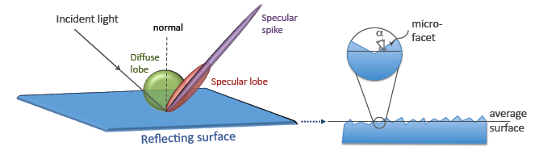
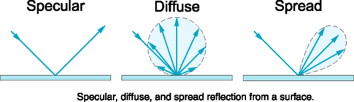

************************
Details: Optical photons
************************

Before discussing how to use the optical photon tracking, it has to be mentioned that there are a few disadvantages in using optical transport. First, the simulation time will increase dramatically. For example, most scintillators used in PET generate in the order of 10,000 optical photons at 511 keV, which means that approximately 10,000 more particles have to be tracked for each annihilation photon that is detected. Although the tracking of optical photons is relatively fast, a simulation with optical photon tracking can easily be a factor thousand slower than one without. Finally, in order to perform optical simulations, many parameters are needed for the materials and surfaces, some of which may be difficult to determine.

Optical Photon Generation
-------------------------
Optical photon source can be implemented as any particle source using the GenericSource class. The particle type should be set to `opticalphoton`.
Optical photon polarization is not yet implemented. A random polarization is therefore assumed.

.. code:: python

    source = sim.add_source('GenericSource', 'OpticalPhotonSource')
    source.particle = 'opticalphoton'
    source.position.type = 'point'
    source.position.translation = [0, 0, 0]
    source.n = 100
    source.energy.mono = 1.9*eV
    source.mother = 'world
    source.direction.type = "iso"

Optical photon physics
----------------------

To enable optical physics in Gate10, one must add the following line:

.. code:: python

    sim.physics_manager.special_physics_constructors.G4OpticalPhysics = True

This allows the following processes:

- OpticalAbsorption
- OpticalRayleigh
- OpticalBoundary
- OpticalMie
- OpticalWLS
- Scintillation
- Cerenkov

Defining material properties
----------------------------

The optical properties of materials are stored in a material property table. In this table each of the properties of a material is identified by a name. There are two kinds of properties. The first are constant properties, these contain only one value. The second are property vectors, these contain properties that depend on the energy of the optical photon. Such a vector is a list of energy-value pairs.

The property tables for the materials used in a simulation are to be stored in a file separate from the material database. This makes it easier to change the properties without having to change the material database. This file should be named *Materials.xml*. When GATE reads in a material from the materials database, it also checks if the Materials.xml file contains a property table for this material. If so, this table is read in and coupled to the material.

This file can be imported in your Python script using the following line:

.. code:: python

    sim.physics_manager.optical_properties_file = "path_to_file/Materials.xml"

The following sections describe the properties that can be defined in the *Materials.xml* file for the various optcial processes.

Scintillation
-------------

A scintillator is characterized by its photon emission spectrum. The scintillation follows an exponential decay with up to three time constants. The relative strength of the components as a fraction of the total scintillation yield is given by `SCINTILLATIONYIELD1`, `SCINTILLATIONYIELD2` and `SCINTILLATIONYIELD3`. The emission spectra of the decays are given by the property vectors `SCINTILLATIONCOMPONENT1`, `SCINTILLATIONCOMPONENT2` and `SCINTILLATIONCOMPONENT3` and the time constants `SCINTILLATIONTIMECONSTANT1`, `SCINTILLATIONTIMECONSTANT2` and `SCINTILLATIONTIMECONSTANT3`. These vectors specify the probability that a photon with the given energy is emitted. The sum of each of the vectors should therefore be one.

In order to have scintillation in a material, the first parameter that has to be specified is the `SCINTILLATIONYIELD` (1/Mev, 1/keV), which gives the number of photons that is emitted per amount of energy absorbed, or, more precisely, it gives the expectation value of this number, since the real number of emitted photons follows a normal distribution. The variance of this normal distribution is `RESOLUTIONSCALE` times this expectation value. Thus, for example, when a gamma photon deposits
amount of energy in the scintillator, optical photons are emitted with an expectation value of:

.. math::

    \mu_N = E \cdot SCINTILLATIONYIELD

...

and a standard deviation of :

.. math::

    \sigma_N = RESOLUTIONSCALE \cdot \sqrt{E \cdot SCINTILLATIONYIELD}.

The parameters `RESOLUTIONSCALE` can be calculated from the energy resolution of the scintillator. The energy resolutions specified in the literature may contain contributions of electronic noise. The energy resolution needed to calculate the RESOLUTIONSCALE should be the intrinsic energy resolution of the scintillator.

.. math::

    RESOLUTIONSCALE = \frac{R}{2 \sqrt{2 \cdot \log(2)}} \cdot \sqrt{E \cdot SCINTILLATIONYIELD},

where `R` is the energy resolution (FWHM - Full width at half maximum) at energy `E`:

.. code:: XML

    <material name="BGO">
        <propertiestable>
            <property name="SCINTILLATIONYIELD" value="8500" unit="1/MeV"/>
            <property name="RESOLUTIONSCALE" value="1.0"/>
            <property name="SCINTILLATIONTIMECONSTANT1" value="300" unit="ns"/>
            <property name="SCINTILLATIONTIMECONSTANT2" value="60" unit="ns"/>
            <property name="SCINTILLATIONYIELD1" value="0.9"/>
            <property name="SCINTILLATIONYIELD2" value="0.1"/>
            <propertyvector name="SCINTILLATIONCOMPONENT1" energyunit="eV">
                <ve energy="2.5" value="1"/>
                <ve energy="2.5" value="1"/>
            </propertyvector>
            <propertyvector name="SCINTILLATIONCOMPONENT2" energyunit="eV">
                <ve energy="2.5" value="1"/>
                <ve energy="2.5" value="1"/>
            </propertyvector>
        </propertiestable>
    </material>

In the above example the scintillation of BGO (Bismuth Germanate) is set to have a scintillation yield of 8500 optical photons per MeV, with a resolution scale of 1.0. Two scintillation time constants are defined and set to 300 ns and 60 ns. Their corresponding light yield are set to 0.9 for the first component and 0.1 for the second component. For simplification, the emission spectra of are set to a single energy of 2.5 eV with a relative intensity of 1.

Cerenkov photons
----------------

The radiation of Cerenkov light occurs when a charged particle moves through a dispersive medium faster than the group velocity of light in that medium. Photons are emitted on the surface of a cone, whose opening angle with respect to the particle’s instantaneous direction decreases as the particle slows down. To generate Cerenkov optical photons in a material, refractive index must be specified using the material property name `RINDEX`.

.. code:: XML

    <material name="PWO">
        <propertiestable>
            <propertyvector name="RINDEX" energyunit="eV">
                <ve energy="1.84" value="2.16"/>
                <ve energy="4.08" value="2.16"/>
            </propertyvector>
        </propertiestable>
    </material>

In this example, the refractive index of PWO (Lead Tunstate) is set to a constant value of 2.16 on the optical photon energy range of 1.84 eV to 4.08 eV.

**Warning about Cherenkov process:** Only activating the Cherenkov process is not enough to add the Cerenkov process in a volume. One also need to define an appropriate physics cut in the volume of interest, for the particule type of interest. For instance a cut in the order of 0.1 mm is required for electrons in order to generate Cerenkov photons.

.. code:: python

    sim.physics_manager.set_production_cut(my_volume.name, "e-", 0.1*mm)

Absorption
----------

This process kills the particle. It requires the Material.xml properties filled by the user with the Absorption length ABSLENGTH (average distance traveled by a photon before being absorbed by the medium):

.. code:: XML

    <material name="LSO">
        <propertiestable>
            <propertyvector name="ABSLENGTH" unit="m" energyunit="eV">
                <ve energy="1.84" value="50"/>
                <ve energy="4.08" value="50"/>
            </propertyvector>
        </propertiestable>
    </material>

In this example the absorption length of LSO (Lutetium Oxyorthosilicate) is set to a constant value of 50 m on the optical photon energy range of 1.84 eV to 4.08 eV.

Mie Scattering
--------------

Mie Scattering is an analytical solution of Maxwell’s equations for scattering of optical photons by spherical particles. It is significant only when the radius of the scattering object is of order of the wave length.The analytical expressions for Mie Scattering are very complicated. One common approximation (followed by Geant4) made is called Henyey-Greenstein (HG).

The Geant4 implementation of this model defines the differential cross section by:

.. math::

    \frac{d\sigma}{d\Omega} = r\frac{d\sigma(\theta_f, g_f)}{d\Omega} + (1-r)\frac{d\sigma(\theta_b, g_b)}{d\Omega},

where the forward (repectively backward) anisotropy is defined by the parameter :math:`g_f` (respectively :math:`g_b`). It corresponds to:

.. math::

    g_{f,b} = <\cos[\theta_{f, b}]>,

the average cosine of the forward and backward scatterings angle :math:`\theta_{f,b}`. These forward and backward anisotropies are defined in GATE in the *Materials.xml* file as the parameters `MIEHG_FORWARD` and `MIEHG_BACKWARD`. The parameter :math:`r` is the ratio of forward to total scattering. It is defined in GATE in the *Materials.xml* file as the parameter `MIEHG_FORWARD_RATIO`. Finally the energy-dependant scattering length is defined in the *Materials.xml* file as the parameter `MIEHG`.

.. code:: XML

    <material name="Epidermis">
        <propertiestable>
            <property name="MIEHG_FORWARD" value="0.8" />
            <property name="MIEHG_BACKWARD" value="0.8" />
            <property name="MIEHG_FORWARD_RATIO" value="1.0" />
            <propertyvector name="MIEHG" unit="mm" energyunit="eV">
                <ve energy="1.8" value="0.07326"/>
                <ve energy="1.87" value="0.07326"/>
                <ve energy="2.0" value="0.07326"/>
            </propertyvector>
        </propertiestable>
    </material>

In the above example, the Mie scattering of the epidermis is set to have a forward and backward anisotropy of 0.8, with a forward ratio of 1.0. The energy-dependant scattering length is set to aconstant value of 0.07326 mm on the optical photon energy range of 1.8 eV to 2.0 eV.

Rayleigh Scattering
-------------------

Rayleigh scattering is the scattering of light by particles much smaller than the wavelength of the light. It is implemented in Geant4 as a special case of Mie scattering. It is defined in GATE as a energy-dependant scattering length vector in the *Materials.xml* file with the parameter `RAYLEIGH`.

.. code:: XML

    <material name="Water">
        <propertiestable>
            <propertyvector name="RAYLEIGH" unit="mm" energyunit="eV">
                <ve energy="1.0" value="10.8"/>
                <ve energy="1.97" value="10.8"/>
                <ve energy="2.34" value="10.3"/>
                <ve energy="4.0" value="10.4"/>
            </propertyvector>
        </propertiestable>
    </material>

In the above example the Rayleigh scattering length of a turbid water is set to values of 10.8 mm to 10.3 mm on the optical photon energy range of 1 eV to 4 eV.

Fluorescence / Wavelength shifting (WLS)
----------------------------------------

Fluorescence is a 3 step process: The fluorophore is in an excited state after the absorption of an optical photon provided by an external source (laser, lamp). The life time of the excited state is of order of 1-10ns during which the fluorophore interacts with its environment and ends-up in a relaxed-excited state. The last step is the emission of a fluorescent photon which energy/wave length is smaller(larger) than the one of the excitation optical photon.

Gate user needs to provide four parameters/properties to define the fluorescent material: `RINDEX`, `WLSABSLENGTH`, `WLSCOMPONENT` and `WLSTIMECONSTANT`. The `WLSABSLENGTH` defines the fluorescence absorption length which is the average distance travelled by a photon before it is absorbed by the fluorophore. This distance could be very small but probably not set to 0 otherwise the photon will be absorbed immediately upon entering the fluorescent volume and fluorescent photon will appear only from the surface. The `WLSCOMPONENT` describes the emission spectrum of the fluorescent volume by giving the relative strength between different photon energies. Usually these numbers are taken from measurements (i.e. emission spectrum). The `WLSTIMECONSTANT` defines the time delay between the absorption and re-emission.
The WLS process has an absorption spectrum and an emission spectrum. If these overlap then a WLS photon may in turn be absorpted and emitted again. If you do not want that you need to avoid such overlap. The WLS process does not distinguish between "original" photons and WLS photons:

.. code:: XML

    <material name="Fluorescein">
        <propertiestable>
            <propertyvector name="RINDEX" energyunit="eV">
                <ve energy="1.0" value="1.4"/>
                <ve energy="4.13" value="1.4"/>
            </propertyvector>
            <propertyvector name="WLSABSLENGTH" unit="cm" energyunit="eV">
                <ve energy="3.19" value="2.81"/>
                <ve energy="3.20" value="2.82"/>
                <ve energy="3.21" value="2.81"/>
            </propertyvector>
            <propertyvector name="WLSCOMPONENT" energyunit="eV">
                <ve energy="1.771"  value="0.016"/>
                <ve energy="1.850"  value="0.024"/>
                <ve energy="1.901"  value="0.040"/>
                <ve energy="2.003"  value="0.111"/>
                <ve energy="2.073"  value="0.206"/>
                <ve energy="2.141"  value="0.325"/>
                <ve energy="2.171"  value="0.413"/>
                <ve energy="2.210"  value="0.540"/>
                <ve energy="2.250"  value="0.683"/>
                <ve energy="2.343"  value="0.873"/>
                <ve energy="2.384"  value="0.968"/>
                <ve energy="2.484"  value="0.817"/>
                <ve energy="2.749"  value="0.008"/>
                <ve energy="3.099"  value="0.008"/>
            </propertyvector>
            <property name="WLSTIMECONSTANT" value="1.7" unit="ns"/>
        </propertiestable>
    </material>

In this example fluorescence propoerties of `fluorescein <https://en.wikipedia.org/wiki/Fluorescein>`_ in a solution (water or alcohol) is defined with aconstant refractive index of 1.4, a fluorescence absorption length of 2.81 cm to 2.82 cm on the optical photon energy range of 3.19 eV to 3.21 eV. The fluorescence emission spectrum is defined with relative intensities over the 1.771 eV to 3.099 eV range. The time constant of the fluorescence is set to 1.7 ns.

Boundary Processes
------------------

When a photon arrives at a medium boundary its behavior depends on the nature of the two materials that join at that boundary.

In the case of two dielectric materials, the photon can undergo total internal reflection, refraction or reflection, depending on the photon’s wavelength, angle of incidence, and the refractive indices on both sides of the boundary. In the case of an interface between a dielectric and a metal, the photon can be absorbed by the metal or reflected back into the dielectric. When simulating a perfectly smooth surface, the user doesn’t have to provide a G4Surface. The only relevant property is the refractive index (RINDEX) of the two materials on either side of the interface. Geant4 will calculate from Snell’s Law the probabilities of refraction and reflections.

Defining surfaces
~~~~~~~~~~~~~~~~~

.. image:: ../figures/surface-definition.png

The photon travels through the surface between the two volumes Volume1 and Volume2. The surface between Volume1 and Volume2 is NOT the same surface as that between Volume2 and Volume1; the surface definition is directional. When there is optical transport in both directions, two surfaces should be created.

To create optical surfaces from Volume1 to Volume2 and *vice versa*, the following commands should be used:

.. code:: python

    sim.physics_manager.add_optical_surface(
        volume_from="name_of_volume 1",
        volume_to="name_of_volume 2",
        g4_surface_name="surface_name"
    )

    sim.physics_manager.add_optical_surface(
        volume_from="name_of_volume 2",
        volume_to="name_of_volume 1",
        g4_surface_name="surface_name"
    )

While the `volume_from` and `volume_to` arguments must reference a volume defined in the Python simulation script, `surface_name` can be any surface defined in the *SurfaceProperties.xml* file. This external file must be loaded with the following command:

.. code:: python

    sim.physics_manager.surface_properties_file = "path_to/SurfaceProperties.xml"

*Note: a `SurfaceProperties.xml <https://github.com/OpenGATE/opengate/blob/master/opengate/data/SurfaceProperties.xml>`_ file already containing many surfaces type is loaded by default when imortint the opengate module. It is located in the Gate installation directory in the `data` folder.*

Surfaces can be defined  in this file in two ways corresponding to two boundary models:
- The **LUT_Davis model** ;
- The **Unified model**.

LUT_Davis model
~~~~~~~~~~~~~~~

This is a model for optical transport called the LUT Davis model [Roncali& Cherry(2013)]. The model is based on measured surface data and allows the user to choose from a list of available surface finishes. Provided are a rough and a polished surface that can be used without reflector, or in combination with a specular reflector (e.g. ESR) or a Lambertian reflector (e.g. Teflon). The specular reflector can be coupled to the crystal with air or optical grease. Teflon tape is wrapped around the crystal with 4 layers.

.. code:: XML

    <surface model="DAVIS" name="RoughTeflon_LUT" type="dielectric_LUTDAVIS" finish="RoughTeflon_LUT">
    </surface>

The above example show how the `RoughTeflon_LUT` surface name is defined. Surface names of available LUTs are:

+-----------+--------------+--------------------+-----------------+-----------------------+
|           |   BARE       |      TEFLON        |   ESR AIR       |   ESR GREASE          |
+===========+==============+====================+=================+=======================+
| POLISHED  | Polished_LUT | PolishedTeflon_LUT | PolishedESR_LUT | PolishedESRGrease_LUT |
+-----------+--------------+--------------------+-----------------+-----------------------+
| ROUGH     | Rough_LUT    | RoughTeflon_LUT    |  RoughESR_LUT   |  RoughESRGrease_LUT   |
+-----------+--------------+--------------------+-----------------+-----------------------+

The user can extend the list of finishes with custom measured surface data. In GATE, this can be achieved by utilising `this <https://github.com/LUTDavisModel/Standalone-Application-Installers>`_ tool to calculate LUTs. In the LUT database, typical roughness parameters obtained from the measurements are provided to characterize the type of surface modelled:

- ROUGH: :math:`Ra=0.48 µm`, :math:`\sigma=0.57 µm`, :math:`Rpv=3.12 µm`
- POLISHED: :math:`Ra=20.8 nm`, :math:`\sigma=26.2 nm`, :math:`Rpv=34.7 nm`

with :math:`Ra` the average roughness ; :math:`\sigma` the roughness rms and :math:`Rpv` the peak-to-valley ratio.

In addition, the detector surface, called **Detector_LUT**, defines a polished surface coupled to a photodetector with optical grease or a glass interface (similar index of refraction 1.5). Any surface can be used as a detector surface when the Efficiency is set according to the following example:

.. code:: XML

     <surface model="DAVIS" name="Detector_LUT" type="dielectric_LUTDAVIS" finish="Detector_LUT">
     <propertiestable>
        <propertyvector name="EFFICIENCY" energyunit="eV">
            <ve energy="1.84" value="1"/>
            <ve energy="4.08" value="1"/>
        </propertyvector>
    </propertiestable>
  </surface>

Background
^^^^^^^^^^

The crystal topography is obtained with atomic force microscopy (AFM). From the AFM data, the probability of reflection (1) and the reflection directions (2) are computationally determined, for incidence angles ranging from 0° to 90°. Each LUT is computed for a given surface and reflector configuration. The reflection probability in the LUT combines two cases: directly reflected photons from the crystal surface and photons that are transmitted to the reflector surface and later re-enter the crystal. The key operations of the reflection process are the following: The angle between the incident photon (Old Momentum) and the surface normal are calculated. The probability of reflection is extracted from the first LUT. A Bernoulli test determines whether the photon is reflected or transmitted. In case of reflection two angles are dcoden from the reflection direction LUT.

.. image:: ../figures/flowchart_lut_model.png

Old Momentum to New Momentum. The old momentum is the unit vector that describes the incident photon. The reflected/transmitted photon is the New Momentum described by two angles :math:`\phi`, :math:`\theta`.

UNIFIED Model
~~~~~~~~~~~~~

The UNIFIED model allows the user to control the radiant intensity of the surface: Specular lobe, Specular spike, Backscatter spike (enhanced on very rough surfaces) and Reflectivity (Lambertian or diffuse distribution). The sum of the four constants is constrained to unity. In that model, the micro-facet normal vectors follow a Gaussian distribution defined by sigmaalpha (:math:`\sigma_{\alpha}`) given in degrees. This parameter defines the standard deviation of the Gaussian distribution of micro-facets around the average surface normal. In the case of a perfectly polished surface, the normal used by the G4BoundaryProcess is the normal to the surface.

An example of a surface definition looks like:

.. code:: XML

    <surface name="rough_teflon_wrapped" type="dielectric_dielectric" sigmaalpha="0.1" finish="groundbackpainted">
        <propertiestable>
            <propertyvector name="SPECULARLOBECONSTANT" energyunit="eV">
                <ve energy="4.08" value="1"/>
                <ve energy="1.84" value="1"/>
            </propertyvector>
            <propertyvector name="RINDEX" energyunit="eV">
                <ve energy="4.08" value="1"/>
                <ve energy="1.84" value="1"/>
            </propertyvector>
            <propertyvector name="REFLECTIVITY" energyunit="eV">
                <ve energy="1.84" value="0.95"/>
                <ve energy="4.08" value="0.95"/>
            </propertyvector>
            <propertyvector name="EFFICIENCY" energyunit="eV">
                <ve energy="1.84" value="0"/>
                <ve energy="4.08" value="0"/>
            </propertyvector>
        </propertiestable>
    </surface>

The attribute type can be either dielectric_dielectric or dielectric_metal, to model either a surface between two dielectrica or between a dielectricum and a metal. The attribute sigma-alpha models the surface roughness and is discussed in the next section. The attribute finish can have one of the following values: ground, polished, ground-back-painted, polished-back-painted, ground-front-painted and polished-front-painted. It is therefore possible to cover the surface on the inside or outside with a coating that reflects optical photons using Lambertian reflection. In case the finish of the surface is polished, the surface normal is used to calculate the probability of reflection. In case the finish of the surface is ground, the surface is modeled as consisting of small micro-facets. When an optical photon reaches a surface, a random angle

is dcoden for the micro facet that is hit by the optical photon. Using the angle of incidence of the optical photon with respect to this micro facet and the refractive indices of the two media, the probability of reflection is calculated.

In case the optical photon is reflected, four kinds of reflection are possible. The probabilities of the first three are given by the following three property vectors:
- SPECULARSPIKECONSTANT gives the probability of specular reflection about the average surface normal
- SPECULARLOBECONSTANT gives the probability of specular reflection about the surface normal of the micro facet
- BACKSCATTERCONSTANT gives the probability of reflection in the direction the optical photon came from

LAMBERTIAN (diffuse) reflection occurs when none of the other three types of reflection happens. The probability of Lambertian reflection is thus given by one minus the sum of the other three constants.

When the photon is refracted, the angle of refraction is calculated from the surface normal (of the average surface for polished and of the micro facet for rough) and the refractive indices of the two media.

When an optical photon reaches a painted layer, the probability of reflection is given by the property vector `REFLECTIVITY`. In case the paint is on the inside of the surface, the refractive indices of the media are ignored, and when the photon is reflected, it undergoes Lambertian reflection.

When the paint is on the outside of the surface, whether the photon is reflected on the interface between the two media is calculated first, using the method described in the previous section. However, in this case the refractive index given by the property vector RINDEX of the surface is used. When the photon is refracted, it is reflected using Lambertian reflection with a probability `REFLECTIVITY`. It then again has to pass the boundary between the two media. For this, the method described in the previous section is used again and again, until the photon is eventually reflected back into the first medium or is absorbed by the paint.

A dielectric_dielectric surface may have a wavelength dependent property `TRANSMITTANCE`. If this is specified for a surface it overwrites the Snell’s law’s probability. This allows the simulation of anti-reflective coatings.

Detection of optical photons
^^^^^^^^^^^^^^^^^^^^^^^^^^^^

Optical photons can be detected by using a dielectric-metal boundary. In that case, the probability of reflection should be given by the `REFLECTIVITY` property vector. When the optical photon is reflected, the UNIFIED model is used to determine the reflection angle. When it is absorbed, it is possible to detect it. The property vector `EFFICIENCY` gives the probability of detecting a photon given its energy and can therefore be considered to give the internal quantum efficiency. Note that many measurements of the quantum efficiency give the external quantum efficiency, which includes the reflection: :math:`external quantum efficiency = EFFICIENCY \cdot(1-REFLECTIVITY)`.

The hits generated by the detection of the optical photons are generated in the volume from which the optical photons reached the surface. This volume should therefore contain a digitizer.

OptiGAN
=======

Refer to this `testcase <https://github.com/OpenGATE/opengate/blob/6cd98d3f7d76144889b1615e28a00873ebc28f81/opengate/tests/src/source/test081_simulation_optigan_with_random_seed.py>`_ for a simulation example.

In the default optical simulations of Gate v10, each optical photon generated is treated as a separate track, which can be quite resource-intensive. For instance, approximately one second is required to simulate the spatial distribution of optical photons detected from a single 511 keV gamma ray interaction in a 20 mm thick layer of bismuth germanate (BGO), which has a light yield of about 8500 photons per MeV. Recent advancements in Monte Carlo simulations using deep learning, particularly with Generative Adversarial Networks (GANs), have shown significant potential in reducing simulation times. We have adopted a specific type of GAN known as Wasserstein GAN to enhance the efficiency of generating optical photons in scintillation crystals, which we have named OptiGAN. For more detailed information, you can refer to this `research paper <https://iopscience.iop.org/article/10.1088/2632-2153/acc782>`_.

The OptiGAN model trained with 3 x 3 x 3 mm\ :sup:`3` BGO crystal is already included with Gate 10. More models will be added in the future.

Users can utilize OptiGAN in two ways: they can integrate it into the simulation file, or they can use it after running the simulation.

Method 1 - Running OptiGAN with Simulation
------------------------------------------

.. code-block:: python

    optigan = OptiGAN(input_phsp_actor=phsp_actor)

Method 2 - Running OptiGAN After Simulation
-------------------------------------------

.. code-block:: python

    optigan = OptiGAN(root_file_path=hc.get_output_path())

Method 1 can be used when a user wants to run OptiGAN within the same simulation file. The ``input_phsp_actor`` parameter must be set to the phase space actor attached to the crystal in the simulation. The output will then be saved in the folder specified by ``sim.output_dir``.

Method 2 can be used when a user wants to use OptiGAN in a file outside their main simulation file. In this case, the ``root_file_path`` must be set to the path of the root file obtained from the simulation.

Workflow of OptiGAN module in Gate 10
-------------------------------------

.. image:: ../figures/optigan_working.png

OptiGAN requires two pieces of input information: the position of gamma interaction in the crystal and the number of optical photons emitted. This information is automatically parsed from the root files when users utilize OptiGAN.

- **Position of gamma interaction:** This refers to the coordinate information of gamma interaction with the scintillation crystal.

- **Number of optical photons emitted:** This indicates the total number of optical photons emitted per gamma event.

Obtaining the number of optical photons emitted without modifying Geant4 is challenging. As a workaround for now, we ask users to use a kill actor and add a filter in the test case to eliminate optical photons.

.. code-block:: python

    # filter : remove opticalphoton
    fe = sim.add_filter("ParticleFilter", "fe")
    fe.particle = "opticalphoton"
    fe.policy = "reject"

    # add a kill actor to the crystal
    ka = sim.add_actor("KillActor", "kill_actor2")
    ka.attached_to = crystal
    ka.filters.append(fe)

.. note:: Using a kill actor still creates optical photons, but it terminates the track after the first step. This approach provides us with the required information (number of optical photons emitted) as an input for OptiGAN, while also saving tracking time by terminating the photons early.

.. image:: ../figures/kill_actor.png

The analysis of computation time gained by using OptiGAN in GATE 10 is still under investigation by the team at UC Davis.

