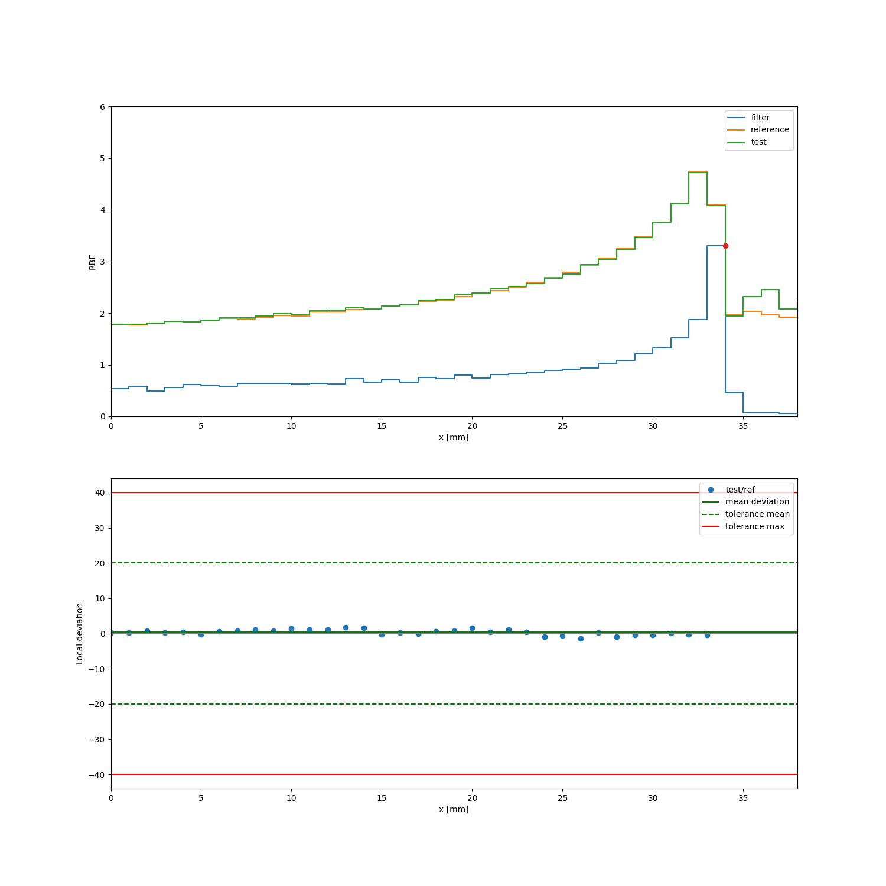

.. _actors-label:

Details: Actors
***************

Overview: Types of actors
-------------------------

Hits-related actors (digitizers)
~~~~~~~~~~~~~~~~~~~~~~~~~~~~~~~~

GATE contains a number of actors that work on a per-hit or per-event basis. A hit in Geant4 refers to a single interaction, i.e. with an associated position, potentially deposited energy, etc. Historically, these actors were developed to mimic the digitization chain in nuclear imaging scanners and are therefore called `digitizers`, but they are actually just actors.

Digitizers can store rich information about the particle involved in the hit, e.g. the type of particle, the kinetic properties, position, as well as information about the hit itself.

Most digitizers can be enchained so that the output of one digitizer provides the input to the next one. The :class:`~.opengate.actors.digitizers.DigitizerHitsCollectionActor` is usually the first one in such a processing chain. It simply collects every hit that occurs in a certain volume and stores in a ROOT file.

The :class:`~.opengate.actors.digitizers.PhaseSpaceActor` is actually a special case of the :class:`~.opengate.actors.digitizers.DigitizerHitsCollectionActor` that stores only certain hits in a volume, rather than all, e.g. the first hit.

Most of the other digitizers process data per event, i.e. one entry in the data is related to one primary particle. The ''compression'' from per-hit to per-event data is for example achieved by the :class:`~.opengate.actors.digitizers.DigitizerAdderActor`.

Most digitizers create a ROOT file as output (except :class:`~.opengate.actors.digitizers.DigitizerProjectionActor`, which outputs an image). The output can be written to disk with ``my_digitizer.root_output.write_to_disk = True``.

If your simulation contains repeated volumes, you need to decide whether you allow a digitizer to be attached to them or not. You can do that via the parameter :attr:`~.opengate.actors.digitizers.DigitizerBase.authorize_repeated_volumes`: Set this to True to work with repeated volumes, such as in PET systems. However, for SPECT heads, you may want to avoid recording hits from both heads in the same file, in which case, set the flag to False.

SimulationStatisticsActor
--------------------------

Description
~~~~~~~~~~~

The SimulationStatisticsActor actor is a very basic tool that allows counting the number of runs, events, tracks, and steps that have been created during a simulation. Most simulations should include this actor as it gives valuable information. The `stats` object contains the `counts` dictionary that contains all results.

.. code-block:: python

   # ...
   stats = sim.add_actor('SimulationStatisticsActor', 'Stats')
   stats.track_types_flag = True
   # ...

   sim.run()
   print(stats)
   print(stats.counts)

In addition, if the flag `track_types_flag` is enabled, the actor will save a dictionary structure with all types of particles that have been created during the simulation, which is available as `stats.counts.track_types`. The start and end time of the whole simulation are  available and speeds are estimated (primary per sec, track per sec, and step per sec).

Reference
~~~~~~~~~

.. autoclass:: opengate.actors.miscactors.SimulationStatisticsActor

KillActor
---------

Description
~~~~~~~~~~~

The KillActor enables the user to "kill", i.e. to stop this particle tracking, during its first step in a defined volume where this actor is attached.
The number of killed particle can be retrieved printing the actor object.

.. code-block:: python

    kill_actor = sim.add_actor("KillActor", "KillAct")
    kill_actor.attached_to = kill_plane
    print(kill_actor)

Refers tot the test064 for more details.

Reference
~~~~~~~~~
.. autoclass:: opengate.actors.miscactors.KillActor

=======

DoseActor
---------

Description
~~~~~~~~~~~

The DoseActor scores the energy deposition (edep) or absorbed dose map in a given volume. The dose map is a 3D matrix parameterized with: size (number of voxels), spacing (voxel size), and translation (according to the coordinate system of the attached volume) and rotation. By default, the matrix is centered according to the volume center. Note that this virtual scoring grid is independent of a potential geometric grid (e.g. simulation using a voxelized CT image as geometry).  The dose map may also have singleton dimensions (dose.size values with 1) reducing its effecctive dimension.

A sample code to score the energy deposition (default) is shown below. Let's assume a geometry of type box with name "waterbox" is already defined and is ``[200, 200, 200] * mm`` big. The dose actor output would now cover the entire size of the "waterbox" and has the same center.

.. code-block:: python

   dose_act_obj = sim.add_actor("DoseActor", "dose_act_obj")
   dose_act_obj.output_filename = "test008-edep.mhd"
   dose_act_obj.attached_to = "waterbox"
   dose_act_obj.size = [100, 100, 100]
   mm = gate.g4_units.mm
   dose_act_obj.spacing = [2 * mm, 2 * mm, 2 * mm]

Adding following lines

.. code-block:: python

   dose_act_obj.dose.active = True
   dose_act_obj.dose_uncertainty.active = True
   dose_act_obj.edep_uncertainty.active = True

to the dose actor object will trigger an additional image scoring the dose. The uncertainty tag will additionally provide an uncertainty image for each of the scoring quantities. Set user_output.edep.active False to disable the edep computation and only return the dose.

**Setting and Evaluating the Statistical Uncertainty Goal**

This section demonstrates how to monitor and enforce a statistical uncertainty goal during a Monte Carlo simulation, particularly in dose simulations using GATE10. It includes how to define the uncertainty criteria, how often to check it, and how to evaluate the final result based on the deposited energy distribution.

To ensure simulation efficiency, we may wish to stop early when a target uncertainty (e.g., 5%) is reached in the high-dose (high-edep) region.

.. code-block:: python

   # Target statistical uncertainty (e.g., 5%)
   unc_goal = 0.05

   # Define how "high-dose" voxels are selected: here, > 70% of max edep value
   thresh_voxel_edep_for_unc_calc = 0.7

   # Planned number of primary particles or events (e.g., 100 MBq)
   n_planned = 100 * 1e6  # 100 million particles

These parameters are then passed to the dose actor:

.. code-block:: python

   dose.uncertainty_goal = unc_goal # 0.05
   dose.uncertainty_first_check_after_n_events = 0.01 * n_planned # check statistical uncertainty every 1 MBq particles
   dose.uncertainty_voxel_edep_threshold = thresh_voxel_edep_for_unc_calc # 0.7

Uncertainty is computed only in high-deposition voxels to focus on the clinically relevant region:

.. code-block:: python

   def calculate_mean_unc(edep_arr, unc_arr, edep_thresh_rel=0.7):
       # Average the uncertainty values ​​over the high energy deposition areas
       edep_max = np.amax(edep_arr)
       mask = edep_arr > edep_max * edep_thresh_rel
       unc_used = unc_arr[mask]
       unc_mean = np.mean(unc_used)

       return unc_mean

Note: This method uses a relative threshold based on the maximum deposited energy, which may be sensitive to outliers. Consider using a percentile-based threshold for robustness if needed.

At the end of the simulation, the actual mean uncertainty and the number of events used are reported:

.. code-block:: python

   # test that final mean uncertainty satisfies the goal uncertainty
   edep_arr = np.asarray(dose.edep.image)
   unc_array = np.asarray(dose.edep_uncertainty.image)
   unc_mean = calculate_mean_unc(edep_arr, unc_array, edep_thresh_rel=thresh_voxel_edep_for_unc_calc)
   n_effective = stats.counts.events

   print(f"{unc_goal = }")
   print(f"{unc_mean = }")
   print(f"{n_planned = }")
   print(f"{n_effective = }")
   if n_effective < n_planned: print("Simulation ended early.")

This can help determine if the simulation converged early due to meeting the uncertainty goal.

Like any image, the output dose map will have an origin, spacing and orientation. By default, it will consider the coordinate system of the volume it is attached to, so at the center of the image volume. The user can manually change the output origin using the option `output_origin` of the DoseActor. Alternatively, if the option `img_coord_system` is set to `True`, the final output origin will be automatically computed from the image the DoseActor is attached to. This option calls the function `get_origin_wrt_images_g4_position` to compute the origin.

.. image:: ../figures/image_coord_system.png

Several tests depict the usage of DoseActor: test008, test009, test021, test035, etc.
The following would translate and rotate the scored image:

.. code-block:: python

   from scipy.spatial.transform import Rotation
   mm = gate.g4_units.mm
   dose_act_obj.translation = [2 * mm, 3 * mm, -2 * mm]
   dose_act_obj.rotation = Rotation.from_euler("y", 90, degrees=True).as_matrix()

In this example a uniform scoring object was created for simplicity. To test trans- and rotations, non-uniform sized and spaced voxelized image are highly encouraged.

The DoseActor has the following output:

- :attr:`~.opengate.actors.doseactors.DoseActor.edep`
- :attr:`~.opengate.actors.doseactors.DoseActor.edep_uncertainty`
- :attr:`~.opengate.actors.doseactors.DoseActor.dose`
- :attr:`~.opengate.actors.doseactors.DoseActor.dose_uncertainty`
- :attr:`~.opengate.actors.doseactors.DoseActor.counts`
- :attr:`~.opengate.actors.doseactors.DoseActor.density`

Reference
~~~~~~~~~

.. autoclass:: opengate.actors.doseactors.DoseActor

.. autoproperty:: opengate.actors.doseactors.DoseActor.edep
.. autoproperty:: opengate.actors.doseactors.DoseActor.edep_uncertainty
.. autoproperty:: opengate.actors.doseactors.DoseActor.dose
.. autoproperty:: opengate.actors.doseactors.DoseActor.dose_uncertainty
.. autoproperty:: opengate.actors.doseactors.DoseActor.counts
.. autoproperty:: opengate.actors.doseactors.DoseActor.density

LETActor
--------

Description
~~~~~~~~~~~

The LET Actor scores the fluence- (also referred to as track-) or dose averaged LET within a volume using a voxelizing parametrization identical to the Dose Actor. Hence, see the Dose Actor documentation for spatial commands like image resolution, origin etc. - the same commands apply for the LET Actor.

.. note:: In most use cases of LET in literature, only a subset of particles is considered for the calculation of averaged LET, e.g. in proton radiotherapy, where often only protons are considered. Therefore, the LET actor often goes along with a particle filter. See test050 as an example.

.. note:: Refer to test050 for a current example.

Reference
~~~~~~~~~

.. autoclass:: opengate.actors.doseactors.LETActor

REActor
--------

Description
~~~~~~~~~~~

The REActor scores the dose-averaged relative effectiveness (RE) map within a given volume, according to `Herrmann et al., 2011 <https://pubmed.ncbi.nlm.nih.gov/21626919/>`_. Spatial options are identical to those of :class:`~.opengate.actors.doseactors.DoseActor`.

.. note:: Refer to test087_beam_quality_actor_re for a current example.

The actor reads a lookup table of RE values as a function of particle and kinetic energy, by `lookup_table_path`. The kinetic energy can be in the unit of either MeV/u or MeV, while remaining consistent with `energy_per_nucleon` option.

.. note:: Particle species with atomic number from 1 to 10 are supported.

The actor has the following outputs:

- :attr:`~.opengate.actors.doseactors.REActor.RE_mix`

Reference
~~~~~~~~~

.. autoclass:: opengate.actors.doseactors.REActor
.. autoproperty:: opengate.actors.doseactors.REActor.RE_mix

RBEActor
--------

Description
~~~~~~~~~~~

The RBEActor scores the relative biological effectiveness (RBE) map within a given volume. Spatial options are identical to those of :class:`~.opengate.actors.doseactors.DoseActor`. The available values for the `model` option are: `mMKM`, `LEM1lda`.

- **mMKM**: The implementation of modified microdosimetric kinetic model (mMKM) was based on `Inaniwa et al., 2010 <https://doi.org/10.1088/0031-9155/55/22/008>`_. The actor reads a lookup table of saturation-corrected dose-averaged specific energy (z*_1D) values by `lookup_table_path`.

- **LEM1lda**: The implementation of local effect model I with low dose approximation (LEM1lda) was based on `Krämer and Scholz, 2006 <https://doi.org/10.1088/0031-9155/51/8/001>`_. The actor reads a lookup table of initial slope (alpha_z) values by `lookup_table_path`.

The format requirement of the lookup table is identical to that in :class:`~.opengate.actors.doseactors.REActor`. By default, the actor uses the radiosensitivity parameters of aerobic `HSG` cells. In order to calculate RBE using the radiosentivity parameters of `Chordoma`, the user should specify by the `cell_type` option.

+----------------------+-----------+-----------+
| Available cell types | alpha_ref | beta_ref  |
+======================+===========+===========+
| HSG                  | 0.764     | 0.0615    |
+----------------------+-----------+-----------+
| Chordoma             | 0.1       | 0.05      |
+----------------------+-----------+-----------+

The actor has the following outputs:

- :attr:`~.opengate.actors.doseactors.RBEActor.rbe` (if `write_RBE_dose_image` is set to `True`, which is the default setting)
- :attr:`~.opengate.actors.doseactors.RBEActor.rbe_dose` (if `write_RBE_dose_image` is set to `True`, which is the default setting)
- :attr:`~.opengate.actors.doseactors.RBEActor.alpha_mix`
- :attr:`~.opengate.actors.doseactors.RBEActor.beta_mix` (if `model` is set to `LEM1lda`)

The user can refer to test087_beam_quality_actor_rbe_mMKM for an example. The test case simulates the central RBE profile (shown in the following figure) and alpha_mix profile of a quasi-monoenergetic carbon ion beam in water, using the `mMKM` model and z*_1D lookup table generated with SURVIVAL (`Manganaro et al., 2018 <https://doi.org/10.1088/1361-6560/aab697>`_). The "reference" RBE profile was simulated using the same configurations, but better statistics (1e5 primaries). The "filter" :attr:`~.opengate.actors.doseactors.DoseActor.edep` profile is shown in arbituary unit to indicate the Bragg peak position, up to which the evaluation is conducted.

.. note:: This test case serves as a reference and does not prescribe specific choices or computations of lookup tables. A publication on the validation of :class:`~.opengate.actors.doseactors.RBEActor` is planned.

Reference
~~~~~~~~~

.. autoclass:: opengate.actors.doseactors.RBEActor
.. autoproperty:: opengate.actors.doseactors.RBEActor.rbe
.. autoproperty:: opengate.actors.doseactors.RBEActor.rbe_dose
.. autoproperty:: opengate.actors.doseactors.RBEActor.alpha_mix
.. autoproperty:: opengate.actors.doseactors.RBEActor.beta_mix

FluenceActor
------------

Description
~~~~~~~~~~~

This actor scores the particle fluence on a voxel grid, essentially by counting the number of particles passing through each voxel. The FluenceActor will be extended in the future with features to handle scattered radiation, e.g. in cone beam CT imaging.

Reference
~~~~~~~~~

.. autoclass:: opengate.actors.doseactors.FluenceActor

TLEDoseActor
------------

Description
~~~~~~~~~~~

This is a variant of the normal :class:`~.opengate.actors.doseactors.DoseActor` which scores dose due to low energy gammas in another way, namely via the track length in the given voxel. Most options as well as the output are identical to the :class:`~.opengate.actors.doseactors.DoseActor`.
It is based on the work of `Baldacci et al., 2014 <https://doi.org/10.1016/j.zemedi.2014.04.001>`_. It is designed to model a photon population instead of treating each photon as a single particle. This approach enables efficient and accurate dose calculation by enabling a multiple energy deposition by a single photon.

**How It Works**
During a step, where a typical photon would interact and deposit its energy stochastically, a TLE photon deposits dose based on the material's mass energy-absorption coefficient (`μ_en`) and the step length. This method implies a local dose deposition at the voxel scale, even though secondary electrons are emitted. This actor indeed do not interfer with the GEANT4 tracking.

Since the database does not take into account the radiative part during the TLE energy deposition calculation, this method is applied to all photons, whether originating from the primary source or from secondary radiative processes. This approach offers a computationally efficient alternative to traditional dose calculation methods.

**Energy Threshold Option**
A novel feature of the TLE actor is the ability to activate or deactivate the TLE mechanism based on a user-defined energy threshold. This provides flexibility in simulations, allowing users to tailor the behavior of the TLE actor according to the energy ranges of interest.

Here is the a classical way to use the TLEDoseActor :

.. code-block:: python

   tle_dose_actor = sim.add_actor("TLEDoseActor", "tle_dose_actor")
   tle_dose_actor.output_filename = "my_output.mhd"
   tle_dose_actor.attached_to = irradiated_volume.name
   tle_dose_actor.dose.active = True
   tle_dose_actor.dose_uncertainty.active = True
   tle_dose_actor.size = [200, 200, 200]
   tle_dose_actor.spacing = [x / y for x, y in zip(irradiated_volume.size, tle_dose_actor.size)]

Refer to test081 for more details.

Reference
~~~~~~~~~

.. autoclass:: opengate.actors.doseactors.TLEDoseActor

VoxelDepositActor
-----------------

This is a common base class used by the actors that scored quantities deposited on voxel grid like the :class:`~.opengate.actors.doseactors.DoseActor`, :class:`~.opengate.actors.doseactors.LETActor`, :class:`~.opengate.actors.doseactors.FluenceActor`, :class:`~.opengate.actors.doseactors.TLEDoseActor`.

.. important:: You cannot use this actor directly in your simulation.

PhaseSpaceActor
---------------

Description
~~~~~~~~~~~

A PhaseSpaceActor stores any set of particles reaching a given volume during the simulation. The list of attributes that are kept for each stored particle can be specified by the user.

.. code-block:: python

   phsp = sim.add_actor("PhaseSpaceActor", "PhaseSpace")
   phsp.attached_to = plane.name
   phsp.attributes = [
       "KineticEnergy",
       "Weight",
       "PostPosition",
       "PrePosition",
       "ParticleName",
       "PreDirection",
       "PostDirection",
       "TimeFromBeginOfEvent",
       "GlobalTime",
       "LocalTime",
       "EventPosition",
   ]
   phsp.output_filename = "test019_hits.root"
   f = sim.add_filter("ParticleFilter", "f")
   f.particle = "gamma"
   phsp.filters.append(f)

In this example, the PhaseSpaceActor will store all particles reaching the given plane. For each particle, some information will be stored, as shown in the attributes array: energy, position, name, time, etc. The list of available attribute names can be found in the file: `GateDigiAttributeList.cpp`.

The output is a ROOT file that contains a tree. It can be analyzed, for example, with `uproot`.

By default, the PhaseSpaceActor stores information about particles entering the volume. This behavior can be modified by the following options:

.. code-block:: python

   phsp.steps_to_store = "entering"  # this is the default
   phsp.steps_to_store = "entering exiting first"  # other options (combined)

The option “first” stores the particle information when it enters the volume to which the actor is attached for the first time. The variables to be used are the PrePosition, PreDirection, etc.

The option “entering” stores the particle information whenever it is at the boundary between the surrounding environment (world, another volume) and the volume to which the actor is attached. The variables to be used are the PrePosition, PreDirection, etc.
For example: if a particle enters the volume only once, its information is stored only once; the option entering is equal to the option first. If a particle passes through a volume, performs n scattering outside of it, and re-enters the volume, its entry information will be stored n times. If a particle interacts with the volume interfaces without exiting the volume (e.g., the reflection of optical photons), the actor will store all instances when the particle is at the boundary (all reflections are stored).

The option “exiting” stores the particle information whenever, starting from within the volume, it is at the boundary between the volume to which the actor is attached and the surrounding environment (world, another volume). The variables to be used are the PostPosition, PostDirection, etc.

Reference
~~~~~~~~~

.. autoclass:: opengate.actors.digitizers.PhaseSpaceActor

DigitizerHitsCollectionActor
----------------------------

The :class:`~.opengate.actors.digitizers.DigitizerHitsCollectionActor` collects hits occurring in a given volume (or its daughter volumes). Every time a step occurs in the volume, a list of attributes is recorded. The list of attributes is defined by the user:

.. code-block:: python

   hc = sim.add_actor('DigitizerHitsCollectionActor', 'Hits')
   hc.attached_to = ['crystal1', 'crystal2']
   hc.output_filename = 'test_hits.root'
   hc.attributes = ['TotalEnergyDeposit', 'KineticEnergy', 'PostPosition',
                    'CreatorProcess', 'GlobalTime', 'VolumeName', 'RunID', 'ThreadID', 'TrackID']

In this example, the actor is attached to (attached_to option) several volumes (crystal1 and crystal2 ) but most of the time, one single volume is sufficient. This volume is important: every time an interaction (a step) is occurring in this volume, a hit will be created. The list of attributes is defined with the given array of attribute names. The names of the attributes are as close as possible to the Geant4 terminology. They can be of a few types: 3 (ThreeVector), D (double), S (string), I (int), U (unique volume ID, see DigitizerAdderActor section). The list of available attributes is defined in the file `GateDigiAttributeList.cpp` and can be printed with:

.. code-block:: python

   import opengate_core as gate_core
   am = gate_core.GateDigiAttributeManager.GetInstance()
   print(am.GetAvailableDigiAttributeNames())

.. warning:: KineticEnergy, Position and Direction are available for PreStep and for PostStep, and there is a “default” version corresponding to the legacy Gate (9.X).

+------------------+-------------------+---------------------+
| Pre version      | Post version      | default version     |
+==================+===================+=====================+
| PreKineticEnergy | PostKineticEnergy | KineticEnergy (Pre) |
+------------------+-------------------+---------------------+
| PrePosition      | PostPosition      | Position (Post)     |
+------------------+-------------------+---------------------+
| PreDirection     | PostDirection     | Direction (Post)    |
+------------------+-------------------+---------------------+

Attribute correspondence with Gate 9.X for Hits and Singles:

+----------------------------+-------------------------+
| Gate 9.X                   | Gate 10                 |
+============================+=========================+
| edep or energy             | TotalEnergyDeposit      |
+----------------------------+-------------------------+
| posX/Y/Z of globalPosX/Y/Z | PostPosition_X/Y/Z      |
+----------------------------+-------------------------+
| time                       | GlobalTime              |
+----------------------------+-------------------------+

At the end of the simulation, the list of hits can be written as a root file and/or used by subsequent digitizer modules (see next sections). The Root output is optional, if the output name is None nothing will be written. Note that, like in Gate, every hit with zero deposited energy is ignored. If you need them, you should probably use a PhaseSpaceActor. Several tests using DigitizerHitsCollectionActor are proposed: test025, test028, test035, etc.

The actors used to convert some `hits` to one `digi` are `DigitizerHitsAdderActor` and `DigitizerReadoutActor` (see next sections).

.. image:: ../figures/digitizer_adder_readout.png

Reference
~~~~~~~~~

.. autoclass:: opengate.actors.digitizers.DigitizerHitsCollectionActor

DigitizerAdderActor
-----------------------

Description
~~~~~~~~~~~

This actor groups the hits per different volumes according to the option `group_volume` (by default, this is the deeper volume that contains the hit). All hits occurring in the same event in the same volume are gathered into one single digi according to one of two available policies:

- **EnergyWeightedCentroidPosition**:
  - The final energy (`TotalEnergyDeposit`) is the sum of all deposited energy.
  - The position (`PostPosition`) is the energy-weighted centroid position.
  - The time (`GlobalTime`) is the time of the earliest hit.

- **EnergyWinnerPosition**:
  - The final energy (`TotalEnergyDeposit`) is the energy of the hit with the largest deposited energy.
  - The position (`PostPosition`) is the position of the hit with the largest deposited energy.
  - The time (`GlobalTime`) is the time of the earliest hit.

.. code-block:: python

   sc = sim.add_actor("DigitizerAdderActor", "Singles")
   sc.output_filename = 'test_hits.root'
   sc.input_digi_collection = "Hits"
   sc.policy = "EnergyWeightedCentroidPosition"
   # sc.policy = "EnergyWinnerPosition"
   sc.group_volume = crystal.name

.. note:: This actor is only triggered at the end of an event, so the `attached_to` volume has no effect. Examples are available in test 037.

Reference
~~~~~~~~~

.. autoclass:: opengate.actors.digitizers.DigitizerAdderActor

DigitizerReadoutActor
---------------------

Description
~~~~~~~~~~~

This actor is similar to the :class:`~.opengate.actors.digitizers.DigitizerAdderActor`, with one additional option: the resulting positions of the digi are set at the center of the defined volumes (discretized). The option :attr:`~.opengate.actors.digitizers.DigitizerAdderActor.discretize_volume` indicates the volume name where the discrete position will be taken.

.. code-block:: python

   sc = sim.add_actor("HitsReadoutActor", "Singles")
   sc.input_digi_collection = "Hits"
   sc.group_volume = stack.name
   sc.discretize_volume = crystal.name
   sc.policy = "EnergyWeightedCentroidPosition"

Examples are available in test 037.

Reference
~~~~~~~~~

.. autoclass:: opengate.actors.digitizers.DigitizerReadoutActor

DigitizerBlurringActor
----------------------

Description
~~~~~~~~~~~

This module applies blurring to an attribute, such as time or energy. The method can be Gaussian, InverseSquare, or Linear:

For Gaussian blurring, specify the sigma or FWHM with `blur_sigma` or `blur_fwhm`.

For InverseSquare blurring, use `blur_reference_value` and `blur_reference_value` (equation TBD).

For Linear blurring, specify `blur_reference_value`, `blur_slope`, and `blur_reference_value` (equation TBD).

.. code-block:: python

   bc = sim.add_actor("DigitizerBlurringActor", "Singles_with_blur")
   bc.output_filename = "output.root"
   bc.input_digi_collection = "Singles_readout"
   bc.blur_attribute = "GlobalTime"
   bc.blur_method = "Gaussian"
   bc.blur_fwhm = 100 * ns

Reference
~~~~~~~~~

.. autoclass:: opengate.actors.digitizers.DigitizerBlurringActor

DigitizerSpatialBlurringActor
-----------------------------

Description
~~~~~~~~~~~

   The blurring operation may cause points to fall outside the volume. If you want to forbud this, use the `keep_in_solid_limits` option. This will push the hits back to the closest edge of the crystal. Alternatively the `use_truncated_Gaussian` option can be used with `keep_in_solid_limits` to recreate a more realistic scenario. This option changes the common Gaussian distribution to a new truncated Gaussian that preserves the standard deviation of the distribution within the crystal. This variation is paramount when using big crystals with spatial resolution, since it is the only way to preserve the original standard deviation of the reconstructed distribution. This is useful for monolithic crystals,  but should not be used for pixelated crystals.

.. code-block:: python

   bc = sim.add_actor("DigitizerSpatialBlurringActor", f"Singles_{crystal.name}_SpatialBlurring")
   bc.attached_to = hc.attached_to
   bc.output_filename = hc.output_filename
   bc.input_digi_collection = sc.name
   bc.keep_in_solid_limits = True
   bc.use_truncated_Gaussian = True
   bc.blur_attribute = "PostPosition"
   bc.blur_fwhm = [5*mm, 5*mm, 5*mm]

Reference
~~~~~~~~~

.. autoclass:: opengate.actors.digitizers.DigitizerSpatialBlurringActor

DigitizerEnergyWindowsActor
---------------------------

Description
~~~~~~~~~~~

The :class:`~.opengate.actors.digitizers.DigitizerEnergyWindowsActor` is used in both PET and SPECT simulations to define energy windows that filter particles by energy range. This helps to reduce noise and select relevant events.

For PET, the window is centered around the 511 keV annihilation photon:

.. code-block:: python

   # EnergyWindows for PET
   ew = sim.add_actor("DigitizerEnergyWindowsActor", "EnergyWindows")
   ew.attached_to = hc.attached_to
   ew.input_digi_collection = "Singles"
   ew.channels = [{"name": ew.name, "min": 425 * keV, "max": 650 * keV}]  # 511 keV window
   ew.output_filename = root_name

For SPECT, the windows can be more complex, with multiple channels:

.. code-block:: python

   # EnergyWindows for SPECT
   ew = sim.add_actor("DigitizerEnergyWindowsActor", "EnergyWindows")
   ew.attached_to = hc.attached_to
   ew.input_digi_collection = "Singles"
   ew.channels = [
       {"name": "scatter", "min": 114 * keV, "max": 126 * keV},
       {"name": "peak140", "min": 126 * keV, "max": 154.55 * keV},  # Tc-99m
   ]
   ew.output_filename = hc.output_filename

For PET, refer to test037; for SPECT, refer to test028.

Reference
~~~~~~~~~

.. autoclass:: opengate.actors.digitizers.DigitizerEnergyWindowsActor

DigitizerProjectionActor
------------------------

Description
~~~~~~~~~~~

The :class:`~.opengate.actors.digitizers.DigitizerProjectionActor` generates 2D projections from digitized particle hits in SPECT or PET simulations. It takes input collections and creates a projection image based on predefined grid spacing and size.

.. code-block:: python

   proj = sim.add_actor("DigitizerProjectionActor", "Projection")
   proj.attached_to = hc.attached_to  # Attach to crystal volume
   proj.input_digi_collections = ["scatter", "peak140", "Singles"]  # Use multiple energy channels
   proj.spacing = [4.41806 * mm, 4.41806 * mm]  # Set pixel spacing in mm
   proj.size = [128, 128]  # Image size in pixels (128x128)
   proj.origin_as_image_center = False  # Origin is not at image center
   proj.output_filename = 'projection.mhd'

Refer to test028 for SPECT examples.

Reference
~~~~~~~~~

.. autoclass:: opengate.actors.digitizers.DigitizerProjectionActor

DigitizerEfficiencyActor
-------------------------

Description
~~~~~~~~~~~

This module simulates detection with non-100% efficiency, which can be set as a float between 0 and 1 (where 1 means all digis are stored). For each digi, a random number determines if the digi is kept.

.. code-block:: python

   ea = sim.add_actor("DigitizerEfficiencyActor", "Efficiency")
   ea.input_digi_collection = "Hits"
   ea.efficiency = 0.3

Refer to test057 for more details.

Reference
~~~~~~~~~

.. autoclass:: opengate.actors.digitizers.DigitizerEfficiencyActor

Coincidences Sorter
-------------------

.. note::
   The current version of the Coincidence sorter is still a work in progress. It is only available for offline use.

The Coincidence Sorter finds pairs of coincident singles within a defined time window and groups them into coincidence events. Various policies are available for handling multiple coincidences.

.. code-block:: python

   root_file = uproot.open("singles.root")
   singles_tree = root_file["Singles_crystal"]
   ns = gate.g4_units.nanosecond
   time_window = 3 * ns
   policy = "takeAllGoods"
   mm = gate.g4_units.mm
   transaxial_plane = "xy"
   min_transaxial_distance = 0 * mm
   max_axial_distance = 32 * mm

   # Apply coincidence sorter
   coincidences = coincidences_sorter(
      singles_tree,
      time_window,
      policy,
      min_transaxial_distance,
      transaxial_plane,
      max_axial_distance,
   )

Coincidences with oblique lines of response can be excluded by limiting the axial distance between their two singles (`max_axial_distance`).
Likewise, coincidences between adjacent detectors can be excluded by imposing a minimum transaxial distance (`min_transaxial_distance`).
The `transaxial_plane` can be `"xy"`, `"yz"`, or `"xz"`, depending on the PET scanner geometry.
Coincidences that comply with the given `max_distance_axial` and `max_distance_axial` are referred to
as "good pairs" in the definitions below.

The following policies are supported to deal with multiple coincidences in the same time window:

- **removeMultiples**: No multiple coincidences are accepted, even if there are good pairs.
- **takeAllGoods**: Each good pair is considered.
- **takeWinnerOfGoods**: From all good pairs, only the one with the highest energy is considered.
- **takeIfOnlyOneGood**: If exactly one good pair exists, keep it, otherwise discard all pairs.
- **takeWinnerIfIsGood**: If the highest energy pair is good, take it, otherwise discard all pairs.
- **takeWinnerIfAllAreGoods**: If all pairs are good, then take the one with the highest energy, otherwise discard all pairs.

By default, coincidences are returned from the function in a Python dictionary (`return_type="dict"`).
Alternatively, they can be returned as a pandas DataFrame (`return_type="pd"`).
It is also possible to specify an output file for saving the coincidences (`output_file_path`) in ROOT format,
(`output_file_format="root"`, the default) or HDF5 format (`output_file_format="hdf5"`).
In the case of file output, the function returns `None`.
Saving coincidences to a file is recommended when processing large numbers of singles, to avoid running out of memory.

The coincidence sorter reads singles from the `singles_tree` in groups containing `chunk_size` singles.
Larger chunk sizes result in more efficient disk I/O but can also result in higher memory consumption.
The coincidence sorter may internally use a larger chunk size than indicated by the `chunk_size` parameter,
when required to correctly handle non-monotonicities of time in the singles tree. These non-monotonicities typically
arise in multi-threaded simulations, because time progresses independently in each thread.
It is important to note that the resulting coincidences are independent of the value of `chunk_size`,
because the coincidence sorter also considers coincidences between singles in consecutive chunks.

Refer to test072 for more details.

ARFActor and ARFTrainingDatasetActor
------------------------------------

Description
~~~~~~~~~~~

The Angular Response Function (ARF) is a method designed to accelerate SPECT simulations by replacing full particle tracking within the SPECT head (collimator and crystal) with an analytical function. This function provides the detection probability of a photon across all energy windows based on its direction and energy. Specifically, ARF estimates the probability that an incident photon will interact with or pass through the collimator and reach the detector plane at a specified energy window. By approximating the SPECT head’s behavior in this manner, ARF allows for faster planar and SPECT simulations. Using ARF involves three steps:

1.	Create a training dataset.
2.	Build the ARF function.
3.	Apply the trained ARF to enhance simulation efficiency.

.. warning::
  Ensure that torch and garf (Gate ARF) packages are installed prior to use. Install them with: ``pip install torch gaga_phsp garf``

Step 1: Creating the Training Dataset
~~~~~~~~~~~~~~~~~~~~~~~~~~~~~~~~~~~~~

The initial step involves creating a dataset for training. This can be implemented by following the example in `test043_garf_training_dataset.py`. Configure a simplified simulation to emit photons across the expected energy range (e.g., slightly above 140.5 keV for Tc99m) through the SPECT head, recording detected counts. The `ARFTrainingDatasetActor` is utilized here, with input from a detector plane positioned directly in front of the collimator. This actor stores detected counts per energy window in a ROOT file. For efficiency, a Russian roulette technique reduces the data size for photons with low detection probabilities due to large incident angles. Users must specify energy windows by referencing the name of the `DigitizerEnergyWindowsActor` associated with the SPECT system.

.. code-block:: python

    # arf actor for building the training dataset
    arf = sim.add_actor("ARFTrainingDatasetActor", "my_arf_actor")
    arf.attached_to = detector_plane.name
    arf.output_filename = "arf_training_dataset.root"
    arf.energy_windows_actor = ene_win_actor.name
    arf.russian_roulette = 50

Step 2: Training the ARF Model
~~~~~~~~~~~~~~~~~~~~~~~~~~~~~~

After generating the dataset, train the ARF model using garf_train, which trains a neural network to represent the ARF function. This requires the previous dataset as input, with training options specified in a JSON configuration file (e.g., `train_arf_v058.json` in `tests/data/test043`). A suitable GPU is recommended for training. The output is a .pth file containing the trained model and its associated weights.

.. code-block:: bash

    garf_train  train_arf_v058.json arf_training_dataset.root arf.pth

Step 3: Using the Trained ARF Model in Simulation
~~~~~~~~~~~~~~~~~~~~~~~~~~~~~~~~~~~~~~~~~~~~~~~~~

With the trained model (.pth file), you can now substitute direct photon tracking in the SPECT head with the ARF model. This is accomplished with the `ARFActor`, which takes the trained .pth file, consider a detector plane, and generates a 2D projection image with estimated detection counts. Note that the values represent probabilities rather than integer counts, as this is a variance reduction method. Although the computation time per particle is comparable to full tracking, ARF accelerates convergence towards the mean counts across all pixels. Consequently, an ARF-based simulation can achieve the same noise level as a traditional simulation but with up to 5-10 times fewer particles. The `distance_to_crystal` parameter defines the spacing between the detector plane and the crystal center, allowing for positional correction in the 2D projection.

.. code-block:: python

    arf = sim.add_actor("ARFActor", "arf")
    arf.attached_to = detector_plane
    arf.output_filename = "projection.mhd"
    arf.image_size = [128, 128]
    arf.image_spacing = [4.41806 * mm, 4.41806 * mm]
    arf.verbose_batch = True
    arf.distance_to_crystal = 74.625 * mm
    arf.pth_filename = "arf.pth"
    arf.batch_size = 2e5
    arf.gpu_mode = "auto"

Reference
~~~~~~~~~

The source code for garf is here : https://github.com/OpenGATE/garf
The associated publication is:

    Learning SPECT detector angular response function with neural network for accelerating Monte-Carlo simulations. Sarrut D, Krah N, Badel JN, Létang JM. Phys Med Biol. 2018 Oct 17;63(20):205013. doi: 10.1088/1361-6560/aae331.  https://www.ncbi.nlm.nih.gov/pubmed/30238925

.. autoclass:: opengate.actors.arfactors.ARFTrainingDatasetActor
.. autoclass:: opengate.actors.arfactors.ARFActor

LETActor
--------

.. note::
   Documentation TODO. Refer to test050 for current examples.

BremsstrahlungSplittingActor
----------------------------

Description
~~~~~~~~~~~

This actor replicates the behaviour of the bremsstrahlung splitting which can be used using GEANT4 command line.
When an electron or a positron occurs a bremsstrahlung process, the interaction is split in splitting_factor particles, with
a weight of 1/splitting_factor.

.. code-block:: python

    nb_split = 100
    brem_splitting_actor = sim.add_actor("BremSplittingActor", "eBremSplittingW")
    brem_splitting_actor.attached_to = W_tubs.name
    brem_splitting_actor.splitting_factor = nb_split
    brem_splitting_actor.particles = "e-", "e+"

To be noted that the GEANT4 command line is a more straightforward way to obtain the same result.

Reference
~~~~~~~~~

.. autoclass:: opengate.actors.biasingactors.BremsstrahlungSplittingActor

