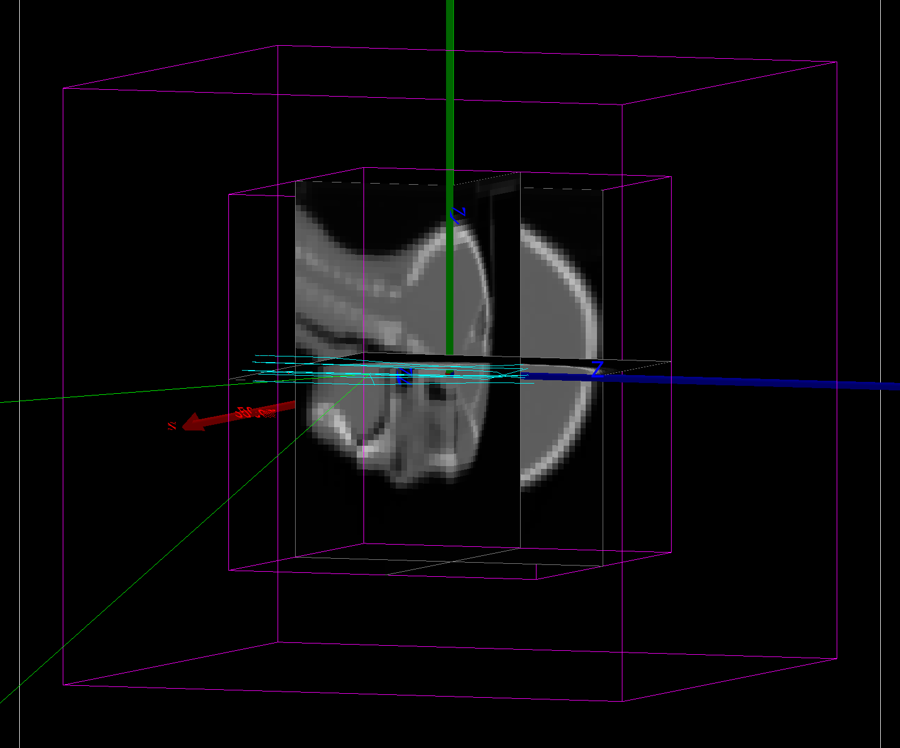

Details: Simulation object
==========================

You can configure the general behavior of your simulation via the parameters of the :class:`opengate.Simulation` object.

Random Number Generator
------------------------

The random number generator used by Geant4 can be set with ``sim.random_engine = "MersenneTwister"``. The default one is "MixMaxRng" and not "MersenneTwister" because it is recommended by Geant4 for multithreading.

You can set the seed of the random number generator with ``sim.random_seed = 123456789`` to any number. Fixing the seed means that the results will be identical  if you run the same simulation twice, which can be useful for testing. There are some exceptions to that behavior, for example when using PyTorch-based GAN. By default, it is set to "auto", which means that the seed is randomly chosen.

Run and timing
--------------

The simulation can be split into several runs, each of them with a given time duration. This is used for example for simulations with a dynamic geometry, e.g. a rotating gantry or a breathing patient. Gaps between the intervals are allowed. By default, the simulation has only one run with a duration of 1 second.

Splitting a simulation into multiple runs is faster than executing a simulation multiple times because Geant4 is initialized only once at the beginning.

In the following example, we define 3 runs, the first has a duration of half a second and starts at 0, the 2nd run goes from 0.5 to 1 second. The 3rd run starts later at 1.5 seconds and lasts 1 second.

.. code-block:: python

   sim.run_timing_intervals = [
       [0, 0.5 * sec],
       [0.5 * sec, 1.0 * sec],
       # Watch out: there is (on purpose) a 'hole' in the timeline
       [1.5 * sec, 2.5 * sec],
   ]

Verbosity
----------

The **verbosity**, i.e., the messages printed on the screen, are controlled via various parameters:

- .. autoproperty:: opengate.Simulation.verbose_level
- .. autoproperty:: opengate.Simulation.running_verbose_level
- .. autoproperty:: opengate.Simulation.g4_verbose
- .. autoproperty:: opengate.Simulation.g4_verbose_level
- .. autoproperty:: opengate.Simulation.g4_verbose_level_tracking
- .. autoproperty:: opengate.Simulation.visu_verbose

Visualisation
-------------

You can enable **visualisation** with ``sim.visu = True``.

GATE 10 can visualize your simulation is different ways, namely using the native Geant4 Qt-based visualization, or via vrml or gdml files. You can select the type of visualization with

.. autoproperty:: opengate.Simulation.visu_type

Qt
^^

If you set `visu_type='qt'`, you can customize the Geant4 visualization commands with

.. autoproperty:: opengate.Simulation.visu_commands

.. note:: When the simulation contains an :class:`opengate.geometry.volumes.ImageVolume`, the visualization displays the middle slices of the image. See `test009 <https://github.com/OpenGATE/opengate/blob/master/opengate/tests/src/geometry/test009_voxels_visu.py>`_ (and others).

VRML
^^^^

.. image:: ../figures/visu_vrml.png

You can choose VRML visualization with ``sim.visu_type = "vrml"``. Opengate uses ``pyvista`` for the GUI, so you need to install it with:

``pip install pyvista``

Alternatively, if you want to use an external VRML viewer, you can save a VRML file with ``sim.visu_type = "vrml_file_only"``. In such cases, the GUI is not opened, and you do not need ``pyvista``. In both cases, you need to set ``sim.visu_filename = "geant4VisuFile.wrl"`` to save the VRML file.

If you want to personalize the ``pyvista`` GUI, you can set ``sim.visu_type = "vrml_file_only"`` and execute your own code in your Python script. You can find an example in `test004_simple_visu_vrml <https://github.com/OpenGATE/opengate/blob/master/opengate/tests/src/others/test004_simple_visu_vrml.py>`_ .

GDML
^^^^

.. image:: ../figures/visu_gdml.png

With GDML visualization, you can only view the geometry, not the paths of the particles. It is enabled with ``sim.visu_type = "gdml"``. GDML visualization needs to be enabled in Geant4 with ``GEANT4_USE_GDML=ON`` during the compilation, but you need to have ``xerces-c`` available on your computer (install it with yum, brew, or apt-get, ...).

Opengate uses ``pyg4ometry`` for the GUI, so you need to install it with:

``pip install pyg4ometry``

``pyg4ometry`` uses opencascade libraries, so install opencascade with your package manager. If you want to use an external GDML viewer, you can save the visualization to a GDML file with ``sim.visu_type = "gdml_file_only"``. In such cases, the GUI is not open, and you do not need ``pyg4ometry``. In both cases, you need to set ``sim.visu_filename = "geant4VisuFile.gdml"`` to save the GDML file. You can find an example in `test004_simple_visu_gdml <https://github.com/OpenGATE/opengate/blob/master/opengate/tests/src/others/test004_simple_visu_gdml.py>`_ .

Multithreading
--------------

.. autoproperty:: opengate.Simulation.number_of_threads

.. warning::

   The speedup is not optimal in all situations. First, it takes time to start a new thread, so if the simulation is short, MT does not bring any speedup. Second, if the simulation contains several runs (e.g., for moving volumes), the master thread will wait for all threads to terminate the run before starting another one. This synchronization takes time and impacts the speedup.

However, for other cases, MT is very efficient and brings almost linear speedups, at least for a "low" number of threads (we tested it with 8 threads on dose computation, leading to almost x8 time gain).

Multiprocessing (advanced use)
------------------------------

The Geant4 kernel can only be executed once per process and cannot be reused in the same process. Therefore, you can (normally) not call `sim.run()` twice in the same script.

This could be a problem in certain scenarios, e.g. when using interactive Python terminal (ipython) or Python notebooks, or when you would need to run a simulation multiple times from a single script. To overcome this limitation, the simulation can be executed in a separate process (different from the one where your script is running). All you need to do is to set `start_new_process=True` when running the simulation:

.. code-block:: python

   sim.run(start_new_process=True)

When this option is used, the Geant4 engine will be created and run in a separate process, which will be terminated after the simulation is finished. The output of the simulation will be copied back to the main process that called the ``run()`` method. This allows for the use of Gate in Python Notebooks, as long as this option is not forgotten.

User hooks
----------

TODO

.. [//]: # (For advanced usage, you can explicitly create the engine for the simulation with:)

.. [//]: # (   se = gate.SimulationEngine(sim))

.. [//]: # (   se.start_new_process = True)

.. [//]: # (   se.user_fct_after_init = my_function)

.. [//]: # (   output = se.start(True))

.. [//]: # (Here user can also define a function (``my_function`` in the above example) that will be called after the Geant4 engine is initialized, and before it starts the simulation. This function will be called in the newly created process, so all data it accesses must be serializable (Python's pickable) to be copied to the new process.)

