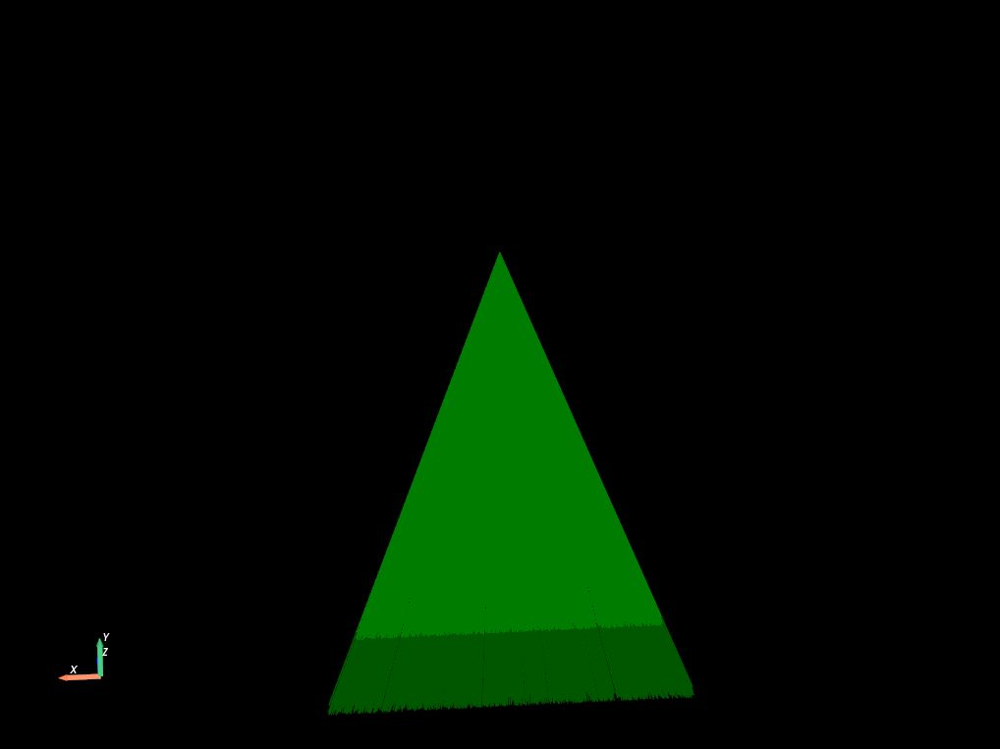
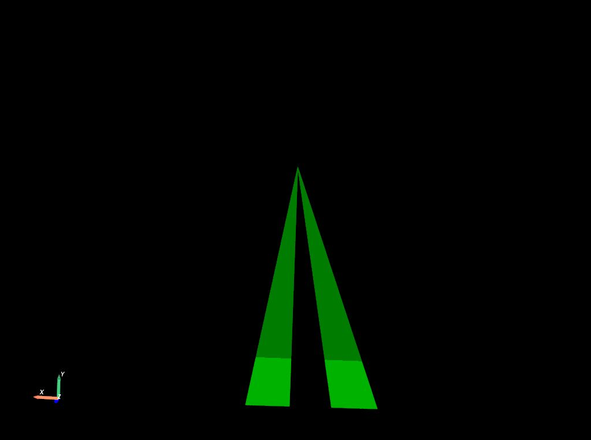
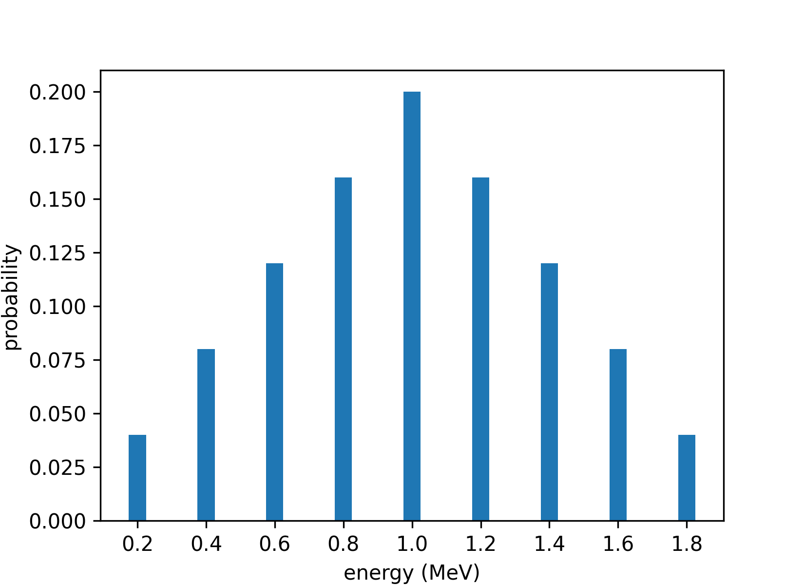
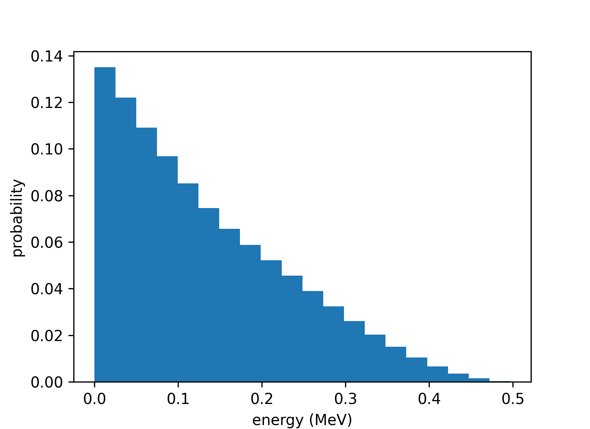

.. _source-generic-source:

Generic source
==============

Description
-----------

The most commonly used type of source is called ''GenericSource''. It can be used to
describe a large range of simple source types. With ‘GenericSource’,
user must describe 1) particle type, 2) position, 3) direction and 4)
energy, see the following example:

.. code:: python

   from scipy.spatial.transform import Rotation  # used to describe a rotation matrix

   MeV = gate.g4_units('MeV')
   Bq = gate.g4_units('Bq')
   source = sim.add_source('GenericSource', 'mysource')
   source.attached_to = 'my_volume'
   source.particle = 'proton'
   source.activity = 10000 * Bq
   source.position.type = 'box'
   source.position.dimension = [4 * cm, 4 * cm, 4 * cm]
   source.position.translation = [-3 * cm, -3 * cm, -3 * cm]
   source.position.rotation = Rotation.from_euler('x', 45, degrees=True).as_matrix()
   source.direction.type = 'iso'
   source.energy.type = 'gauss'
   source.energy.mono = 80 * MeV
   source.energy.sigma_gauss = 1 * MeV

All parameters are stored into a dict-like structure (a Box). Particle
can be ‘gamma’, ‘e+’, ‘e-’, ‘proton’ (all Geant4 names). The number of
particles that will be generated by the source can be described by an
activity ``source.activity = 10 * MBq`` or by a number of particle
``source.n = 100``.

The positions from where the particles will be generated are defined by a
shape (‘box’, ‘sphere’, ‘point’, ‘disc’), defined by several parameters
(‘size’, ‘radius’) and orientation (‘rotation’, ‘center’). The direction
are defined with ‘iso’, ‘momentum’, ‘focused’ and ‘histogram’. The energy
can be defined by a single value (‘mono’) or Gaussian (‘gauss’).

.. _source-particle-type:

Particle type
-------------

The particle type can be set to any valid Geant4 name
(e.g. ``"gamma"``, ``"e+"``, ``"e-"``", ``"proton"``):

.. code:: python

   source.particle = "gamma"

It is also possible to use ions with the key word "ion" followed by Z and A.
Source of ion can be set with the following (see ``test013``):

.. code:: python

   source1 = sim.add_source('GenericSource, 'ion1')
   source1.particle = 'ion 9 18'  # Fluorine18
   source2 = sim.add_source('GenericSource, 'ion2')
   source2.particle = 'ion 53 124'  # Iodine 124

Source of ion can be set with the following (see ``test013``)

.. code:: python

   source1 = sim.add_source('GenericSource, 'ion1')
   source1.particle = 'ion 9 18'  # Fluorine18
   source2 = sim.add_source('GenericSource, 'ion2')
   source2.particle = 'ion 53 124'  # Iodine 124

Note that the ion will only be simulated if the decay is enabled.

.. code:: python

   sim.physics_manager.enable_decay = True

GATE also provide a ``back_to_back`` particle, which is an alias for colinear
gamma pairs of 511 keV.

.. code:: python

   source.particle = "back_to_back"

.. _source-position:

Particle initial position
-------------------------

The positions from were the particles will be generated are defined by a shape
(e.g. "point", "box", "sphere", "disc", "cylinder"), defined by several parameters ("size", "radius")
and orientation ("rotation", "center").
A translation relative to the ``attached_to`` volume can also be set.

Here are some examples (mostly from ``test010_generic_source.py``):

.. code:: python

    source.position.type = "point"
    source.position.translation = [0 * cm, 0 * cm, -30 * cm]

.. code:: python

    source.position.type = "sphere"
    source.position.radius = 5 * mm
    source.position.translation = [-3 * cm, 30 * cm, -3 * cm]

.. code:: python

    source.position.type = "disc"
    source.position.radius = 5 * mm
    source.position.translation = [6 * cm, 5 * cm, -30 * cm]

.. code:: python

    source.position.type = "box"
    source.position.size = [4 * cm, 4 * cm, 4 * cm]
    source.position.translation = [8 * cm, 8 * cm, 30 * cm]

.. code:: python

    source.position.type = "cylinder"
    source.position.radius = 5 * mm
    source.position.dz = 300 * mm / 2.0
    source.position.translation = [8 * cm, 8 * cm, 30 * cm]

.. _source-direction:

Particle initial direction
--------------------------

-  ``direction.type = 'iso'`` assigns directions to primary particles
   based on 𝜃 and 𝜙 angles in a `spherical coordinate system
   <https://en.wikipedia.org/wiki/Spherical_coordinate_system>`__.
   By default, 𝜃 varies from 0° to 180° and 𝜙 varies from 0° to 360°
   (such that any direction is possible). You can define the 𝜃 and 𝜙
   ranges with minimum and maximum values as follows:

   .. code:: python

      source.direction.type = "iso"
      source.direction.theta = [0, 10 * deg]
      source.direction.phi = [0, 90 * deg]

Geant4 defines the direction as: - x = -sin𝜃 cos𝜙; - y = -sin𝜃 sin𝜙; - z
= -cos𝜃.

So 𝜃 is the angle in XOZ plane, from -Z to -X; and 𝜙 is the angle in XOY
plane from -X to -Y.

.. image:: ../figures/thetaphi.png
   :width: 70%
   :align: center

-  ``direction.type = 'momentum'`` specifies a fixed direction for the
   primary particles using a momentum vector [x, y, z].

   .. code:: python

      source.direction.type = "momentum"
      source.direction.momentum = [0,0,1]

-  ``direction.type = 'focused'`` configures the primary particles to be
   emitted such that they converge towards a specified focus point. The
   focus point is set using a coordinate array [x, y, z] that defines its
   position.

   .. code:: python

      source.position.type = "disc"
      source.position.radius = 2 * cm
      source.direction.type = "focused"
      source.direction.focus_point = [1 * cm, 2 * cm, 3 * cm]

-  ``direction.type = 'histogram'``, same as ``'iso'``, but allows you
   to emit primary particles with directional distributions weighted by
   custom-defined histograms for 𝜃 (theta) and 𝜙 (phi) angles.

   .. code:: python

      source.direction.type = "histogram"
      source.direction.histogram_theta_weights = [1]
      source.direction.histogram_theta_angles = [80 * deg, 100 * deg]
      source.direction.histogram_phi_weights = [0.3, 0.5, 1, 0.5, 0.3]
      source.direction.histogram_phi_angles = [60 * deg, 70 * deg, 80 * deg, 100 * deg, 110 * deg, 120 * deg]

See figure below, left:

.. code:: python

    # Example A
    source.direction.type = "histogram"
    source.direction.histogram_phi_angles = [70 * deg, 110 * deg]
    source.direction.histogram_phi_weights = [1]

See figure below, right:

.. code:: python

    # Example B
    source.direction.type = "histogram"
    source.direction.histogram_phi_angles = [70 * deg, 80 * deg, 90 * deg, 100 * deg, 110 * deg]
    source.direction.histogram_phi_weights = [1, 0, 1, 0]

Using ``source.direction_relative_to_attached_volume = True`` will make
your source direction change following the rotation of that volume.

Polarization
------------

``polarization = '[1, 0, 0]'`` assigns a polarization to primary particles (gamma).
The polarization is defined in the particle coordinate system with the
`Stokes parameters <https://en.wikipedia.org/wiki/Stokes_parameters>`_ [Q, U, V].
Do not forget to use an adequate physics list. You can define the polarization as follows:

   .. code:: python

      source.polarization = [1, 0, 0] # linear polarization (horizontal)
      source.polarization = [-1, 0, 0] # linear polarization (vertical)
      source.polarization = [0, 1, 0] # linear polarization (45°)
      source.polarization = [0, -1, 0] # linear polarization (-45°)
      source.polarization = [0, 0, 1] # circular polarization (right)
      source.polarization = [0, 0, -1] # circular polarization (left)
      source.polarization = [0, 0, 0] # unpolarized
      sim.physics_manager.physics_list_name = "G4EmLivermorePolarizedPhysics"

.. autoproperty:: opengate.sources.generic.GenericSource.polarization

Acceptance Angle
----------------

It is possible to indicate an ``angle_acceptance_volume`` to the
direction of a source. In that case, the particle will be created only
if their position & direction make them intersect the given volume. This
is for example useful for SPECT imaging in order to limit the particle
creation to the ones that will have a chance to reach the detector. Note
that the particles that will not intersect the volume will be created
anyway but with a zero energy (so not tracked). This mechanism ensures
to remain consistent with the required activity and timestamps of the
particles, there is no need to scale with the solid angle. See for
example ``test028`` test files for more details.

Geant4 defines the direction as: - x = -sin𝜃 cos𝜙; - y = -sin𝜃 sin𝜙; - z
= -cos𝜃.

So 𝜃 is the angle in XOZ plane, from -Z to -X; and 𝜙 is the angle in XOY
plane from -X to -Y.

.. image:: ../figures/thetaphi.png

Half-life
---------

You can instruct GATE to decrease the activity according to an exponential
decay by setting the parameter :attr:`~.opengate.sources.base.SourceBase.half_life`. Example:

.. code-block:: python

    source = sim.add_source('GenericSource, 'mysource')
    source.half_life = 60 * gate.g4_units.s

Note1: If you set a run_timing_intervals starting at t > 0, the activity set in the source is the activity at t=0.

Note2: If you do not set the half_life for an ion, G4 will use it's own value. Moreover, if you set a
run_timing_intervals, by default you the source will decrease without taking into account the run_timing_intervals.
To restrict the decay to the run_timing_intervals, you can set the parameter:

.. code-block:: python

    sim.run_timing_intervals = [[18 * sec, 28 * sec]]
    source.user_particle_life_time = 0

.. autoproperty:: opengate.sources.generic.GenericSource.half_life

Time Activity Curves (TAC)
--------------------------

Alternatively, user can provide a TAC (Time Activity Curve) by means of
two vectors (times and activities):

.. code:: python

   starting_activity = 1000 * Bq
   half_life = 2 * sec
   times = np.linspace(0, 10, num=500, endpoint=True) * sec
   decay = np.log(2) / half_life
   activities = [starting_activity * np.exp(-decay * t) for t in times]
   source.tac_times = times
   source.tac_activities = activities

During the simulation, the activity of this source will be updated
according to the current simulation time with a linear interpolation of
this TAC. If the simulation time is before the first time or above the
last one in the ``times`` vector, the activity is considered as zero.
The number of elements in the ``times`` linspace (here 500) defined the
accuracy of the TAC. See example ``test052``.

.. autoproperty:: opengate.sources.generic.GenericSource.tac_times
.. autoproperty:: opengate.sources.generic.GenericSource.tac_activities

.. _source-energy:

Energy
------

Mono
""""

``energy.type = "mono"`` corresponds to a single energy value to be used
for every particle.

.. code:: python

    source.energy.type = "mono"
    source.energy.mono = 1 * MeV

Range
"""""

``energy.type = "range"`` corresponds to a range of energy values between
``min_energy`` and ``max_energy`` with a uniform random distribution.

.. code:: python

    source.energy.type = "range"
    source.energy.min_energy = 3 * keV
    source.energy.max_energy = 57 * keV

Gauss
"""""

``energy.type = "gauss"`` allows to produce particles according to a
normal distribution with:

* μ = ``source.energy.mono``
* σ = ``source.energy.sigma_gauss``

.. code:: python

    source.energy.type = "gauss"
    source.energy.mono = 140 * MeV
    source.energy.sigma_gauss = 10 * MeV

Spectra
"""""""

**Discrete energy spectrum**

One can configure a generic source to produce particles with energies depending on weights.
To do so, one must provide two lists of the same size: one for energies, one for weights.
Each energy is associated to the corresponding weight.
Probabilities are derived from weights simply by normalizing the weights list.

1252 isotopes spectra are provided through the `get_spectrum` function:

.. code:: python

   spectrum = gate.sources.utility.get_spectrum("Lu177", spectrum_type, database="icrp107")

where ``spectrum_type`` is one of "gamma", "beta-", "beta+", "alpha", "X", "neutron",
"auger", "IE", "alpha recoil", "annihilation", "fission", "betaD", "b-spectra". From this list,
only b-spectra is histogram based (see next section), the rest are discrete. ``database`` can be "icrp107" or "radar".

ICRP107 data comes from `[ICRP, 2008. Nuclear Decay Data for Dosimetric Calculations. ICRP Publication 107. Ann. ICRP 38] <https://www.icrp.org/publication.asp?id=ICRP%20Publication%20107>`__
with the data from the `[Supplemental material] <https://journals.sagepub.com/doi/suppl/10.1177/ANIB_38_3>`__.
`[Direct link to the zipped data] <https://journals.sagepub.com/doi/suppl/10.1177/ANIB_38_3/suppl_file/P107JAICRP_38_3_Nuclear_Decay_Data_suppl_data.zip>`__

The source can be configured like this:

.. code:: python

   source = sim.add_source("GenericSource", "source")
   source.particle = "gamma"
   source.energy.type = "spectrum_discrete"
   source.energy.spectrum_energies = spectrum.energies
   source.energy.spectrum_weights = spectrum.weights

For example, using this:

.. code:: python

   source.energy.spectrum_energies = [0.2, 0.4, 0.6, 0.8, 1.0, 1.2, 1.4, 1.6, 1.8]
   source.energy.spectrum_weights = [0.2, 0.4, 0.6, 0.8, 1.0, 0.8, 0.6, 0.4, 0.2]

The produced particles will follow this pattern:

**Histogram for beta spectrum**

One can configure a generic source to produce particles with energies according to a given histogram.
Histograms are defined in the same way as `numpy`, using bin edges and histogram values.

Several spectra are provided through the `get_spectrum` function. You can use icrp107 data, or radar data.
Radar data comes from `[doseinfo-radar] <https://www.doseinfo-radar.com/RADARDecay.html>`_ (`[direct link to the excel file] <https://www.doseinfo-radar.com/BetaSpec.zip>`_).

.. code:: python

   spectrum = gate.sources.utility.get_spectrum("Lu177", "beta-", database="radar")

The source can be configured like this:

.. code:: python

   source = sim.add_source("GenericSource", "source")
   source.particle = "e-"
   source.energy.type = "spectrum_histogram"
   source.energy.spectrum_energy_bin_edges = spectrum.energy_bin_edges
   source.energy.spectrum_weights = spectrum.weights

For example, using this (which is what you get from `get_spectrum("Lu177", "beta-", database="radar")`):

.. code:: python

   source.energy.spectrum_energy_bin_edges = [
    0.0, 0.0249, 0.0497, 0.0746, 0.0994, 0.1243, 0.1491,
    0.174, 0.1988, 0.2237, 0.2485, 0.2734, 0.2983, 0.3231,
    0.348, 0.3728, 0.3977, 0.4225, 0.4474, 0.4722, 0.497,
   ]
   source.energy.spectrum_weights = [
    0.135, 0.122, 0.109, 0.0968, 0.0851, 0.0745, 0.0657,
    0.0588, 0.0522, 0.0456, 0.0389, 0.0324, 0.0261, 0.0203,
    0.015, 0.0105, 0.00664, 0.00346, 0.00148, 0.000297,
   ]

The produced particles will follow this pattern:

**Interpolation**

Not yet available in GATE.

Predefined energy spectrum for beta+
""""""""""""""""""""""""""""""""""""

There is some predefined energy spectrum of positron (e+):

.. code:: python

   source = sim.add_source('GenericSource, 'Default')
   source.particle = 'e+'
   source.energy.type = 'F18'  # F18 or Ga68 or C11 ...

It means the positrons will be generated following the (approximated)
energy spectrum of the F18 ion. Source code is
``GateSPSEneDistribution.cpp``. Energy spectrum for beta+ emitters are
available : F18, Ga68, Zr89, Na22, C11, N13, O15, Rb82. See
http://www.lnhb.fr/nuclear-data/module-lara. One example is available in
``test031``.

Confined source
---------------

There is a ``confine`` option that allows to generate particles only if
their starting position is within a given volume. See
``phantom_nema_iec_body`` in the contrib folder. Note that the source
volume MUST be larger than the volume it is confined in. Also, note that
no particle source will be generated in the daughters of the confine
volume.

All options have a default values and can be printed with
``print(source)``.

This example confines a Xe133 source within a Trd volume (see :ref:`volumes-reference-label`) named "leftLung":

.. code:: python

   myConfSource = sim.add_source("GenericSource", "myConfSource")
   myConfSource.attached_to = "leftLung"
   myConfSource.particle = "ion 54 133"
   myConfSource.position.type = "box"
   myConfSource.position.size = sim.volume_manager.volumes[myConfSource.attached_to].bounding_box_size
   myConfSource.position.confine = "leftLung"
   myConfSource.direction.type = "iso"
   myConfSource.activity = 1000 * Bq

Reference
---------

.. autoclass:: opengate.sources.generic.GenericSource

