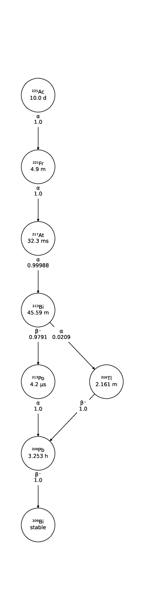

.. The next line draws an horizontal line
-----

.. _source-ion-pencil-beam-source:

Ion Pencil Beam Source
======================

Description
-----------

The :class:`~.opengate.sources.beamsources.IonPencilBeamSource` inherits from the :class:`~.opengate.sources.generic.GenericSource` and retains
therefore the same input parameters. The main difference consists in the
sampling of the position and direction of the particles, which are not
sampled independently, but are correlated. In fact, the Pencil Beam
source is meant to describe a beam that can converge or diverge. This
behaviour is modeled according to the Fermi-Eyges theory (Techniques of
Proton Radiotherapy: Transport Theory B. Gottschalk May 1, 2012), that
describes the correlated momentum spread of the particle with 4
parameters (each for x and y direction, assuming a beam directed as z):

- spot size 𝜎
- divergence 𝜃
- emittance 𝜀
- convergence flag [1,0]

The parameters must satisfy the condition:

.. code:: python

   pi * sigma * theta >= epsilon

.. figure:: https://github.com/OpenGATE/opengate/assets/74096483/8b3d2077-b9e8-4d39-b027-3fa2089b597d
   :alt: image

   image

The user can set the beam parameters as shown in the example below, for
a 120 MeV/n carbon ion beam.

.. code:: python

   source = sim.add_source("IonPencilBeamSource", "mysource")
   source.energy.mono = 1440 * MeV
   source.particle = "ion 6 12"  # carbon
   source.position.translation = [100 * mm, 0 * mm, 0 * cm]
   source.n = 20000
   source.direction.partPhSp_x = [
       2.3335754 * mm,
       2.3335754 * mrad,
       0.00078728 * mm * mrad,
       0,
   ]
   source.direction.partPhSp_y = [
       1.96433431 * mm,
       0.00079118 * mrad,
       0.00249161 * mm * mrad,
       0,
   ]

.. note:: The Pencil Beam source is created by default directed as the positive z axis. To rotate the source, use the source.position.rotation option.

Check all test044 for usage examples.

.. |image1| image:: ../figures/ac225_tac.png
.. |image2| image:: ../figures/ac225_gammas.png

Reference
---------

.. autoclass:: opengate.sources.beamsources.IonPencilBeamSource

