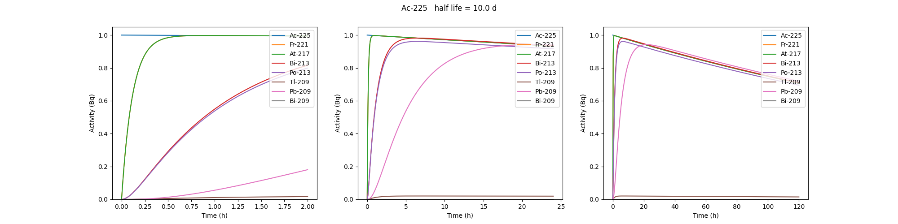
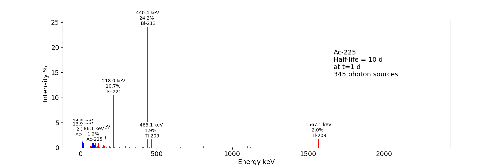

.. _source-phid-source:

PHID source (Photon from Ion Decay)
===================================

Description
-----------

PHID (Photon from Ion Decay) is a virtual source model that generates
photons emitted in the complex decay chain process of alpha-emitter
radionuclides, typically for use during simulation of SPECT image
acquisition. Given an alpha-emitter radionuclide, the model extracts
from Geant4 databases the photon emission lines from all decaying
daughters for both isometric transition and atomic relaxation processes.
According to a given time range, abundances and activities in the decay
chain are considered thanks to the Bateman equations, taking into
account the decay rates and the initial abundances. It generates photons
with the correct energy and temporal distribution, avoiding the costly
Monte Carlo simulation of the complete decay chain. Photons emitted from
Bremsstrahlung are ignored, but are not significant for SPECT imaging.
Also, the model is not expected to be correct for gammas below 20-30
keV.

See `Sarrut et al 2024 Phys. Med. Biol. <https://doi.org/10.1088/1361-6560/ad3881>`_.

To use such a source, declare a “PhotonFromIonDecaySource” with an ion
as particle name, like the “GenericSource”. Only the gammas emitted by
atomic relaxation and isomeric transition will be created and tracked.
The timing is taken into account by using a TAC (Time Activity Curve)
automatically computed from the start and end time of the simulation.
The TAC is then binned and the number of bins can be modified. See `test053 <https://github.com/OpenGATE/opengate/tree/master/opengate/tests/src/source/>`_.

.. code:: python

   source = sim.add_source("PhotonFromIonDecaySource", "my_source")
   source.particle = f"ion 89 225"
   source.position.type = "sphere"
   source.position.radius = 1 * nm
   source.direction.type = "iso"
   source.activity = 10 * kBq
   source.atomic_relaxation_flag = True
   source.isomeric_transition_flag = True
   source.tac_bins = 200
   source.dump_log = "phid_log.txt"
   source.verbose = True

Command line tools
------------------

Also, several command lines tools are provided :

.. code:: bash

   # print information about a radionuclide bi213, pb212, etc.
   phid_info ac225

|image|

.. code:: bash

   # plot time activity curve of a radionuclide. Options may by set to adapt the timing
   phid_tac

|image1|

.. code:: bash

   # plot gammas lines from a radionuclide (whatever the time)
   phid_gammas ac225
   phid_atomic_relaxation ac225
   phid_isomeric_transition ac225

|image2|

.. |image| image:: ../figures/ac225_info.png

Reference
---------

.. autoclass:: opengate.sources.phidsources.PhotonFromIonDecaySource
