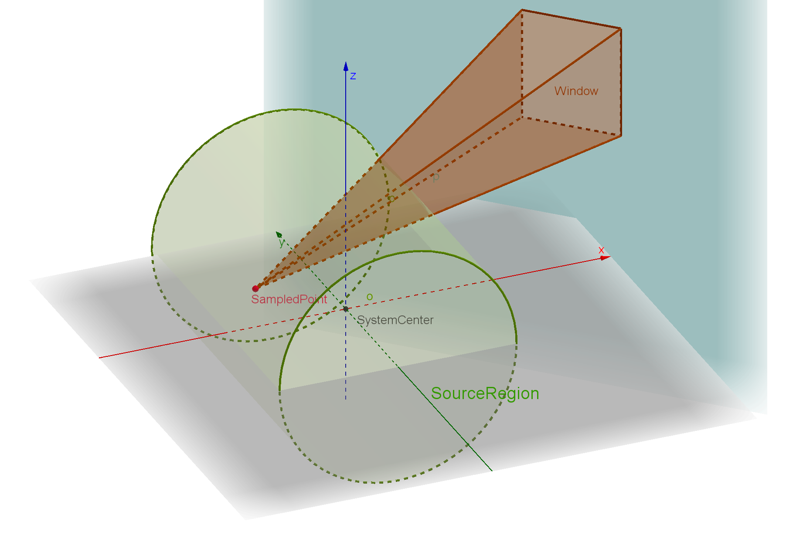
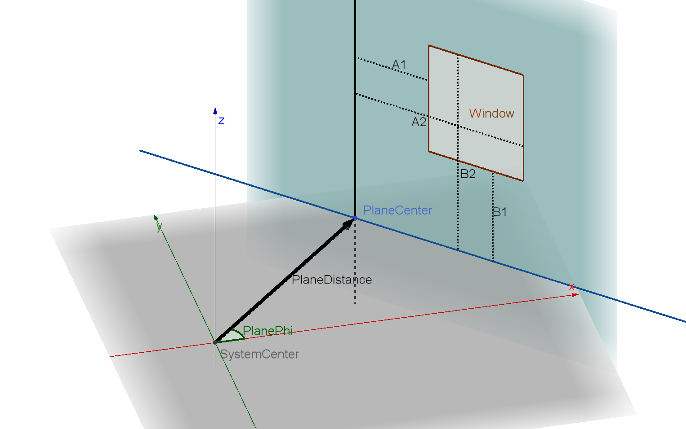
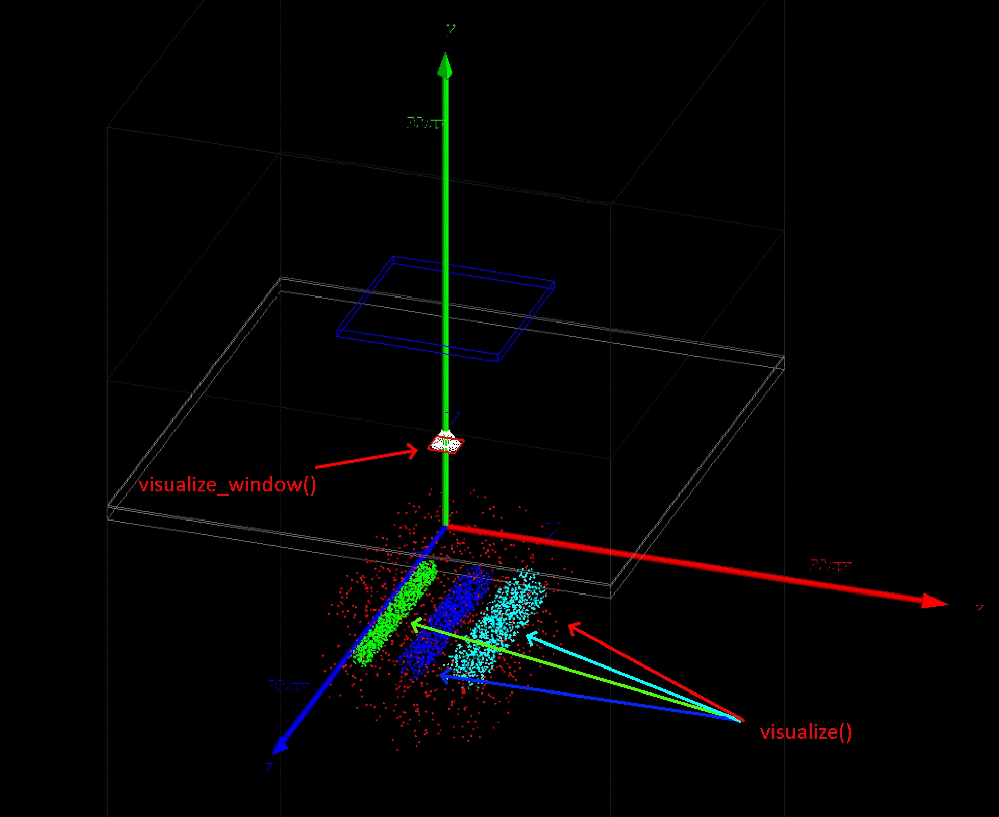

.. _source-window-turbo-source:

Window Turbo Source
===================

Description
-----------

``WindowTurboSource`` is used to make a source emit photons only toward a rectangular window,
thereby reducing the generation of useless particles and the tracking time.
In scenarios such as multi-pinhole collimator SPECT, where only a small number of directions can reach the detector,
it can significantly shorten the simulation time;
the actual speedup depends on the window size, the distance from the source to the window, the source position distribution,
and the downstream geometry.

The purpose of this source is to replace ``GenericSource`` emission with ``direction.type = "iso"``
while preserving the spatial and temporal statistical properties of the resulting counts.
See ``test100`` for related comparisons. Each ``WindowTurboSource`` can define only one rectangular window.
The window must lie on a reference plane parallel to the z axis, and its two pairs of edges must be parallel to the z axis
and to the x-y plane, respectively.

``WindowTurboSource`` inherits the particle, energy, and position settings from ``GenericSource``,
but ``direction`` is replaced by the window parameters.
Usually, ``activity`` should be used to control the emission rate; the ``n`` parameter is not compatible with
``WindowTurboSource``.
This source is mainly intended for ``gamma`` particles, and the ``back_to_back`` particle type is not available.

Basic usage
-----------

The following example creates a cylindrical volume source and makes the photons emit only toward a rectangular window
in the y direction.
The window size is given by ``a1``, ``a2``, ``b1``, and ``b2``; the plane on which the window lies is given by
``plane_distance`` and ``plane_phi``.

.. code:: python

   import numpy as np
   import opengate as gate

   Bq = gate.g4_units.Bq
   keV = gate.g4_units.keV
   mm = gate.g4_units.mm

   source = sim.add_source("WindowTurboSource", "wts")
   source.particle = "gamma"
   source.activity = 1e6 * Bq
   source.energy.mono = 141 * keV

   source.position.type = "cylinder"
   source.position.translation = [0, -100 * mm, 0]
   source.position.radius = 100 * mm
   source.position.dz = 100 * mm

   radius = 13.6 * mm
   source.direction.a1 = -radius
   source.direction.a2 = radius
   source.direction.b1 = -radius
   source.direction.b2 = radius
   source.direction.plane_distance = 86 * mm
   source.direction.plane_phi = np.pi / 2

.. note::

   Although ``WindowTurboSource`` inherits from ``GenericSource``, the ``direction`` parameters of ``GenericSource``
   (for example, ``type``, ``theta``, ``phi``, ``momentum``, ``focus_point``, and so on) are not used.

Window parameters
-----------------

The additional parameters of ``WindowTurboSource`` are all located in ``source.direction``:

.. list-table::
   :header-rows: 1

   * - **Parameter**
     - **Description**
   * - ``a1``
     - Left boundary of the window, relative to the center point of the reference plane; must be smaller than ``a2``.
   * - ``a2``
     - Right boundary of the window, relative to the center point of the reference plane.
   * - ``b1``
     - Lower boundary of the window, relative to the center point of the reference plane; must be smaller than ``b2``.
   * - ``b2``
     - Upper boundary of the window, relative to the center point of the reference plane.
   * - ``plane_distance``
     - Distance from the reference plane to the system center; must be positive.
   * - ``plane_phi``
     - Angle between the reference plane normal vector and the positive x axis, in radians, in the range ``[0, 2*pi)``.
   * - ``init_sampling_count``
     - Number of samples used during initialization to estimate the window acceptance ratio. The default value is ``1000000``.
   * - ``init_number_of_threads``
     - Number of threads used during initialization. The default value ``0`` means that the number of simulation threads is used.
   * - ``act_ratio``
     - Window acceptance ratio. Usually left empty at its default value, so it is estimated automatically during initialization.
   * - ``max_solid_angle``
     - Maximum solid angle of the window over the source position distribution. Usually left empty at its default value, so it is estimated automatically during initialization.
   * - ``skip_mode``
     - Advanced option, with a default value of ``False``. Its usage is not described in this document.

``a1``, ``a2``, ``b1``, ``b2``, ``plane_distance``, and ``plane_phi`` jointly define the position and size of the window.
``a1`` and ``a2`` define the window extent within the reference plane in the direction perpendicular to the z axis;
``b1`` and ``b2`` define the window extent in the z direction.
``plane_distance`` defines the distance from the reference plane to the system center, and ``plane_phi`` defines the
orientation of this plane around the z axis.

If a simulation contains multiple timing intervals, different window parameters can be used for each time interval.
The window parameters listed above, as well as ``act_ratio`` and ``max_solid_angle``, can be written as a single value
or as a list.
The list length can be ``1``, which means that the same value is used for all time intervals, or it can be equal to the
number of ``sim.run_timing_intervals``, which means that values are set time interval by time interval.

.. code:: python

   sec = gate.g4_units.second
   sim.run_timing_intervals = [[0, 1 * sec], [1 * sec, 2 * sec]]

   source.direction.a1 = [-10 * mm, -15 * mm]
   source.direction.a2 = [10 * mm, 15 * mm]
   source.direction.b1 = -10 * mm
   source.direction.b2 = 10 * mm
   source.direction.plane_distance = [80 * mm, 90 * mm]
   source.direction.plane_phi = np.pi / 2

Initialization
--------------

``WindowTurboSource`` needs to estimate two quantities:

* ``act_ratio``: on average, the fraction of ``GenericSource`` isotropic events that would pass through the window.
* ``max_solid_angle``: the maximum solid angle subtended by the window over the source position distribution.

If the user does not provide these two parameters, the simulation estimates them automatically before the start of each
timing interval.
The estimation process samples from the source position distribution; the number of samples is controlled by
``init_sampling_count`` and the number of initialization threads is controlled by ``init_number_of_threads``.
After the simulation ends, the estimated values are written back into ``source.direction.act_ratio`` and
``source.direction.max_solid_angle``.
The initialization duration is also written back into ``source.direction.init_duration``, in seconds. This is an output
value for diagnostics, not an input parameter to configure the source.
For repeated simulations with the same configuration, the written-back ``act_ratio`` and ``max_solid_angle`` values can
be saved and set directly in the next run to reduce initialization time.

.. note::

   If the simulation is run with ``sim.run(start_new_process=True)``, the values written back in the child process are
   not retained in the source object of the current Python process.

Voxelization
------------

``VoxelWTSource`` is the voxelized version of ``WindowTurboSource``.
Like ``VoxelSource``, it samples the initial position from a 3D activity image, while the emission direction is
controlled by the window parameters of ``WindowTurboSource``.
Therefore, when using ``VoxelWTSource``, the ``image``, particle, and energy parameters must be set, as well as the same
set of ``direction`` window parameters.

.. code:: python

   source = sim.add_source("VoxelWTSource", "voxel_wts")
   source.image = "activity.mhd"
   source.particle = "gamma"
   source.activity = 1e6 * Bq
   source.energy.mono = 141 * keV

   source.direction.a1 = -13.6 * mm
   source.direction.a2 = 13.6 * mm
   source.direction.b1 = -13.6 * mm
   source.direction.b2 = 13.6 * mm
   source.direction.plane_distance = 86 * mm
   source.direction.plane_phi = np.pi / 2

Except for ``direction``, the meaning, normalization, and position settings of the voxel source image are the same as
for ``VoxelSource``.
If the activity image needs to be aligned with a CT image or another voxelized volume, see :ref:`source-voxel-source`.

Dynamic activity image
~~~~~~~~~~~~~~~~~~~~~~

``VoxelWTSource`` can use a dynamic activity image in the same way as ``VoxelSource``.
After configuring the source as above, set ``sim.run_timing_intervals`` and provide one image per timing interval with
``add_dynamic_parametrisation(image=[...])``.

.. code:: python

   source.add_dynamic_parametrisation(
       image=[
           "activity_0.mhd",
           "activity_1.mhd",
       ]
   )

The number of images must match the number of ``sim.run_timing_intervals``.
See :ref:`source-voxel-source` and :doc:`user_guide_dynamic_parametrisations` for the corresponding ``VoxelSource``
usage.

Visualization
-------------

``WindowTurboSource`` and ``VoxelWTSource`` use the ``visualization`` attribute
to display source-position sampling points, like ``GenericSource``.
In addition, the ``visualization.window_run_id``, ``visualization.window_color``,
and ``visualization.window_width`` fields can draw one or more rectangular window
outlines:

.. code:: python

   sim.visu = True
   sim.visu_type = "qt"

   source.visualization.count = 1000
   source.visualization.color = "red"
   source.visualization.size = 2

   source.visualization.window_run_id = 0
   source.visualization.window_color = "red"
   source.visualization.window_width = 2

The following visualization result is generated by ``test100_window_turbo_source_visu_wip.py``.

The visualization parameters specific to ``WindowTurboSource`` and
``VoxelWTSource`` are:

.. list-table::
   :header-rows: 1

   * - **Parameter**
     - **Description**
   * - ``window_color``
     - Window line color. It must be set when ``window_run_id`` is not empty. Use a color name such as ``"red"``, ``"green"``, or ``"blue"`` to reuse one color for all displayed windows, or use a list with one color per window. RGB or RGBA colors must be provided as color entries, for example ``[[1, 0, 0]]`` for one red window.
   * - ``window_width``
     - Window line width. It must be set when ``window_run_id`` is not empty. Use a single number to reuse one width for all displayed windows, or use a list with one number per window. Values must be in the range ``(0, 10]``.
   * - ``window_run_id``
     - Index, or list of indexes, of the timing intervals whose windows should be displayed. Indexes start from ``0`` and must be smaller than the number of ``sim.run_timing_intervals``. The default value is an empty list, so no window outline is drawn unless this field is set.

When displaying several timing intervals, either give ``window_color`` and ``window_width`` as scalar values to reuse
the same style for every window, or give lists with the same length as ``window_run_id``.
For example:

.. code:: python

   source.visualization.window_run_id = [0, 1]
   source.visualization.window_color = ["red", "blue"]
   source.visualization.window_width = 2

.. note::

   Visualization of ``WindowTurboSource`` and ``VoxelWTSource`` currently does not support multithreaded mode.
   Use ``sim.number_of_threads = 1`` when ``sim.visu`` is enabled; otherwise, the displayed source origin may be
   incorrect.

Implementation details
----------------------

FIXME (details to be added)
