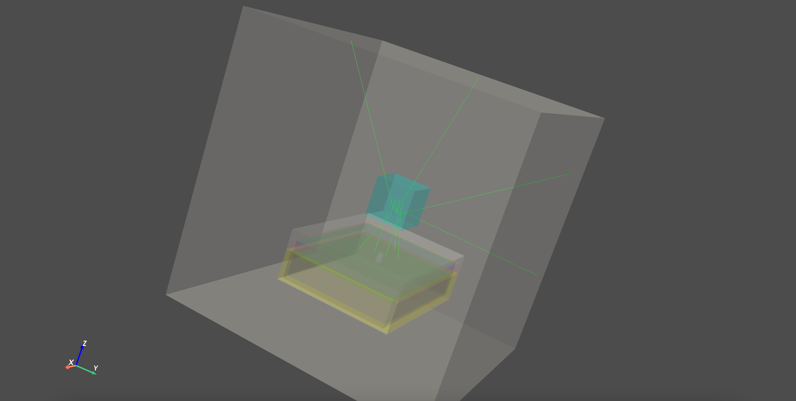
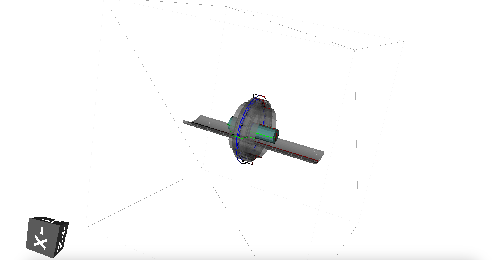

## Simulation


### Units values

The Geant4 physics units can be retrieved with the following:

```python
import opengate as gate

cm = gate.g4_units.cm
eV = gate.g4_units.eV
MeV = gate.g4_units.MeV
x = 32 * cm
energy = 150 * MeV
print(f'The energy is {energy/eV} eV')
```

The units behave like in Geant4 [system of units](https://geant4.web.cern.ch/sites/default/files/geant4/collaboration/working_groups/electromagnetic/gallery/units/SystemOfUnits.html).

### Main Simulation object

Any simulation starts by defining the (unique) `Simulation` object. The generic options can be set with the `user_info` data structure (a kind of dictionary), as follows. You can print this `user_info` data structure to see all available options with the default value `print(sim.user_info)`.

```python
sim = gate.Simulation()
ui = sim.user_info
print(ui)
ui.verbose_level = gate.LOG_DEBUG
ui.running_verbose_level = gate.LOG_EVENT
ui.g4_verbose = False
ui.g4_verbose_level = 1
ui.visu = False
ui.visu_verbose = False
ui.random_engine = 'MersenneTwister'
ui.random_seed = 'auto'
ui.number_of_threads = 1
```

A simulation must contains 4 main elements that define a complete simulation:

- **Geometry**: all geometrical elements that compose the scene, such as phantoms, detectors, etc.
- **Sources**: all sources of particles that will be created ex-nihilo. Each source may have different properties (location, direction, type of particles with their associated energy ,etc).
- **Physics**: describe the properties of the physics models that will be simulated. It describes models, databases, cuts etc.
- **Actors** : define what will be stored and output during the simulation. Typically, dose deposition or detected particles. This is the generic term for 'scorer'. Note that some `Actors` can not only store and output data, but also interact with the simulation itself (hence the name 'actor').

Also, you can use the command line ```opengate_user_info``` to print all default and possible parameters.

Each four elements will be described in the following sections. Once they have be defined, the simulation must be initialized and can be started. The initialization corresponds to the Geant4 step needed to create the scene, gather cross-sections, etc.

```python
output = sim.start()
```

#### Random Number Generator

The RNG can be set with `ui.random_engine = "MersenneTwister"`. The default one is "MixMaxRng" and not "MersenneTwister" because it is recommended by Geant4 for MT.

The seed of the RNG can be set with `self.random_seed = 123456789`, with any number. If you run two times a simulation with the same seed, the results will be exactly the same. There are some exception to that behavior, for example when using PyTorch-based GAN. By default, it is set to "auto", which means that the seed is randomly chosen.

#### Run and timing

The simulation can be split into several runs, each of them with a given time duration. Geometry can only be modified between two runs, not within one. By default, the simulation has only one run with a duration of 1 second. In the following example, we defined 3 runs, the first has a duration of half a second and start at 0, the 2nd run goes from 0.5 to 1 second. The 3rd run starts later at 1.5 second and lasts 1 second.

```python
sim.run_timing_intervals = [
    [ 0, 0.5 * sec],
    [ 0.5 * sec, 1.0 * sec],
    # Watch out : there is (on purpose) a 'hole' in the timeline
    [ 1.5 * sec, 2.5 * sec],
    ]
```

#### Verbosity (for debug)

The **verbosity**, i.e. the messages printed on the screen, are controlled via various parameters.

- `ui.verbose_level`: can be `DEBUG` or `INFO`. Will display more or less messages during initialization
- `ui.running_verbose_level`: can be `RUN` or `EVENT`. Will display message during simulation run
- `ui.g4_verbose`: (bool) enable or disable the Geant4 verbose system
- `ui.g4_verbose_level`: level of the Geant4 verbose system
- `ui.visu_verbose`: enable or disable Geant4 verbose during visualisation

#### Visualisation

**Visualisation** is enabled with `ui.visu = True`. Then, you have the choice to choose between qt, vrml or gdml interface.

##### QT

It will start a Qt interface with `ui.visu_type = "qt"`. By default, the Geant4 visualisation commands are the ones provided in the file `opengate\mac\default_visu_commands_qt.mac`. It can be changed with `self.visu_commands = gate.read_mac_file_to_commands('my_visu_commands.mac')`.


The visualisation with qt is still work in progress. First, it does not work on some linux systems (we don't know why yet). With MacOS Qt6 is working but sometimes you need to set the library path properly before running python with: ```export DYLD_LIBRARY_PATH=/<venv_osx_path>/lib/python3.9/site-packages/opengate_core/plugins:$DYLD_LIBRARY_PATH```. When a CT image is inserted in the simulation, every voxel should be drawn which is highly inefficient and cannot really be used.

##### VRML



You can choose vrml visualization with `ui.visu_type = "vrml"`. Opengate uses `pyvista` for the GUI, so you need to install it before with `pip install pyvista`. Alternatively, if you want to use an external VRML viewer, you can save a VRML file with `ui.visu_type = "vrml_file_only"`. In such case, the GUI is not open, and you do not need pyvista. In both cases, you need to set `ui.visu_filename = "geant4VisuFile.wrl"` to save the VRML file.

If you want to personalized the pyvista GUI, you can set `ui.visu_type = "vrml_file_only"` and execute you own code in your python script. You can find an example in [test004_simple_visu_vrml.py](https://github.com/OpenGATE/opengate/blob/master/opengate/tests/src/test004_simple_visu_vrml.py#L69-L90)

##### GDML



With GDML visualization, you can only view the geometry, not the paths of the particles. It is enabled with `ui.visu_type = "gdml"`. GDML visualization needs to be enabled in Geant4 with `GEANT4_USE_GDML=ON` during the compilation but you need to have xerces-c available on your computer (install it with yum, brew, or apt-get, ...). Opengate uses `pyg4ometry` for the GUI, so you need to install it with `pip install pyg4ometry`. `pyg4ometry` uses opencascade librairy, so install opencascade with your package manager. If you want to use an external GDML viewer, you can save the visualization to a GDML file with `ui.visu_type = "gdml_file_only"`. In such case, the GUI is not open, and you do not need pyg4ometry. In both cases, you need to set `ui.visu_filename = "geant4VisuFile.gdml"` to save the GDML file.

#### Multithreading

**Multithreading** is enabled with `ui.number_of_threads = 4` (larger than 1). When MT is enabled, there will one run for each thread, running in parallel.

Warning, the speedup is not optimal in all situations. First, it takes time to start a new thread, so it the simulation is short, MT does not bring any speedup. Second, if the simulation contains several runs (for moving volumes for example), all runs will be synchronized, i.e. the master thread will wait for all threads to terminate the run before starting another one. This synchronisation takes times and impact the speedup.

However, for other cases, MT is very efficient and brings almost linear speedups, at least for a "low" numbers of threads (we tested it with 8 threads on dose computation, leading to almost x8 time gain).

### Starting and SimulationEngine

Once all simulation elements have been described (see next sections for more details), the Geant4 engine can be initialized and started. This is done by one single command:

    output = sim.start()

Geant4 engine is designed to be the only one instance of the engine, and thus prevent to run two simulations in the same process. In most of the cases, this is not an issue, but sometimes, for example in notebook, we want to run several simulations during the same process session. This can be achieved by setting the following option that will start the Geant4 engine in a separate process and copy back the resulting output in the main process. This is the task of the `SimulationEngine` object.

    se = gate.SimulationEngine(sim, start_new_process=True)
    output = se.start()
    # or shorter :
    output = sim.start(start_new_process=True)


### After the simulation

Once the simulation is terminated (after the `start()`), user can retrieve some actor outputs via the `output.get_actor` function. Note that some output data can be un-available when the simulation is run in a separate process. For the moment, G4 objects (ROOT output) and ITK images cannot be copied back to the main process, e.g. ITK images and ROOT files should be written on disk to be accessed back.

This behavior may change in the future.

#### Multiprocessing (advanced use)

The Geant4 simulation engine has a limitation where it can only run one single simulation and cannot be reused in the same process. This can be a problem in certain contexts, such as when using Python Notebooks. To overcome this limitation, multiprocessing can be used to run the simulation in a separate process (not a thread) with its own memory space. The following option can be used to achieve this:

    output = sim.start(start_new_process=True)

When this option is used, the Geant4 engine will be created and run in a separate process, which will be terminated after the simulation is finished. The output of the simulation will be copied back to the main process that called the `start()` function. This allows for the use of Gate in Python Notebooks, as long as this option is not forgotten.

For advanced usage, you can explicitly create the engine for the simulation with:

    se = gate.SimulationEngine(sim)
    se.start_new_process = True
    se.user_fct_after_init = my_function
    output = se.start(True)

Here user can also define a function (`my_function` in the above example) that will be called after the Geant4 engine is initialized, and before it starts the simulation. This function will be called in the newly created process, so all data it accesses must be serializable (Python's pickable) to be copied to the new process.

------------

```{include} user_guide_2_1_volumes.md
```

------------

```{include} user_guide_2_2_sources.md
```

------------

```{include} user_guide_2_3_physics.md
```

------------

```{include} user_guide_2_4_actors.md
```
