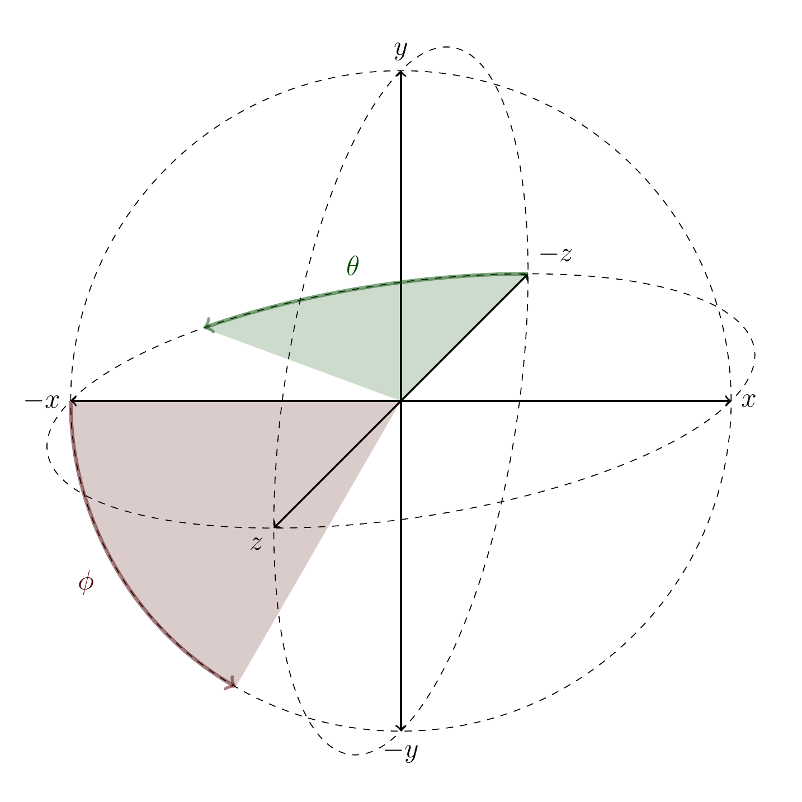
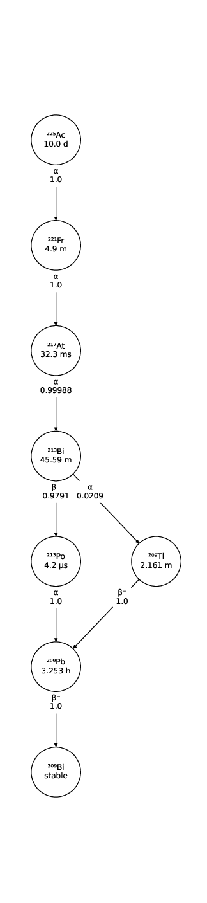
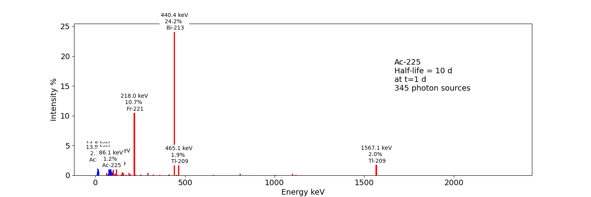

## Sources

Sources are the objects that create particles *ex nihilo*. The particles created from sources are called the *Event* in the Geant4 terminology, they got a *EventID* which is unique in a given *Run*.

Several sources can be defined and are managed at the same time. To add a source description to the simulation, you do:

```python
source1 = sim.add_source('Generic', 'MySource')
source1.n = 100

Bq = gate.g4_units('Bq')
source2 = sim.add_source('Voxels', 'MySecondSource')
source2.activity = 10 * Bq
```

There are several source types, each one with different parameter. In this example, `source1.n` indicates that this source will generate 10 Events. The second source manages the time and will generate 10 Events per second, so according to the simulation run timing, a different number of Events will be generated.

Information about the sources may be displayed with:

```python
# Print all types of source
print(sim.dump_source_types())

# Print information about all sources
print(sim.dump_sources())
```

### Generic sources

The main type of source is called 'GenericSource' that can be used to describe a large range of simple source types. With 'GenericSource', user must describe 1) particle type, 2) position, 3) direction and 4) energy, see the following example:

```python
from scipy.spatial.transform import Rotation  # used to describe a rotation matrix

MeV = gate.g4_units('MeV')
Bq = gate.g4_units('Bq')
source = sim.add_source('Generic', 'mysource')
source.mother = 'my_volume'
source.particle = 'proton'
source.activity = 10000 * Bq
source.position.type = 'box'
source.position.dimension = [4 * cm, 4 * cm, 4 * cm]
source.position.translation = [-3 * cm, -3 * cm, -3 * cm]
source.position.rotation = Rotation.from_euler('x', 45, degrees=True).as_matrix()
source.direction.type = 'iso'
source.energy.type = 'gauss'
source.energy.mono = 80 * MeV
source.energy.sigma_gauss = 1 * MeV
```

All parameters are stored into a dict-like structure (a Box). Particle can be 'gamma', 'e+', 'e-', 'proton' (all Geant4 names). The number of particles that will be generated by the source can be described by an activity `source.activity = 10 * MBq` or by a number of particle `source.n = 100`. The activity may be automatically decreased according to an exponential decay by setting the half-life `source.half_life = 60 * sec`. Alternatively, user can provide a TAC (Time Activity Curve) by means of two vectors (times and activities) :
```python
starting_activity = 1000 * Bq
half_life = 2 * sec
times = np.linspace(0, 10, num=500, endpoint=True) * sec
decay = np.log(2) / half_life
activities = [starting_activity * np.exp(-decay * t) for t in times]
source.tac_times = times
source.tac_activities = activities
```


During the simulation, the activity of this source will be updated according to the current simulation time with a linear interpolation of this TAC. If the simulation time is before the first time or above the last one in the `times` vector, the activity is considered as zero. The number of elements in the `times` linspace (here 500) defined the accuracy of the TAC. See example `test052`.

The positions from were the particles will be generated are defined by a shape ('box', 'sphere', 'point', 'disc'), defined by several parameters ('size', 'radius') and orientation ('rotation', 'center'). The direction are defined with 'iso', 'momentum', 'focused'.
The energy can be defined by a single value ('mono') or Gaussian ('gauss').

The `mother` option indicate the coordinate system of the source. By default, it is the world, but it is possible to attach a source to any volume. In that case, the coordinate system of all emitted particles will follow the given volume.

It is possible to indicate a `angle_acceptance_volume` to the direction of a source. In that case, the particle will be created only if their position & direction make them intersect the given volume. This is for example useful for SPECT imaging in order to limit the particle creation to the ones that will have a chance to reach the detector. Note that the particles that will not intersect the volume will be created anyway but with a zero energy (so not tracked). This mechanism ensures to remain consistent with the required activity and timestamps of the particles, there is no need to scale with the solid angle. See for example `test028` test files for more details.

Using `direction.type = 'iso'`, the directions given to primary particles depends on 𝜃 and 𝜙 angles in a [spherical coordinate system](https://en.wikipedia.org/wiki/Spherical_coordinate_system).
By default, 𝜃 varies from 0° to 180° and 𝜙 varies from 0° to 360° (such that any direction is possible).
One can define the 𝜃 and 𝜙 ranges (minimum and maximum values) like this:

```python
source.direction.theta = [0, 10 * deg]
source.direction.phi = [0, 90 * deg]
```

Geant4 defines the direction as:
- x = -sin𝜃 cos𝜙;
- y = -sin𝜃 sin𝜙;
- z = -cos𝜃.

So 𝜃 is the angle in XOZ plane, from -Z to -X; and 𝜙 is the angle in XOY plane from -X to -Y.



Source of ion can be set with the following (see `test013`)

```python
source1 = sim.add_source('Generic', 'ion1')
source1.particle = 'ion 9 18'  # Fluorine18
source2 = sim.add_source('Generic', 'ion2')
source2.particle = 'ion 53 124'  # Iodine 124
```

There is some predefined energy spectrum of positron (e+):

```python
source = sim.add_source('Generic', 'Default')
source.particle = 'e+'
source.energy.type = 'F18'  # F18 or Ga68 or C11 ...
```

It means the positrons will be generated following the (approximated) energy spectrum of the F18 ion. Source code is `GateSPSEneDistribution.cpp`. Energy spectrum for beta+ emitters are available : F18, Ga68, Zr89, Na22, C11, N13, O15, Rb82. See [http://www.lnhb.fr/nuclear-data/module-lara](http://www.lnhb.fr/nuclear-data/module-lara). One example is available in `test031`.

There is a `confine` option that allows to generate particles only if their starting position is within a given volume. See `phantom_nema_iec_body` in the contrib folder. Note that the source volume MUST be larger than the volume it is confined in. Also, note that no particle source will be generated in the daughters of the confine volume.

All options have a default values and can be printed with `print(source)`.

### Voxelized sources

Voxelized sources can be described as follows:

```python
source = sim.add_source('Voxels', 'vox')
source.particle = 'e-'
source.activity = 4000 * Bq
source.image = 'an_activity_image.mhd'
source.direction.type = 'iso'
source.energy.mono = 100 * keV
source.mother = 'my_volume_name'
```

This code create a voxelized source. The 3D activity distribution is read from the given image. This image is internally normalized such that the sum of all pixels values is 1, leading to a 3D probability distribution. Particles will be randomly located somewhere in the image according to this probability distribution. Note that once an activity voxel is
chosen from this distribution, the location of the particle inside the voxel is performed uniformly. In the given example, 4 kBq of electrons of 140 keV will be generated.

Like all objects, by default, the source is located according to the coordinate system of its mother volume. For example, if the mother volume is a box, it will be the center of the box. If it is a voxelized volume (typically a CT image), it will the **center** of this image: the image own coordinate system (ITK's origin) is not considered here. If you want to align a voxelized activity with a CT image that have the same coordinate system you should compute the correct translation. This is done by the function  ```gate.image.get_translation_between_images_center```. See the contrib example ```dose_rate.py```.


### Phase-Space sources

A phase-space source reads particles properties (position, direction, energy, etc.) from a root file and use them as events. Typically one particle read is counted as one particle. There is an option to change it, see Enhanced particle counting below. Here is an example to use a phase space source:

```python
source = sim.add_source("PhaseSpaceSource", "phsp_source")
source.mother = plane.name
source.phsp_file = "input.root"
source.position_key = "PrePositionLocal"
source.direction_key = "PreDirectionLocal"
source.global_flag = False
source.particle = "gamma"
source.batch_size = 4000
source.n = 20000
```

In that case, the key "PrePositionLocal" in the root tree file will be used to define the position of all generated particles. The flag "global_flag" is False so the position will be relative to the mother volume (the plane here) ; otherwise, position is considered as global (in the world coordinate system).


Limitation: the particle timestamps is NOT read from the phsp and not considered (yet)

#### Particle type

The particle type can be set by ```source.particle = "proton"``` option. Using this option all generated particles will be for example protons, overriding the particle type specified in the phase space.

Alternatively, by setting ```source.particle = None``` the particle type is read from the phase space file using the PDGCode. ```source.PDGCode_key = PDGCode``` specifies the name of the entry in the phase space file.
Full listing:
```python
source.PDGCode_key = "PDGCode"
source.particle = None
```

The PDGCode is defined by the particle data group (see [https://pdg.lbl.gov/2023/web/viewer.html?file=../reviews/rpp2022-rev-monte-carlo-numbering.pdf](https://pdg.lbl.gov/2023/web/viewer.html?file=../reviews/rpp2022-rev-monte-carlo-numbering.pdf)).
Here is a short overview of common particle types and its corresponding PDG Code
```
proton: 2212
neutron: 2211
electron: 11
gamma: 22
carbon ion C12: 1000060120
```

#### Naming of the phase space file keys
The naming of the phsp file entries generated by e.g. a GATE phase space actor changed over time, most notably from GATE v9 to GATE v10.
Setting ```source.position_key = "PrePositionLocal"``` will cause the phsp source to look for particle positions in ```PrePositionLocal_X, PrePositionLocal_Y, PrePositionLocal_Z```.
```source.direction_key = "PreDirectionLocal"``` will do the corresponding for the particle direction vector components in ```PreDirectionLocal_X, PreDirectionLocal_y, PreDirectionLocal_Z```.

It is possible to directly set the individual keys of the phase space file:
```
source.position_key = None"PrePositionLocal"
source.position_key_x = Position_X"
source.position_key_y = Position_X
source.position_key_z = Position_X
source.direction_key = None
source.direction_key_x = Direction_X
source.direction_key_y = Direction_X
source.direction_key_z = Direction_X
source.energy_key = "KineticEnergy"
source.weight_key = "Weight"
source.PDGCode_key = "PDGCode"
```

#### Source rotation and translation

The starting position and direction from eah particle is read from the phase space fiel. It is possible to shift the origin as well as rotate the source.
```
source.translate_position = False
source.rotate_direction = False
source.position.translation = [0, 0, 0]
source.position.rotation = Rotation.identity().as_matrix()
```
If translate_position is set to true, the source.position.translation is evaluated and translates the starting point of the particles by this vector. If rotate_direction is set to true, the source.position.rotation is evaluated to rotate the initial particle vectors. It can be set usign the code below, resulting in a rotation of 30 degrees around the x axis.

```
from scipy.spatial.transform import Rotation
rotation = Rotation.from_euler("x", [30], degrees=True)
source.position.rotation = rotation.as_matrix()
```

#### Enhanced particle counting - realistic particle mix
In case of simulating a realistic particle mix, for example the output after a linac, a phsp file could contain a mixture of particles.
Typically, one would be interested in simulating a given number of primary particles (e.g. protons), simulating, but not counting as secondary particles (e.g. secondary electrons) in the number of particles to simulate.
This can be acchieved by setting ```generate_until_next_primary = True```. Furthermore, the PDG code of the primary particle needs to be specified, as well as a
lower energy threshold (in order to identify secondary particles of the same type as the primary particle).
The example below will consider protons above 90 MeV as primary particles. Every primary particle found in the phsp file will increase the number of particles simulated counter, while secondary particles (e.g. all other particles in the phsp file)
will be simulated, but not be considered in (e.g. not increasing) the number of particles simulated.
```
source.generate_until_next_primary = True
source.primary_lower_energy_threshold = 90.0 * MeV
source.primary_PDGCode = 2212
```

#### Multithreading - where to start reading in a phase space file

For multithread: you need to indicate the ```entry_start``` for all threads, as an array, so that each thread starts in the phsp file at a different position. This done for example as follows (see ```test019_linac_phsp_source_MT.py```). Warning, if the phsp reach its end, it will cycle and start back at the beginning.

```python
total_nb_of_particle = 1e6
nb_of_threads = 4
source.entry_start = [total_nb_of_particle * p for p in range(nb_of_threads)]
```

See all test019 and test060 as examples.

### GAN sources (Generative Adversarial Network)

(documentation TODO)

- `test034` : GAN for linac
- `test038` : GAN for SPECT
- `test040` : GAN for PET

1) generate training dataset
2) train GAN
3) use GAN as source ; compare to reference


### PHID source (Photon from Ion Decay)

PHID (Photon from Ion Decay) is a virtual source model that generates photons emitted in the complex decay chain process of alpha-emitter radionuclides, typically for use during simulation of SPECT image acquisition. Given an alpha-emitter radionuclide, the model extracts from Geant4 databases the photon emission lines from all decaying daughters for both isometric transition and atomic relaxation processes. According to a given time range, abundances and activities in the decay chain are considered thanks to the Bateman equations, taking into account the decay rates and the initial abundances. It generates photons with the correct energy and temporal distribution, avoiding the costly Monte Carlo simulation of the complete decay chain. Photons emitted from Bremsstrahlung are ignored, but are not significant for SPECT imaging. Also, the model is not expected to be correct for gammas below 20-30 keV.

See Sarrut et al 2024 Phys. Med. Biol. [https://doi.org/10.1088/1361-6560/ad3881](https://doi.org/10.1088/1361-6560/ad3881)

To use such a source, declare a "PhotonFromIonDecaySource" with an ion as particle name, like the "GenericSource". Only the gammas emitted by atomic relaxation and isomeric transition will be created and tracked. The timing is taken into account by using a TAC (Time Activity Curve) automatically computed from the start and end time of the simulation. The TAC is then binned and the number of bins can be modified. See tests 053.

```python
source = sim.add_source("PhotonFromIonDecaySource", "my_source")
source.particle = f"ion 89 225"
source.position.type = "sphere"
source.position.radius = 1 * nm
source.direction.type = "iso"
source.activity = 10 * kBq
source.atomic_relaxation_flag = True
source.isomeric_transition_flag = True
source.tac_bins = 200
source.dump_log = "phid_log.txt"
source.verbose = True
```

Also, several command lines tools are provided :

```bash
# print information about a radionuclide bi213, pb212, etc.
phid_info ac225

# plot time activity curve of a radionuclide. Options may by set to adapt the timing
phid_tac

# plot gammas lines from a radionuclide (whatever the time)
phid_gammas ac225
phid_atomic_relaxation ac225
phid_isomeric_transition ac225
```






### Pencil Beam sources

The Pencil Beam source inherits from the Generic source, and retains therefore the same settings.
The main difference consists in the sampling of the position and direction of the particles, which are not sampled independently, but are correlated. In fact, the Pencil Beam source is meant to describe a beam that can converge or diverge. This behaviour is modeled according to the Fermi-Eyges theory (Techniques of Proton Radiotherapy: Transport Theory B. Gottschalk May 1, 2012), that describes the
correlated momentum spread of the particle with 4 parameters (each for x and y direction, assuming a beam directed as z):
- spot size  𝜎
- divergence  𝜃
- emittance  𝜀
- convergence flag  [1,0]
The parameters must satisfy the condition:
```python
pi * sigma * theta >= epsilon
```


The user can set the beam parameters as shown in the example below, for a 120 MeV/n carbon ion beam.
```python
source = sim.add_source("IonPencilBeamSource", "mysource")
source.energy.mono = 1440 * MeV
source.particle = "ion 6 12"  # carbon
source.position.translation = [100 * mm, 0 * mm, 0 * cm]
source.n = 20000
source.direction.partPhSp_x = [
    2.3335754 * mm,
    2.3335754 * mrad,
    0.00078728 * mm * mrad,
    0,
]
source.direction.partPhSp_y = [
    1.96433431 * mm,
    0.00079118 * mrad,
    0.00249161 * mm * mrad,
    0,
]
```
NOTE: the Pencil Beam source is created by default directed as the positive z axis. To rotate the source, use the source.position.rotation option.

Check all test044 for usage examples.
