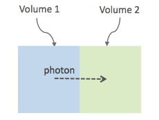

## Physics

The managements of the physic in Geant4 is rich and complex, with hundreds of options. OPENGATE proposes a subset of available options.

### Physics list and decay

First, the user needs to select a physics list. A physics list contains a large set of predefined physics options, adapted to different problems. Please refer to the [Geant4 guide](https://geant4-userdoc.web.cern.ch/UsersGuides/PhysicsListGuide/html/physicslistguide.html) for a
detailed explanation. The user can select the physics list with the following:

```python
# Assume that sim is a simulation
phys = sim.get_physics_info()
phys.name = 'QGSP_BERT_EMZ'
```

The default physics list is QGSP_BERT_EMV. The Geant4 standard physics list are composed of a first part:

```python
FTFP_BERT
FTFP_BERT_TRV
FTFP_BERT_ATL
FTFP_BERT_HP
FTFQGSP_BERT
FTFP_INCLXX
FTFP_INCLXX_HP
FTF_BIC
LBE
QBBC
QGSP_BERT
QGSP_BERT_HP
QGSP_BIC
QGSP_BIC_HP
QGSP_BIC_AllHP
QGSP_FTFP_BERT
QGSP_INCLXX
QGSP_INCLXX_HP
QGS_BIC
Shielding
ShieldingLEND
ShieldingM
NuBeam
```

And a second part with the electromagnetic interactions:

```python
_EMV
_EMX
_EMY
_EMZ
_LIV
_PEN
__GS
__SS
_EM0
_WVI
__LE
```

The lists can change according to the Geant4 version (this list is for 10.7).

Moreover, additional physics list are available:

```python
G4EmStandardPhysics_option1
G4EmStandardPhysics_option2
G4EmStandardPhysics_option3
G4EmStandardPhysics_option4
G4EmStandardPhysicsGS
G4EmLowEPPhysics
G4EmLivermorePhysics
G4EmLivermorePolarizedPhysics
G4EmPenelopePhysics
G4EmDNAPhysics
G4OpticalPhysics
```

Note that EMV, EMX, EMY, EMZ corresponds to option1, 2, 3, 4 (don't ask us why).

**WARNING** The decay process, if needed, must be added explicitly. This is done with:

```python
sim.enable_decay(True)
# or
sim.physics_manager = True
```

Under the hood, this will add two processed to the Geant4 list of processes, G4DecayPhysics and G4RadioactiveDecayPhysics. Those processes are required in particular if decaying generic ion (such as F18) is used as source. Additional information can be found in the following:

- <https://geant4-userdoc.web.cern.ch/UsersGuides/ForApplicationDeveloper/html/TrackingAndPhysics/physicsProcess.html#particle-decay-process>
- <https://geant4-userdoc.web.cern.ch/UsersGuides/PhysicsReferenceManual/html/decay/decay.html>
- <https://geant4-userdoc.web.cern.ch/UsersGuides/PhysicsListGuide/html/physicslistguide.html>
- <http://www.lnhb.fr/nuclear-data/nuclear-data-table/>

### Optical Physics Processes

#### G4OpticalPhysics physics list

To include optical processes in the simulation, explicitly enable them with the following code:

```python
sim.physics_manager.special_physics_constructors.G4OpticalPhysics = True
```

When G4OpticalPhysics is set to True, the following process are automatically added:

- Cerenkov effect
- Scintillation
- Absorption
- Rayleigh scattering
- Mie scattering
- Wave-length shifting
- Boundary Scattering

WARNING: It's important to note that merely including the G4OpticalPhysics physics list does not automatically activate the Cherenkov process. To generate Cherenkov photons, it's necessary to set an appropriate electron physics cut in the relevant volume. Currently, setting the electron physics cut to 0.1 mm has been found effective:

```python
sim.physics_manager.set_production_cut("crystal", "electron", 0.1 * mm)
```

You can find additional details about the G4OpticalPhysics physics list at the following link: <https://geant4-userdoc.web.cern.ch/UsersGuides/AllGuides/html/ForApplicationDevelopers/TrackingAndPhysics/physicsProcess.html?highlight=g4opticalphysics#optical-photon-processes>

#### Optical Physics Properties

The material property table stores the optical properties of materials, where each property is labeled with a name. These properties are of two types: constant properties, which consist of a single value, and property vectors, which are properties varying with the energy of the optical photon. A property vector comprises a series of pairs, each linking a specific energy level with its corresponding value.

To enable Optical physics, material property tables must be stored separately from the material database. This separation allows for easier modification of properties without altering the material database itself. In Gate 10, a default file named **OpticalProperties.xml** is used, located in the opengate/data folder. Users can specify a custom file by using:

```python
sim.physics_manager.optical_properties_file = PATH_TO_FILE
```

#### Scintillation

A scintillator's properties are influenced by its photon emission spectrum, which is characterized by an exponential decay process with up to three time constants. The contribution of each component to the total scintillation yield is defined by the parameters **SCINTILLATIONYIELD1**, **SCINTILLATIONYIELD2**, and **SCINTILLATIONYIELD3**. The emission spectra for these decays are specified through the property vectors **SCINTILLATIONCOMPONENT1**, **SCINTILLATIONCOMPONENT2**, and **SCINTILLATIONCOMPONENT3**, in addition to the time constants **SCINTILLATIONTIMECONSTANT1**, **SCINTILLATIONTIMECONSTANT2**, and **SCINTILLATIONTIMECONSTANT3**. These vectors indicate the probability of emitting a photon at a particular energy, and their total should equal one.

To initiate scintillation in a material, the first parameter to be set is **SCINTILLATIONYIELD** (in units of 1/Mev, 1/keV). This parameter denotes the average number of photons emitted per unit of energy absorbed. The actual photon count follows a normal distribution, with the mean value expressed as:

$$\mu_N = E \cdot \text{SCINTILLATIONYIELD}$$

The standard deviation of this distribution is:

$$\sigma_N = RESOLUTIONSCALE \cdot \sqrt{E \cdot \text{SCINTILLATIONYIELD}}$$

The parameter **RESOLUTIONSCALE** is derived from the scintillator's energy resolution, which should exclude any electronic noise influences to reflect the intrinsic energy resolution of the scintillator. It is computed using the following formula:

$$
\text{RESOLUTIONSCALE} = \frac{R}{2.35} \cdot \sqrt{E \cdot \text{SCINTILLATIONYIELD}}
$$

In this equation, **R** stands for the energy resolution (FWHM - Full Width at Half Maximum) at energy **E**.

```xml
<material name="LSO">
  <propertiestable>
    <property name="SCINTILLATIONYIELD" value="26000" unit="1/MeV"/>
    <property name="RESOLUTIONSCALE" value="4.41"/>
    <property name="SCINTILLATIONTIMECONSTANT1" value="40" unit="ns"/>
    <property name="SCINTILLATIONYIELD1" value="1"/>
    <propertyvector name="SCINTILLATIONCOMPONENT1" energyunit="eV">
      <ve energy="2.95167" value="1"/>
    </propertyvector>
    <propertyvector name="ABSLENGTH" unit="m" energyunit="eV">
      <ve energy="1.84" value="50"/>
      <ve energy="4.08" value="50"/>
    </propertyvector>
    <propertyvector name="RINDEX" energyunit="eV">
      <ve energy="1.84" value="1.82"/>
      <ve energy="4.08" value="1.82"/>
    </propertyvector>
  </propertiestable>
</material>
```

#### Cerenkov photons

Cerenkov light emission occurs when a charged particle traverses a dispersive medium at a speed exceeding the medium's group velocity of light. This emission forms a cone-shaped pattern of photons, with the cone's opening angle narrowing as the particle decelerates. To simulate Cerenkov optical photon generation in a material, the refractive index must be defined using the **RINDEX** property of the material.

#### Absorption

This process kills the particle. It requires the OpticalProperties.xml properties filled by the user with the Absorption length ABSLENGTH (average distance traveled by a photon before being absorbed by the medium).

#### Mie/Rayleigh Scattering

Mie Scattering is a solution derived from Maxwell's equations for the scattering of optical photons by spherical particles. This phenomenon becomes significant when the radius of the scattering particle is approximately equal to the photon's wavelength. The formulas for Mie Scattering are complex, and a common simplification used, including in Geant4, is the **Henyey-Greenstein** (HG) approximation. In cases where the size parameter (diameter of the scattering particle) is small, Mie theory simplifies to the Rayleigh approximation.

For both Rayleigh and Mie scattering, it's required that the final momentum, initial polarization, and final polarization all lie in the same plane. These processes need the material properties to be defined by the user with specific scattering length data for Mie/Rayleigh scattering, denoted as **MIEHG/RAYLEIGH**. This represents the average distance a photon travels in a medium before undergoing Mie/Rayleigh scattering. Additionally, for Mie scattering, users must input parameters for the HG approximation: **MIEHG_FORWARD** (forward anisotropy), **MIEHG_BACKWARD** (backward anisotropy), and **MIEHG_FORWARD_RATIO** (the ratio between forward and backward angles). In Geant4, the forward and backward angles can be addressed independently. If the material properties only provide a single value for **anisotropy** (i.e., the average cosine of the scattering angle), the Materials.xml file might look something like this:

```xml
<material name="Biomimic">
  <propertiestable>
   <propertyvector name="ABSLENGTH" unit="cm" energyunit="eV">
     <ve energy="1.97" value="0.926"/>
     <ve energy="2.34" value="0.847"/>
    </propertyvector>
    <propertyvector name="RINDEX" energyunit="eV">
      <ve energy="1.97" value="1.521"/>
      <ve energy="2.34" value="1.521"/>
    </propertyvector>
    <property name="MIEHG_FORWARD" value="0.62" />
    <property name="MIEHG_BACKWARD" value="0.62" />
    <property name="MIEHG_FORWARD_RATIO" value="1.0" />
    <propertyvector name="MIEHG" unit="cm" energyunit="eV">
      <ve energy="1.97" value="0.04"/>
      <ve energy="2.34" value="0.043"/>
    </propertyvector>
  </propertiestable>
</material>
```

#### Fluorescence

Fluorescence involves a three-stage process: Initially, the fluorophore reaches an excited state after absorbing an optical photon from an external source (like a laser or lamp). This excited state typically lasts between 1-10 ns, during which the fluorophore interacts with its surroundings, eventually transitioning to a relaxed-excited state. The final step involves emitting a fluorescent photon, whose energy/wavelength is lower (or wavelength longer) than the excitation photon.


Geant4 models the process of Wavelength Shifting (WLS) in fibers, which are used in high-energy physics experiments. For example, the CMS Hadronic EndCap calorimeter utilizes scintillator tiles integrated with WLS fibers. These fibers absorb the blue light generated in the tiles and re-emit green light to maximize the light reaching the Photomultiplier Tubes (PMTs).

Users of Gate need to specify four properties to define the fluorescent material: **RINDEX**, **WLSABSLENGTH**, **WLSCOMPONENT**, and **WLSTIMECONSTANT**. **WLSABSLENGTH** indicates the absorption length of fluorescence, representing the average distance a photon travels before being absorbed by the fluorophore. This distance is typically short, but not zero to prevent immediate photon absorption upon entering the fluorescent material, which would result in fluorescent photons emerging only from the surface. **WLSCOMPONENT** details the emission spectrum of the fluorescent material, showing the relative intensity at different photon energies, usually derived from experimental measurements. **WLSTIMECONSTANT** sets the delay between absorption and re-emission of light.

##### Simulation of the Fluorescein

```xml
We define the refractive index of the fluorophore’s environment (water or alcohol):
<material name="Fluorescein">
<propertiestable>
<propertyvector name="RINDEX" energyunit="eV">
<ve energy="1.0" value="1.4"/>
<ve energy="4.13" value="1.4"/>
</propertyvector>
```

The WLS process encompasses both absorption and emission spectra. If these spectra overlap, a WLS photon might be absorbed and re-emitted repeatedly. To avoid this, one must ensure there is no overlap between these spectra. In the WLS process, there's no distinction between original photons and WLS photons.

```xml
We describe the fluorescein absorption length taken from measurements or literature as function of the photon energy:
<propertyvector name="WLSABSLENGTH" unit="cm" energyunit="eV">
<ve energy="3.19" value="2.81"/>
<ve energy="3.20" value="2.82"/>
<ve energy="3.21" value="2.81"/>
</propertyvector>

We describe the fluorescein Emission spectrum taken from measurements or literature as function of the photon energy:
<propertyvector name="WLSCOMPONENT" energyunit="eV">
    <ve energy="1.771"  value="0.016"/>
    <ve energy="1.850"  value="0.024"/>
    <ve energy="1.901"  value="0.040"/>
    <ve energy="2.003"  value="0.111"/>
    <ve energy="2.073"  value="0.206"/>
    <ve energy="2.141"  value="0.325"/>
    <ve energy="2.171"  value="0.413"/>
    <ve energy="2.210"  value="0.540"/>
    <ve energy="2.250"  value="0.683"/>
    <ve energy="2.343"  value="0.873"/>
    <ve energy="2.384"  value="0.968"/>
    <ve energy="2.484"  value="0.817"/>
    <ve energy="2.749"  value="0.008"/>
    <ve energy="3.099"  value="0.008"/>
</propertyvector>
<property name="WLSTIMECONSTANT" value="1.7" unit="ns"/>
</propertiestable>
</material>
```

#### Boundary Processes

When a photon reaches the boundary between two mediums, its behavior is determined by the characteristics of the materials forming the boundary. If the boundary is between two dielectric materials, the photon's reaction – whether it undergoes total internal reflection, refraction, or reflection – depends on factors such as the photon's wavelength, its angle of incidence, and the refractive indices of the materials on either side of the boundary. In contrast, at an interface between a dielectric material and a metal, the photon may either be absorbed by the metal or reflected back into the dielectric material. For simulating a perfectly smooth surface, it's not necessary for the user to input a G4Surface; the only essential property is the refractive index (RINDEX) of the materials on both sides of the interface. In such cases, Geant4 uses Snell’s Law to compute the probabilities of refraction and reflection.

### Defining Surfaces



The photon travels through the surface between the two volumes Volume1 and Volume2. To create an optical surface from Volume1 to Volume2, the following command should be used:

```python
sim.physics_manager.add_optical_surface(
  volume_from = "name of volume 1",
  volume_to = "name of volume 2",
  g4_surface_name = "name of the surface between two volumes"
)
```

The surface between Volume1 and Volume2 is NOT the same surface as that between Volume2 and Volume1; the surface definition is directional. When there is optical transport in both directions, two surfaces should be created. Surface name can be any surface defined in the SurfaceProperties.xml file.

##### EXAMPLES -

For instance if the objective is to create a PolishedTeflon_LUT surface from Volume1 to Volume2, and create a different surface like RoughTeflon_LUT from Volume2 to Volume1 -

```python
sim.physics_manager.add_optical_surface(
  volume_from = "name of volume 1",
  volume_to = "name of volume 2",
  g4_surface_name = "PolishedTeflon_LUT"
)

sim.physics_manager.add_optical_surface(
  volume_from = "name of volume 2",
  volume_to = "name of volume 1",
  g4_surface_name = "RoughTeflon_LUT"
)
```
The keywords volume_from, volume_to, g4_surface_name are just for clarity. You can also define surfaces without them -

```python
sim.physics_manager.add_optical_surface("name of volume 1", "name of volume 2", "PolishedTeflon_LUT")
sim.physics_manager.add_optical_Surface("name of volume 2", "name of volume 1", "PolishedTeflon_LUT")
```

This creates same surface from Volume1 to Volume2 and from Volume2 to Volume1.


#### LUT Davis Model

Available from GATE V8.0 onwards is a model for optical transport called the LUT Davis model [Roncali& Cherry(2013)]. The model is based on measured surface data and allows the user to choose from a list of available surface finishes. Provided are a rough and a polished surface that can be used without reflector, or in combination with a specular reflector (e.g. ESR) or a Lambertian reflector (e.g. Teflon). The specular reflector can be coupled to the crystal with air or optical grease. Teflon tape is wrapped around the crystal with 4 layers.

Surface names of available LUTs -
|           | BARE              | TEFLON            | ESR AIR           | ESR GREASE              |
|-----------|-------------------|-------------------|-------------------|-------------------------|
| POLISHED  | Polished_LUT      | PolishedTeflon_LUT| PolishedESR_LUT   | PolishedESRGrease_LUT   |
| ROUGH     | Rough_LUT         | RoughTeflon_LUT   | RoughESR_LUT      | RoughESRGrease_LUT      |

The user can extend the list of finishes with custom measured surface data. In GATE, this can be achieved by utilising [this](https://github.com/LUTDavisModel/Standalone-Application-Installers-User-Guide) tool to calculate LUTs. In the LUT database, typical roughness parameters obtained from the measurements are provided to characterize the type of surface modelled:

- **ROUGH** Ra=0.48 µm, σ=0.57 µm, Rpv=3.12 µm
- **POLISHED** Ra=20.8 nm, σ=26.2 nm, Rpv=34.7 nm

with Ra = average roughness; σ = rms roughness, Rpv = peak-to-valley ratio.

The desired finish should be defined in Surfaces.xml (file available in <https://github.com/OpenGATE/GateContrib/tree/master/imaging/LUTDavisModel>):
```xml
 <surface model="DAVIS" name="RoughTeflon_LUT" type="dielectric_LUTDAVIS" finish="RoughTeflon_LUT">
 </surface>
```

The detector surface, called **Detector_LUT**, defines a polished surface coupled to a photodetector with optical grease or a glass interface (similar index of refraction 1.5). Any surface can be used as a detector surface when the Efficiency is set according to the following example:

```xml
 <surface model="DAVIS" name="**Detector_LUT**" type="dielectric_LUTDAVIS" finish="Detector_LUT">
     <propertiestable>
      <propertyvector name="**EFFICIENCY**" energyunit="eV">
        <ve energy="1.84" value="**1**"/>
        <ve energy="4.08" value="**1**"/>
      </propertyvector>
    </propertiestable>
  </surface>
```

Running the simulation produces an output in the terminal confirming that the LUT data is read in correctly. The user should check the presence of these lines in the terminal. For example:

```
===== XML PATH ====: ./Surfaces.xml
===== XML PATH ====: ...
LUT DAVIS - data file: .../Rough_LUT.dat read in!
Reflectivity LUT DAVIS - data file: .../Rough_LUTR.dat read in!
===== XML PATH ====: ./Surfaces.xml
===== XML PATH ====: ...
LUT DAVIS - data file: .../Detector_LUT.dat read in!
Reflectivity LUT DAVIS - data file: .../Detector_LUTR.dat read in!
```
##### Detection of Optical Photons

Once the simulation is finished, the optical photon data can be found in the Hits Tree in the ROOT output. The Hits Tree consists of events that ended their path in the geometry defined as the sensitive detector (SD). Thus, photons can either be detected or absorbed in the crystal material when set as SD. The user can identify the optical photons from other particles using the PDGEncoding (-22 for optical photons).

**NOTE** - From Geant4 10.7, PDG code for optical photon has changed [from 0 (zero) to -22](https://geant4.kek.jp/lxr/diff/particles/bosons/src/G4OpticalPhoton.cc?v=10.6.p3;diffval=10.7;diffvar=v).

##### Example

The example (https://github.com/OpenGATE/GateContrib/tree/master/imaging/LUTDavisModel) includes a 3 mm x 3 mm x 20 mm scintillation crystal coupled to a 3 mm x 3 mm detector area. The source is positioned at the side of the crystal, irradiating it at 10 mm depth. The set surface is RoughTeflon_LUT in combination with the Detector_LUT as the photo detector surface.


##### Background

The crystal topography is obtained with atomic force microscopy (AFM). From the AFM data, the probability of reflection (1) and the reflection directions (2) are computationally determined, for incidence angles ranging from 0° to 90°. Each LUT is computed for a given surface and reflector configuration. The reflection probability in the LUT combines two cases: directly reflected photons from the crystal surface and photons that are transmitted to the reflector surface and later re-enter the crystal. The key operations of the reflection process are the following: The angle between the incident photon (Old Momentum) and the surface normal are calculated. The probability of reflection is extracted from the first LUT. A Bernoulli test determines whether the photon is reflected or transmitted. In case of reflection two angles are drawn from the reflection direction LUT.


Old Momentum to New Momentum. The old momentum is the unit vector that describes the incident photon. The reflected/transmitted photon is the New Momentum described by two angles φ, 𝛳.

#### UNIFIED Model

The UNIFIED model allows the user to control the radiant intensity of the surface: Specular lobe, Specular spike, Backscatter spike (enhanced on very rough surfaces) and Reflectivity (Lambertian or diffuse distribution). The sum of the four constants is constrained to unity. In that model, the micro-facet normal vectors follow a Gaussian distribution defined by sigmaalpha ($\sigma_a$) given in degrees. This parameter defines the standard deviation of the Gaussian distribution of micro-facets around the average surface normal. In the case of a perfectly polished surface, the normal used by the G4BoundaryProcess is the normal to the surface.


An example of a surface definition looks like:

```xml
<surface name="rough_teflon_wrapped" type="dielectric_dielectric" sigmaalpha="0.1" finish="groundbackpainted">
 <propertiestable>
   <propertyvector name="SPECULARLOBECONSTANT" energyunit="eV">
     <ve energy="4.08" value="1"/>
     <ve energy="1.84" value="1"/>
   </propertyvector>
   <propertyvector name="RINDEX" energyunit="eV">
     <ve energy="4.08" value="1"/>
     <ve energy="1.84" value="1"/>
   </propertyvector>
   <propertyvector name="REFLECTIVITY" energyunit="eV">
     <ve energy="1.84" value="0.95"/>
     <ve energy="4.08" value="0.95"/>
   </propertyvector>
   <propertyvector name="EFFICIENCY" energyunit="eV">
     <ve energy="1.84" value="0"/>
     <ve energy="4.08" value="0"/>
   </propertyvector>
 </propertiestable>
</surface>
```

The attribute type can be either dielectric_dielectric or dielectric_metal, to model either a surface between two dielectrica or between a dielectricum and a metal. The attribute sigma-alpha models the surface roughness and is discussed in the next section. The attribute finish can have one of the following values: ground, polished, ground-back-painted, polished-back-painted, ground-front-painted and polished-front-painted. It is therefore possible to cover the surface on the inside or outside with a coating that reflects optical photons using Lambertian reflection. In case the finish of the surface is polished, the surface normal is used to calculate the probability of reflection. In case the finish of the surface is ground, the surface is modeled as consisting of small micro-facets. When an optical photon reaches a surface, a random angle $\sigma$ is drawn for the micro facet that is hit by the optical photon. Using the angle of incidence of the optical photon with respect to this micro facet and the refractive indices of the two media, the probability of reflection is calculated.

In case the optical photon is reflected, four kinds of reflection are possible. The probabilities of the first three are given by the following three property vectors:

- **SPECULARSPIKECONSTANT** gives the probability of specular reflection about the average surface normal
- **SPECULARLOBECONSTANT** gives the probability of specular reflection about the surface normal of the micro facet
- **BACKSCATTERCONSTANT** gives the probability of reflection in the direction the optical photon came from

LAMBERTIAN (diffuse) reflection occurs when none of the other three types of reflection happens. The probability of Lambertian reflection is thus given by one minus the sum of the other three constants.

When the photon is refracted, the angle of refraction is calculated from the surface normal (of the average surface for polished and of the micro facet for rough) and the refractive indices of the two media.

When an optical photon reaches a painted layer, the probability of reflection is given by the property vector REFLECTIVITY. In case the paint is on the inside of the surface, the refractive indices of the media are ignored, and when the photon is reflected, it undergoes Lambertian reflection.

When the paint is on the outside of the surface, whether the photon is reflected on the interface between the two media is calculated first, using the method described in the previous section. However, in this case the refractive index given by the property vector RINDEX of the surface is used. When the photon is refracted, it is reflected using Lambertian reflection with a probability REFLECTIVITY. It then again has to pass the boundary between the two media. For this, the method described in the previous section is used again and again, until the photon is eventually reflected back into the first medium or is absorbed by the paint.

A dielectric_dielectric surface may have a wavelength dependent property TRANSMITTANCE. If this is specified for a surface it overwrites the Snell’s law’s probability. This allows the simulation of anti-reflective coatings.

##### Detection of optical photons

Optical photons can be detected by using a dielectric-metal boundary. In that case, the probability of reflection should be given by the REFLECTIVITY property vector. When the optical photon is reflected, the UNIFIED model is used to determine the reflection angle. When it is absorbed, it is possible to detect it. The property vector EFFICIENCY gives the probability of detecting a photon given its energy and can therefore be considered to give the internal quantum efficiency. Note that many measurements of the quantum efficiency give the external quantum efficiency, which includes the reflection: external quantum efficiency = efficiency*(1-reflectivity).

The hits generated by the detection of the optical photons are generated in the volume from which the optical photons reached the surface. This volume should therefore be a sensitive detector.

### Electromagnetic parameters

WARNING : this part is work in progress. DO NOT USE YET.

Electromagnetic parameters are managed by a specific Geant4 object called G4EmParameters. It is available with the following:

```python
phys = sim.get_physics_info()
em = phys.g4_em_parameters
em.SetFluo(True)
em.SetAuger(True)
em.SetAugerCascade(True)
em.SetPixe(True)
em.SetDeexActiveRegion('world', True, True, True)
```

WARNING: it must be set **after** the initialization (after `sim.initialize()` and before `output = sim.start()`).

The complete description is available in this page: <https://geant4-userdoc.web.cern.ch/UsersGuides/ForApplicationDeveloper/html/TrackingAndPhysics/physicsProcess.html>

### Managing the cuts and limits

WARNING : this part is work in progress. DO NOT USE YET.

<https://geant4-userdoc.web.cern.ch/UsersGuides/ForApplicationDeveloper/html/TrackingAndPhysics/thresholdVScut.html>

<https://geant4-userdoc.web.cern.ch/UsersGuides/ForApplicationDeveloper/html/TrackingAndPhysics/cutsPerRegion.html>

<https://geant4-userdoc.web.cern.ch/UsersGuides/ForApplicationDeveloper/html/TrackingAndPhysics/userLimits.html>
