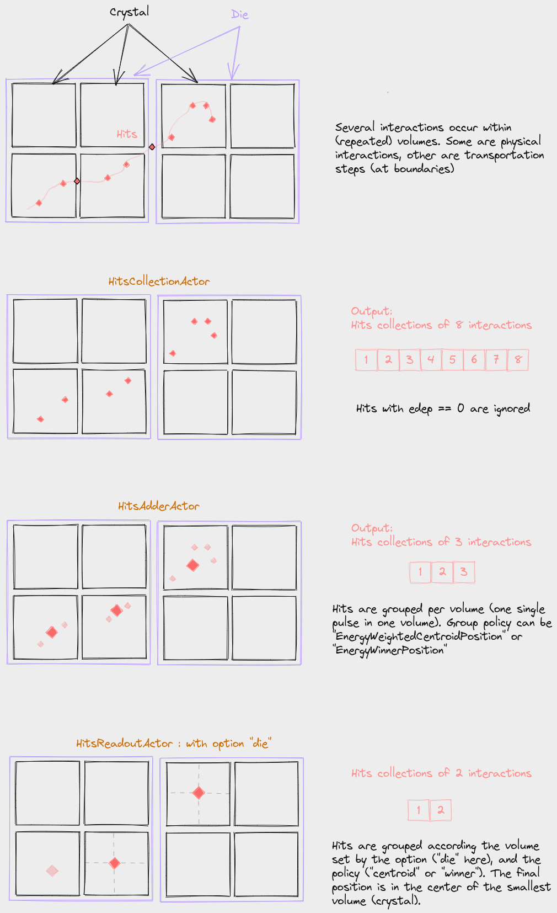

## Actors and Filters

The "Actors" are scorers can store information during simulation such as dose map or phase-space (like a "tally" in MCNPX). They can also be used to modify the behavior of a simulation, such as the `MotionActor` that allows to move volumes, this is why they are called "actor".

### SimulationStatisticsActor

The SimulationStatisticsActor actor is a very basic tool that allow to count the number of runs, events, tracks and steps that have been created during a simulation. Most of the simulations should include this actor as it gives valuable information. Once the simulation ends, the user can retrieve the values as follows:

```python
# during the initialisation:
stats = sim.add_actor('SimulationStatisticsActor', 'Stats')
stats.track_types_flag = True

# (...)
output = sim.start()

# after the end of the simulation
stats = output.get_actor('Stats')
print(stats)
stats.write('myfile.txt')
```

The `stats` object contains the `counts` dictionary that contains all numbers. In addition, if the flag `track_types_flag` is enabled, the `stats.counts.track_types` will contain a dictionary structure with all types of particles that have been created during the simulation. The start and end time of the whole simulation is also available. Speeds are also estimated (primary per sec, track per sec and step per sec). You can write all the data to a file like in the previous GATE, via `stats.write`. See [source](https://tinyurl.com/pygate/actor/SimulationStatisticsActor/).

### DoseActor

The DoseActor computes a 3D edep/dose map for deposited energy/absorbed dose in a given volume. The dose map is a 3D matrix parameterized with: dimension (number of voxels), spacing (voxel size), and translation (according to the coordinate system of the “attachedTo” volume). There is no possibility to rotate this 3D matrix for the moment. By default, the matrix is centered according to the volume center.

Like any image, the output dose map will have an origin. By default, it will consider the coordinate system of the volume it is attached to, so at the center of the image volume. The user can manually change the output origin, using the option `output_origin` of the DoseActor. Alternatively, if the option `img_coord_system` is set to `True` the final output origin will be automatically computed from the image the DoseActor is attached to. This option calls the function `get_origin_wrt_images_g4_position` to compute the origin. See the figure for details.


Several tests depict usage of DoseActor: test008, test009, test021, test035, etc.

````python
dose = sim.add_actor("DoseActor", "dose")
dose.output_filename = output_path / "test008-edep.mhd"
dose.attached_to = "waterbox"
dose.size = [99, 99, 99]
mm = gate.g4_units.mm
dose.spacing = [2 * mm, 2 * mm, 2 * mm]
dose.translation = [2 * mm, 3 * mm, -2 * mm]
dose.uncertainty = True
dose.hit_type = "random"
````

### PhaseSpaceActor

A PhaseSpaceActor stores any set of particles reaching a given volume during the simulation. The list of attributes that are kept for each stored particle can be specified by the user.

```python
phsp = sim.add_actor("PhaseSpaceActor", "PhaseSpace")
phsp.attached_to = plane.name
phsp.attributes = [
    "KineticEnergy",
    "Weight",
    "PostPosition",
    "PrePosition",
    "ParticleName",
    "PreDirection",
    "PostDirection",
    "TimeFromBeginOfEvent",
    "GlobalTime",
    "LocalTime",
    "EventPosition",
]
phsp.output_filename = "test019_hits.root"
f = sim.add_filter("ParticleFilter", "f")
f.particle = "gamma"
phsp.filters.append(f)
```

In this example, the PhaseSpace will store all particles reaching the given plane. For each particle, some information will be stored, as shown in the attributes array: energy, position, name, time, etc. The list of available attributes name can be seen in the file : [GateDigiAttributeList.cpp](https://github.com/OpenGATE/opengate/blob/master/core/opengate_core/opengate_lib/digitizer/GateDigiAttributeList.cpp). Here is the current list:

```
TotalEnergyDeposit
PostKineticEnergy PreKineticEnergy KineticEnergy TrackVertexKineticEnergy EventKineticEnergy
LocalTime GlobalTime PreGlobalTime TimeFromBeginOfEvent TrackProperTime
Weight
TrackID ParentID EventID RunID ThreadID
TrackCreatorProcess TrackCreatorModelName TrackCreatorModelIndex ProcessDefinedStep
ParticleName ParentParticleName ParticleType PDGCode
TrackVolumeName TrackVolumeCopyNo
PreStepVolumeCopyNo PostStepVolumeCopyNo TrackVolumeInstanceID
PreStepUniqueVolumeID PostStepUniqueVolumeID HitUniqueVolumeID
Position PostPosition PrePosition PrePositionLocal PostPositionLocal EventPosition TrackVertexPosition
Direction PostDirection PreDirection PreDirectionLocal TrackVertexMomentumDirection EventDirection
StepLength TrackLength
UnscatteredPrimaryFlag
```

The output is a root file that contains a tree. It can be analysed for example with [uproot](https://uproot.readthedocs.io/).

By default, the phsp store only the information of the particles that ENTERS the volume the PhaseSpaceActor is attached to. It means that the information are stored when the pre-step is at the boundary of the volume. This behavior may be modified by the following options:

```python
phsp.steps_to_store = "entering" # this is the default
phsp.steps_to_store = "entering exiting first" # others options (combined)
```

The keyword "entering" is the default. The keyword "exiting" stores the information if the particle EXITS the volume (post-step is at the volume boundary or at the world boundary if the PhaseSpace is attached to the world). The keyword "first" stores the information if this is the first time we see this particle in the volume, whether it enters, exists or just mode inside the volume. This may be useful for example when the PhaseSpace is attached to the world.

Note: all three conditions may be combined (if one condition is True, the particle is stored). The same particle may hence be stored several times: when it enters, when it exits, etc.


### Hits-related actors (digitizer)

The digitizer module is a set of tools used to simulate the behaviour of the scanner detectors and signal processing chain. The tools consider a list of interactions occurring in the detector (e.g. in the crystal), named as "hits collections". This collection of hits is then processed and filtered by different modules to produce a final digital value. To initiate a digitizer chain, you begin by defining a `HitsCollectionActor`, as explained in the following sections.

Common features of all digitizer actors:

- Most digitizers have a root output (with the exception for `DigitizerProjectionActor`, which outputs an image). This output can be written to disk with `my_digitizer.root_output.write_to_disk = True`. Multiple digitizers can share the same root output file, with each storing data in a separate branch named after the actor.

- `authorize_repeated_volumes`: Set this to True if you want the digitizer to work with repeated volumes. This is useful, for example, when the digitizer is attached to a region with repeated crystal volumes (as in a PET system). However, if you are repeating some SPECT heads, you may not want the digitizer to record hits from both heads in the same file (in which case, set the flag to False).


#### DigitizerHitsCollectionActor

The `DigitizerHitsCollectionActor` is an actor that collects hits occurring in a given volume (or one of its daughters). Every time a step occurs in the volume a list of attributes is recorded. The list of attributes is defined by the user as follows:

```python
hc = sim.add_actor('DigitizerHitsCollectionActor', 'Hits')
hc.attached_to = ['crystal1', 'crystal2']
hc.output_filename = 'test_hits.root'
hc.attributes = ['TotalEnergyDeposit', 'KineticEnergy', 'PostPosition',
                 'CreatorProcess', 'GlobalTime', 'VolumeName', 'RunID', 'ThreadID', 'TrackID']
```

In this example, the actor is attached (`attached_to` option) to several volumes (`crystal1` and `crystal2` ) but most of the time, one single volume is sufficient. This volume is important: every time an interaction (a step) is occurring in this volume, a hit will be created. The list of attributes is defined with the given array of attribute names. The names of the attributes are as close as possible to the Geant4 terminology. They can be of a few types: 3 (ThreeVector), D (double), S (string), I (int), U (unique volume ID, see `DigitizerAdderActor` section). The list of available attributes is defined in the file `core/opengate_core/opengate_lib/GateDigiAttributeList.cpp` and can be printed with:

```python
import opengate_core as gate_core
am = gate_core.GateDigiAttributeManager.GetInstance()
print(am.GetAvailableDigiAttributeNames())
```
        Direction 3
        EventDirection 3
        EventID I
        EventKineticEnergy D
        EventPosition 3
        GlobalTime D
        HitUniqueVolumeID U
        KineticEnergy D
        LocalTime D
        ParticleName S
        Position 3
        PostDirection 3
        PostKineticEnergy D
        PostPosition 3
        PostStepUniqueVolumeID U
        PostStepVolumeCopyNo I
        PreDirection 3
        PreDirectionLocal 3
        PreKineticEnergy D
        PrePosition 3
        PreStepUniqueVolumeID U
        PreStepVolumeCopyNo I
        ProcessDefinedStep S
        RunID I
        ThreadID I
        TimeFromBeginOfEvent D
        TotalEnergyDeposit D
        TrackCreatorProcess S
        TrackID I
        TrackProperTime D
        TrackVertexKineticEnergy D
        TrackVertexMomentumDirection 3
        TrackVertexPosition 3
        TrackVolumeCopyNo I
        TrackVolumeInstanceID I
        TrackVolumeName S
        Weight D

Warning: KineticEnergy, Position and Direction are available for PreStep and for PostStep, and there is a "default" version corresponding to the legacy Gate (9.X).

| Pre version | Post version | default version         |
|-------------|--------------|-------------------------|
| PreKineticEnergy | PostKineticEnergy | KineticEnergy (**Pre**) |
| PrePosition | PostPosition | Position (**Post**)     |
| PreDirection | PostDirection | Direction (**Post**)    |

Attributes correspondence with Gate 9.X for Hits and Singles:
| Gate 9.X         | Gate 10         |
|------------------|-----------------|
| edep or energy | TotalEnergyDeposit
| posX/Y/Z of globalPosX/Y/Z| PostPosition_X/Y/Z   |
| time | GlobalTime |


At the end of the simulation, the list of hits can be written as a root file and/or used by subsequent digitizer modules (see next sections). The Root output is optional, if the output name is `None` nothing will be written. Note that, like in Gate, every hit with zero deposited energy is ignored. If you need them, you should probably use a PhaseSpaceActor. Several tests using `DigitizerHitsCollectionActor` are proposed: test025, test028, test035, etc.

The two actors used to convert some `hits` to one `digi` are "DigitizerHitsAdderActor" and "DigitizerReadoutActor" described in the next sections and illustrated in the figure:




#### DigitizerHitsAdderActor

This actor groups the hits per different volumes according to the option `group_volume` (by default, this is the deeper volume that contains the hit). All hits (in the same event) occurring in the same volume are gathered into one single digi according to one of the two available policies:

- EnergyWeightedCentroidPosition:
  - the final energy (`TotalEnergyDeposit`") is the sum of all deposited energy
  - the position (`PostPosition`) is the energy-weighted centroid position
  - the time (`GlobalTime`) is the time of the earliest hit

- EnergyWinnerPosition
  - the final energy (`TotalEnergyDeposit`) is the energy of the hit with the largest deposited energy
  - the position (`PostPosition`) is the position of the hit with the largest deposited energy
  - the time (`GlobalTime`) is the time of the earliest hit

```python
sc = sim.add_actor("DigitizerAdderActor", "Singles")
sc.output_filename = 'test_hits.root'
sc.input_digi_collection = "Hits"
sc.policy = "EnergyWeightedCentroidPosition"
# sc.policy = "EnergyWinnerPosition"
sc.group_volume = crystal.name
```

Note that this actor is only triggered at the end of an event, so the `attached_to` volume to which it is attached has no effect. Examples are available in test 037.

#### DigitizerReadoutActor

This actor is the same as the previous one (`DigitizerHitsAdderActor`) with one additional option: the resulting positions of the digi are set in the center of the defined volumes (discretized). We keep two different actors (Adder and Readout) to be close to the previous legacy GATE versions. The additional option `discretize_volume` indicates the volume name in which the discrete position will be taken.

```python
sc = sim.add_actor("HitsReadoutActor", "Singles")
sc.input_digi_collection = "Hits"
sc.group_volume = stack.name
sc.discretize_volume = crystal.name
sc.policy = "EnergyWeightedCentroidPosition"
```

Examples are available in test 037.

#### DigitizerGaussianBlurringActor

Digitizer module for blurring an attribute such as the time or the energy (single value only, not a vector). The blurring method can be "Gaussian", "InverseSquare" or "Linear" :

For Gaussian: the sigma or the FWHM should be given `blur_sigma` or `.blur_fwhm` options.

For InverseSquare: `blur_reference_value` and `blur_reference_value` EQUATION

For Linear: `blur_reference_value`, `blur_reference_value` and `blur_slope`  EQUATION


```python
bc = sim.add_actor("DigitizerBlurringActor", "Singles_with_blur")
bc.output_filename = "output.root"
bc.input_digi_collection = "Singles_readout"
bc.blur_attribute = "GlobalTime"
bc.blur_method = "Gaussian"
bc.blur_fwhm = 100 * ns
```


#### DigitizerSpatialBlurringActor

(documentation TODO)

warning: if blur leads to point outside volume (keep_in_solid_limits option). Useful for monocrystal. Should probably not be used for pixelated crystal.

#### DigitizerEnergyWindowsActor

(documentation TODO)
for spect, test028

#### DigitizerProjectionActor

(documentation TODO)
for spect, test028

#### DigitizerEfficiencyActor

Digitizer module for simulating detection with lowered (non-100%) efficiency. It is initialized with a float number representing the probability of storing the hit. An efficiency of 0 means that absolutely nothing will be recorded, whereas a probability of 1 means that all digis will be stored.

For each digi the digitizer receives, a random float is uniformly shot between 0 and 1: if this random float is below the efficiency set when initializing the digitizer, then the digit is kept, otherwise, it is discarded.

As an example, a DigitizerEfficiencyActor with an efficiency of 0.3 can be initialized as follows:
```python
ea = sim.add_actor("DigitizerEfficiencyActor", "Efficiency")
ea.input_digi_collection = "Hits"
ea.efficiency = 0.3
```
A more detailed example can be found in [test 57](https://github.com/OpenGATE/opengate/blob/master/opengate/tests/src/test057_digit_efficiency.py).

### Coincidences Sorter

*Please, be aware that the current version of the Coincidence sorter is still work in progress. Coincidence sorter is only offline yet.*

The Coincidence Sorter searches, into the singles list, for pairs of coincident singles. Whenever two or more singles are found within a coincidence time window, these singles are grouped to form a Coincidence event.

As an example, a Coincidence Sorter is shown here:
```python
singles_tree = root_file["Singles_crystal"]
...
ns = gate.g4_units.nanosecond
time_window = 3 * ns
policy="keepAll"

minSecDiff=1 #NOT YET IMPLEMENTED
# apply coincidences sorter
coincidences = coincidences_sorter(singles_tree, time_window, policy, minDistanceXY, maxDistanceZ, chunk_size=1000000)
```
As parameters, Coincidence Sorter expects as input:

* **Singles Tree**
* Defined coincidence **time window**
* **minDistanceXY** (equivalent to Minimum sector difference in Gate 9.X) minimal distance in transaxial plane between the detectors triggered the coincidence needed for removing geometrically impossible coincidences,
* **maxDistanceZ** maximal distance in axial plane between the detectors triggered the coincidence needed for data reduction for systems with a long axial size (ex.,total body systems)
* **Policy** to process the multiple coincidences. When more than two singles are found in coincidence, several types of behavior could be implemented.
* **Chunk size** important for very large root files to avoid loading everything in memory.

#### Policies

When more than two singles are found in coincidence, several type of behavior could be implemented. GATE allows to model 5 different policies to treat multiple coincidences that can be used. Multiple coincidences or "multicoincidence" are composed of at least three singles detected in the same **time window** that could form coincidence. The list of policies along with their explanation are given in Table below. The 5 policies, same as in [Gate9.X](https://opengate.readthedocs.io/en/latest/digitizer_and_detector_modeling.html#id43), were selected for the implementation as the most used. If an option that you need is missing, please, don't hesitate to report it in [Issues](https://github.com/OpenGATE/opengate/issues).


**Available multiple policies and associated meaning**. When a multiple coincidence involving n *singles* is processed, it is first decomposed into a list of n·(n−1) pairs which are analyzed individually.
The naming convention:
* "Good" means that a pair of singles are in coincidence and passes all filters **minDistanceXY** and **maxDistanceZ**
* "take" means that 1 or more pairs of coincidences will be stored
* "accept" means that a unique coincidence, composed of at least three singles will be kept in the data flow and is called "multicoincidence". *TO DO: In the latter case, the multicoincidence will not be written to the disk, but may participate to a possible deadtime or bandwidth occupancy. The user may clear the multicoincidence at any desired step of the acquisition, by using the multipleKiller pulse processor (described in #Multiple coincidence removal).*
* "remove" prefix means that all events will be discarded and will not produce any coincidence

| Policy name             | Description                                                                                            |
|-------------------------|--------------------------------------------------------------------------------------------------------|
| takeAllGoods            | Each good pairs are considered                                                                         |
| takeWinnerOfGoods       | Only the good pair with the highest energy is considered                                               |
| takeWinnerIfIsGood      | If the pair with the highest energy is good, take it, otherwise, kill the event                        |
| keepIfOnlyOneGood       | If exactly one pair is good, keep the multicoincidence                                                 |
| removeMultiples         | No multiple coincidences are accepted, no matter how many good pairs are present (*killAll in Gate9.X) |

The following figure illustrates an example of different policies application. The stars represent the detected singles. The size of the star, as well as the number next to it, indicate the energy level of the single (ie. single no 1 has more energy than single no 2, which has itself more energy than the single no 3). The lines represent the possible **good** coincidences.


In the table:
* a **minus(-)** sign indicates that the event is killed (ie. no coincidence is formed)
* **⋆** sign indicates that all the singles are kept into a unique multicoincidence *TODO:, which will not be written to disk, but which might participate to data loss via dead time or bandwidth occupancy*.
* In the other cases, the list of pairs which are written to the disk is indicated

| Policy name             | Case 1 | Case 2              | Case 3       | Case 4       |
|-------------------------|--------|---------------------|--------------|--------------|
| takeAllGoods            | (1,2)  | (1,2); (1,3); (2,3) | (1,2); (2,3) | (1,3); (2,3) |
| takeWinnerOfGoods       | (1,2)  | (1,2)               | (1,2)        | (1,3)        |
| takeWinnerIfIsGood      | (1,2)  | (1,2)               | (1,2)        | \-           |
| keepIfOnlyOneGood       | \*     | \-                  | \-           | \-           |
| removeMultiples         | \-     | \-                  | \-           | \-           |

A more detailed example can be found in [test 072](https://github.com/OpenGATE/opengate/blob/master/opengate/tests/src/).

### MotionVolumeActor

(documentation TODO)
test029

### ARFActor (and ARFTrainingDatasetActor)

(documentation TODO)
test043
The detector MUST be oriented such that the depth is Z dimension


### LETActor

(documentation TODO)
test050


### ComptonSplittingActor

The Compton splitting actor generates N particles, each with a weight equal to the initial track weight divided by N, whenever a Compton process occurs. To tailor the splitting process to your specific application, you can use various options, as presented in [test 71](https://github.com/OpenGATE/opengate/tree/compton_splitting/opengate/tests/src/test071_operator_russian_roulette.py) :


```python
compt_splitting_actor = sim.add_actor("ComptSplittingActor", "ComptSplitting")
compt_splitting_actor.attached_to = W_tubs.name
compt_splitting_actor.splitting_factor = nb_split
compt_splitting_actor.russian_roulette = True
compt_splitting_actor.rotation_vector_director = True
compt_splitting_actor.vector_director = [0, 0, -1]
```

The options include:

- the splitting Number: Specifies the number of splits to create.
- A Russian Roulette to activate : Enables selective elimination based on a user-defined angle, with a probability of 1/N.
- A Minimum Track Weight: Determines the minimum weight a track must possess before undergoing subsequent Compton splitting. To mitigate variance fluctuations or too low-weight particles, I recommend to set the minimum weight to the average weight of your track multiplied by 1/N², with N depending on your application.
