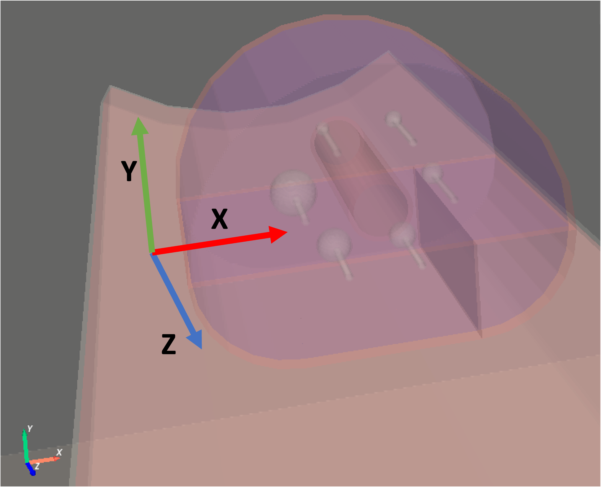

## Additional functionalities

The command line tool ```opengate_user_info``` allo to print all default and possible parameters for Volumes, Sources, Physics and Actors elements. This is verbose but allow to have a dynamic documentation of everything currently available in the installed gate version.

The "contrib" folder contains additional functions that are useful but do not belong to the core of GATE.

The functions are used in several tests.

A readme file can be found : https://github.com/OpenGATE/opengate/tree/master/opengate/contrib/readme.md

### Dose rate computation

(documentation TODO), test035

### Linac : Elekta Synergy (warning: approximate model)

(documentation TODO), test019

### Phantom: IEC 6 spheres NEMA phantom

An analytical model of the 6 spheres IEC NEMA phantom is provided. It can be used as follows:

```python
import opengate as gate
import opengate.contrib.phantoms.nemaiec as gate_iec

sim = gate.Simulation()
iec_phantom = gate_iec.add_iec_phantom(sim)
```

The rotation should be adapted according to your need. The order of the 6 spheres can be changed with the parameter `sphere_starting_angle` of the `add_iec_phantom` command.



Example can be found in [test015](https://github.com/OpenGATE/opengate/blob/master/opengate/tests/src/test015_iec_phantom_1.py) (and others).


### Voxelization of the IEC 6 spheres phantom

(documentation TODO), test032

### Phantom: cylinder phantom for PET NECR

(documentation TODO), test037

### SPECT GE NM 670 (warning: approximate model)

(documentation TODO), test028

### SPECT "ideal reconstruction"

(documentation TODO)

### PET Philips Vereos

(documentation TODO), test037
