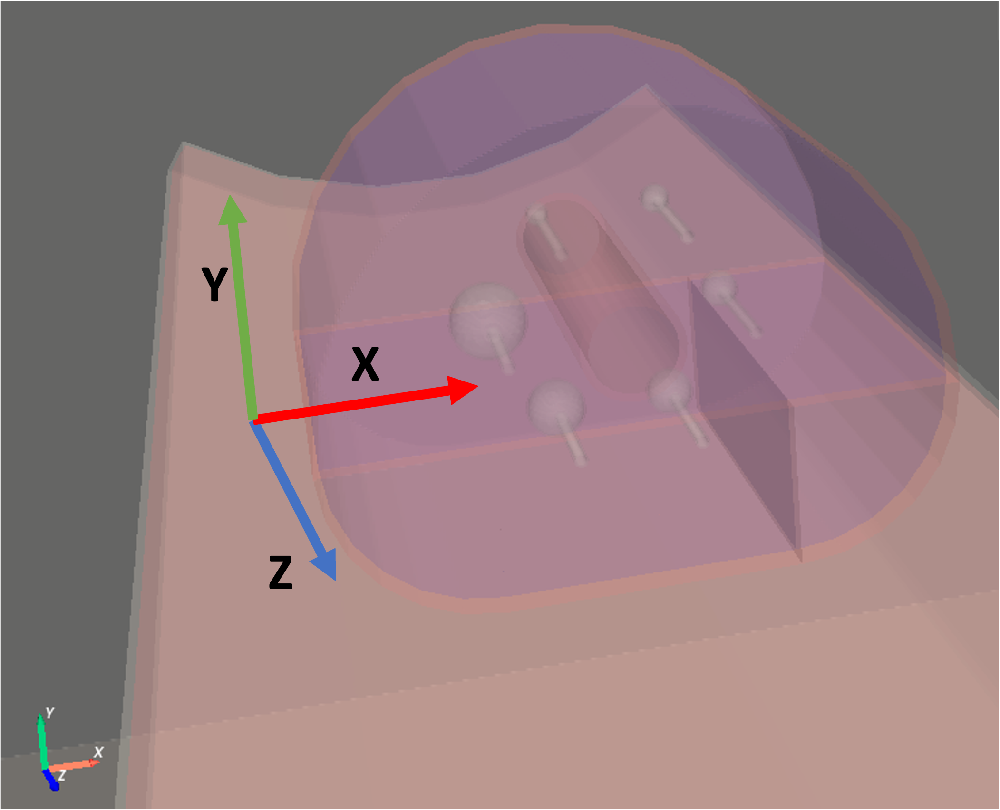
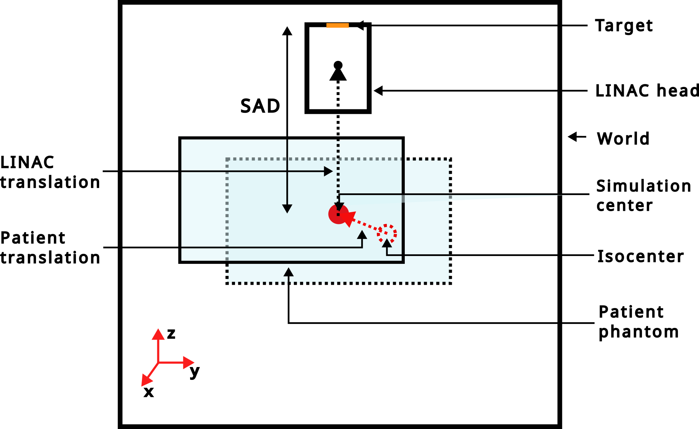

## Contributions

The "contribution folder" contains additional useful functions that do not belong to the core of gate.

### Dose rate computation

(documentation TODO), test035

### Phantoms

#### Phantom: IEC 6 spheres NEMA phantom

An analytical model of the 6 spheres IEC NEMA phantom is provided. It can be used as follows:

```python
import opengate as gate
import opengate.contrib.phantoms.nemaiec as gate_iec

sim = gate.Simulation()
iec_phantom = gate_iec.add_iec_phantom(sim, 'iec_phantom')
activities = [3 * BqmL, 4 * BqmL, 5 * BqmL, 6 * BqmL, 9 * BqmL, 12 * BqmL]
iec_source = gate_iec.add_spheres_sources(sim, 'iec_phantom', 'iec_source', 'all', activities)
iec_bg_source = gate_iec.add_background_source(sim, 'iec_phantom', 'iec_bg_source', 0.1 * BqmL)
```

The rotation should be adapted according to your need. The order of the 6 spheres can be changed with the parameter `sphere_starting_angle` of the `add_iec_phantom` command.



Example can be found in [test015](https://github.com/OpenGATE/opengate/blob/master/opengate/tests/src/test015_iec_phantom_1.py) (and others).

#### Phantom: cylinder phantom for PET NECR

An analytical model of the simple NECR phantom (cylinder and linear source) is provided. It can be used as follows:


```python
import opengate as gate
import opengate.contrib.phantoms.necr as gate_necr

sim = gate.Simulation()
necr_phantom = gate_necr.add_necr_phantom(sim, 'necr_phantom')
necr_source = gate_necr.add_necr_source(sim, 'necr_phantom')
necr_source.activity = 1000 * Bq
```
Example can be found in [test049](https://github.com/OpenGATE/opengate/blob/master/opengate/tests/src/test049_pet_digit_blurring_v1.py) (and others).


### Radiation therapy linac

**Important Notice**: Please be aware that the models provided within the OpenGate toolkit are based on approximate simulations. Users are strongly encouraged to independently verify these models against empirical data to ensure their applicability and accuracy for specific use cases.

The following models are available:
- Elekta Synergy, without patient specific collimation systems
- Elekta Versa HD, with Agility multileaf collimator (160 leaves) and back-up jaws.

```python
import opengate as gate
import opengate.contrib.linacs.elektasynergy as synergy
import opengate.contrib.linacs.elektaversa as versa

sim = gate.Simulation()
linac1 = synergy.add_linac(sim)
linac2 = versa.add_linac(sim)
```

#### LINACs reference systems :

Each LINAC head is simulated with a z-axis translation relative to the world center. This translation aligns the machine's isocenter with the world center, with a user-defined Source-Axis Distance (SAD). The "translation_from_sad" function (example in [test019_linac_elekta_versa.py](https://github.com/OpenGATE/opengate/blob/master/opengate/tests/src/test019_linac_elekta_versa.py)) can be used to move the LINAC head with a translation relative to the SAD.




The "rotation_around_user_point" function enables LINAC head rotation around either the world center (i.e the isocenter) or a user-defined point.  Axis and angle lists for each axis must be defined in a way consistent with [Rotation_from_euler](https://docs.scipy.org/doc/scipy/reference/generated/scipy.spatial.transform.Rotation.from_euler.html). An example illustrating how to use this function is available in [test019_elekta_versa.py](https://github.com/OpenGATE/opengate/blob/master/opengate/tests/src/test019_linac_elekta_versa.py).

#### LINACs source types :

There are two way to simulate the LINAC photon beam: from an electron source impinging the tungsten target, and from a phase space source provided by the user (only .root extension)

##### Electron source

The function to create an electron is add_electron_source ([test019_linac_elekta_versa.py](https://github.com/OpenGATE/opengate/blob/master/opengate/tests/src/test019_linac_elekta_versa.py)). The electron source replicates the processes undergone by electrons to generate the photon beam. It's positioned at the beginnin of the linac target and characterized as follows:

- Electron momentum is strictly aligned along the z-axis.
- Electron beam kinetic energy is 6.7 MeV for the LINAC Synergy and 6.4 MeV for the LINAC Versa.
- Initial X-Y positions of electrons are defined as a 2 mm radius cylinder for the LINAC Synergy and as a 2D Gaussian distribution with a σ of 0.47 mm for the LINAC Versa.
These parameters delineate the profile of the photon beam derived from the electron beam.

##### Phase space source

When simulating electron sources becomes too time-consuming, you can switch to using a phase space source. This source have to be put before your custom collimation system for patients. To get started, you'll need a rootfile. The user is free to use its own rootfile, tailored to his photon beam setup.

The prerequisite parameters to include into your rootfile are :

- Position in X, Y, Z
- Direction in dX, dY, dZ
- Energy
- Weight (important if you've used any biasing methods)

The photon polarization is not available with the phase space source. If a user wants to build a phase space source encompassing a LINAC-specific photon beam, He can run the simulation with the electron source and use the phase_space_plan function to generate the required phase space.


#### Phase space plan

The phase space is generated through two sequential steps: firstly, employing the function "add_phase_space_plane" to establish a plane, and secondly, attaching a phase space actor to this designated plane using "add_phase_space." Examples illustrating the utilization of these functions are provided in [test019_linac_elekta_versa.py](https://github.com/OpenGATE/opengate/blob/master/opengate/tests/src/test019_linac_elekta_versa.py). This plane is positioned a few centimeters beyond the mirror, before the collimation system. These functions offer a convenient way to generate a phase space, subsequently usable as a source.


#### Empty LINAC box

In case users want to simulate a LINAC box without shaping and/or collimation systems, the function add_empty_linac_box is available and the created object behaves the same way as the normal LINAC head.

#### Collimation systems

##### Multi-Leaf Collimator

The LINAC Versa module includes a simulation model of the Agility multileaf collimator, featuring two banks of 80 leaves each. In the simulation, each leaf tip is rounded to resemble real leaf characteristics, and leaves operate independently. To use this collimator system, users can simply employ the "add_mlc" function, which sets up the multileaf collimator in a closed position. An example is provided in [test019_linac_elekta_versa_with_mlc.py](https://github.com/OpenGATE/opengate/blob/master/opengate/tests/src/test019_linac_elekta_versa_with_mlc.py).

For users who wish to manually control specific leaf movements, the "field" function ([elektaversa.py](https://github.com/OpenGATE/opengate/blob/master/opengate/contrib/linacs/elektaversa.py)) is available. An example within the "set_rectangular_field" function demonstrates its usage. This function requires parameters including the mlc and jaw objects, as well as vectors specifying the real (not the projected positions at the isocenter) x-axis positions for the leaves within the multileaf collimator and y-axis positions for the jaws.

##### Back-up Jaws

The LINAC Versa module also includes a complex model of the Elekta Versa Y-jaws. Users can simply employ the "add_jaws" function, setting up the jaws in a closed position. The y-axis jaws position can also be modified using the "field" function.

##### Rectangular Fields

For a quick and easy establishment of a rectangular field, for example to compare measurements between experiments and simulations, users can utilize the "set_rectangular_field" function. An example is available in [test019_linac_elekta_versa_with_mlc.py](https://github.com/OpenGATE/opengate/blob/master/opengate/tests/src/test019_linac_elekta_versa_with_mlc.py).

To use it, users just provide the MLC and jaws objects he has created, along with the desired x and y dimensions of the field at the isocenter. The LINAC head position relative to the isocenter needs to be specified to adjust the leaves and jaws accurately.


#### Reproduction of a radiotherapy plan irradiation

The LINAC Versa HD module, combined to the dicomrtplan module, enable the reproduction of an IMRT or VMAT irradiation sequence. By default, the LINAC head position is set-up at a source-axis distance of 100 cm. The rotation will be performed around the center of the world.

##### Lecture of the DICOM RT plan

The [dicomrtplan.py](https://github.com/OpenGATE/opengate/blob/master/opengate/opengate/contrib/linacs/dicomrtplan.py) module can be used to get useful data from DICOM radiotherapy plans for reproducing radiotherapy sessions. The "read" function returns a Python dictionary with lists of leaf positions, y-jaw positions, normalized monitor units, and isocenter for each LINAC head rotation:

```python
import opengate as gate
import opengate.contrib.linacs.elektaversa as versa
import opengate.contrib.linacs.dicomrtplan as rtplan

paths = utility.get_default_test_paths(__file__, output_folder="test019_linac")
sim = gate.Simulation()
linac = versa.add_linac(sim)

rt_plan_parameters = rtplan.read(str(paths.data / "DICOM_RT_plan.dcm"))
leaves_positions = rt_plan_parameters["leaves"]
jaws_1_positions = rt_plan_parameters["jaws 1"]
jaws_2_positions = rt_plan_parameters["jaws 2"]
linac_head_angles = rt_plan_parameters["gantry angle"]
monitor_unit_weights = rt_plan_parameters["weight"]
isocenter = rt_plan_parameters["isocenter"]

```

All parameters related to modifying the LINAC head geometry are linearly interpolated between two subsequent control points. The deposited dose between these control points is assumed to be delivered from a single rotation angle, also interpolated between them. Note that the isocenter remains the same for all LINAC head rotations, but it's returned as a list for convenience.

##### Simulation according to the DICOM RT plan

###### LINAC head rotation

To simulate a VMAT or IMRT session, we opted to realise one GEANT4 run for each LINAC head rotation. Motion actor are used to adjust the geometry based on the DICOM RT plan between each run. The "set_linac_head_motion" function links relevant parameters extracted from the DICOM RT plan with the LINAC head and the collimation system to be moved.

It's important to note that the rotation is performed around the center of the simulation. Consequently, the patient geometry must be relocated to align the isocenter with the world center. An illustrative example is provided in [test019_linac_elekta_versa_rt_plan_isocenter.py](https://github.com/OpenGATE/opengate/blob/master/opengate/tests/src/test019_linac_elekta_versa_rt_plan_isocenter.py).


###### Modulation of the number of particle to send

To tailor the number of particles sent for each LINAC head rotation, a weight is applied to the "activity" specified by the user. This weight is extracted from the DICOM RT plan and is normalized relative to the median weight of the specific therapy.

The function "set_time_intervals_from_rtplan" (with an example provided in [test019_linac_elekta_versa_with_mlc_rt_plan.py](https://github.com/OpenGATE/opengate/blob/master/opengate/tests/src/test019_linac_elekta_versa_with_mlc_rt_plan.py))  converts the weight into irradiation time. Consequently, this time becomes directly proportional to the number of particles to be sent.

### SPECT imaging systems

**Important Notice**: Please be aware that the models provided within the OpenGate toolkit are based on approximate simulations. Users are strongly encouraged to independently verify these models against empirical data to ensure their applicability and accuracy for specific use cases.

The following models are available:
- GE Discovery 670 SPECT
- Siemens Symbia Intevo Bold SPECT

```python
import opengate as gate
import opengate.contrib.spect.ge_discovery_nm670 as discovery
import opengate.contrib.spect.siemens_intevo as intevo

sim = gate.Simulation()

spect = discovery.add_spect_head(sim, "discovery1", collimator_type="melp")
crystal = sim.volume_manager.get_volume(f"{spect.name}_crystal")
discovery.add_digitizer_tc99m(sim, crystal.name, "digit_tc99m")

spect = discovery.add_spect_head(sim, "discovery12", collimator_type="lehr")
crystal = sim.volume_manager.get_volume(f"{spect.name}_crystal")
discovery.add_digitizer_lu177(sim, crystal.name, "digit_lu177")

spect = intevo.add_spect_head(sim, "intevo1", collimator_type="melp")
crystal = sim.volume_manager.get_volume(f"{spect.name}_crystal")
intevo.add_digitizer_tc99m(sim, crystal.name, "digit_tc99m")

spect = discovery.add_spect_head(sim, "intevo2", collimator_type="lehr")
crystal = sim.volume_manager.get_volume(f"{spect.name}_crystal")
intevo.add_digitizer_lu177(sim, crystal.name, "digit_lu177")
```

test028

### PET imaging systems

**Important Notice**: Please be aware that the models provided within the OpenGate toolkit are based on approximate simulations. Users are strongly encouraged to independently verify these models against empirical data to ensure their applicability and accuracy for specific use cases.

The following models are available:
- Philips Vereos Digital PET
- Siemens Biograph Vision PET

test037
